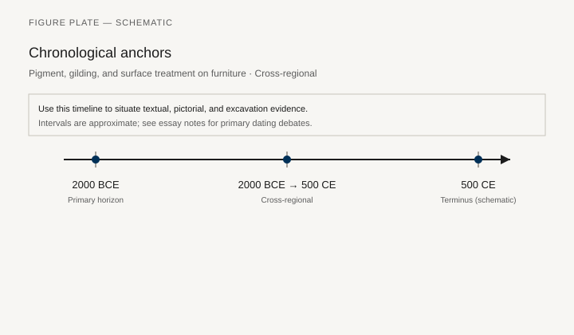
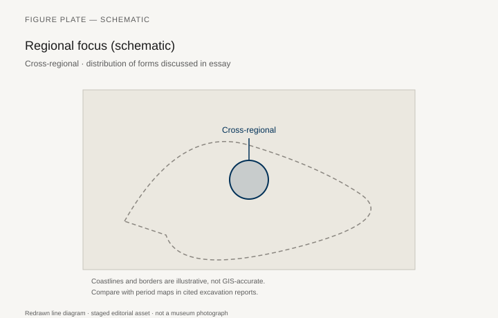
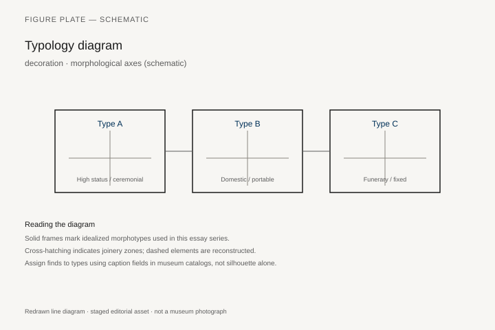
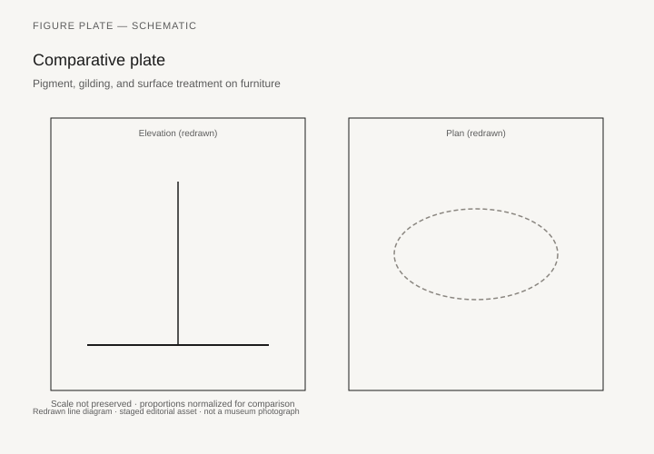

# Pigment, gilding, and surface treatment on furniture

*Fig. 1.* Chronological anchors for the evidence discussed below. Schematic redrawn line diagram; staged editorial asset (2026). Not a photograph of a museum object.

*Fig. 2.* Regional focus for circulation and local workshop traditions. Schematic redrawn line diagram; staged editorial asset (2026). Not a photograph of a museum object.

*Fig. 3.* Morphological typology for decoration (idealized morphotypes). Schematic redrawn line diagram; staged editorial asset (2026). Not a photograph of a museum object.

*Fig. 4.* Comparative elevation and plan plate for decoration. Schematic redrawn line diagram; staged editorial asset (2026). Not a photograph of a museum object.

## Evidence and argument

This essay treats **pigment, gilding, and surface treatment on furniture** as a problem in evidence, not as a catalog of pretty objects. The chronological frame **2000 BCE–500 CE** and the regional lens **Cross-regional** constrain what can responsibly be said about **decoration** in domestic, ceremonial, and funerary contexts.

Ancient furniture rarely survives intact. We reconstruct it from intersecting lines: excavation plans, relief sculpture, tomb inventories, price lists, and—where preservation allows—metal fittings or mineralized wood. Each line of evidence carries its own bias. Reliefs exaggerate height; inventories abbreviate; luxury goods travel farther than their makers.

For **decoration**, typology is a working tool, not a taxonomy carved in stone. Museum catalogs often assign type numbers to fragments that ancient users would have recognized by material, patron, and occasion. The schematic figures embedded in this article separate **morphology** (legs, back, seat height) from **social function** (who may sit, who must stand, who reclines).

Comparative plates in this series follow a consistent graphic contract: redrawn line work, neutral ground, no photographic simulation of specific museum accession numbers. Where a published excavation drawing informs a silhouette, the caption states the publication—not a implied license to reproduce the museum’s photograph.

Joinery and surface treatment belong in the same paragraph as status. A folding stool and a fixed throne may share cedar and ebony veneers yet answer different protocols. Reading furniture without those protocols produces anachronistic living-room furniture in scholarly prose.

The timeline figure anchors debates that prose alone scatters: foundation dates of palaces, terminuses of dynasties, and the lag between artistic fashion and archaeological closure contexts. When dates disagree in secondary literature, the essay notes the disagreement in text and keeps the figure intentionally coarse.

Regional maps in this pack are **schematic**. They show where the argument travels, not a GIS export. Use them beside gazetteers and excavation site plans.

Finally, reconstruction ethics: displaying a piece in a gallery implies a chain of inference each link of which should be visible. This blog’s figures are staged didactic diagrams—Serious in the sense of museum caption discipline, honest in the sense of refusing forged artifact photography.

## Sources to consult

- Excavation reports and corpus volumes for Cross-regional (primary).
- Museum catalog entries consulted as **textual descriptions**; figures in this article are redrawn schematics.
- Cross-references in `GRAPHICS_INDEX.md` for asset paths and reuse policy.

## Editorial note

Graphics for this slug live under `assets/pigment-and-gilding-furniture/`. External open-access museum URLs, when cited in prose elsewhere in the series, must document license terms in `LICENSES.md`. Prefer these redrawn diagrams when rights are unclear.
