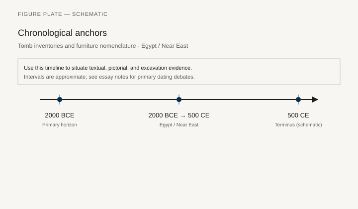
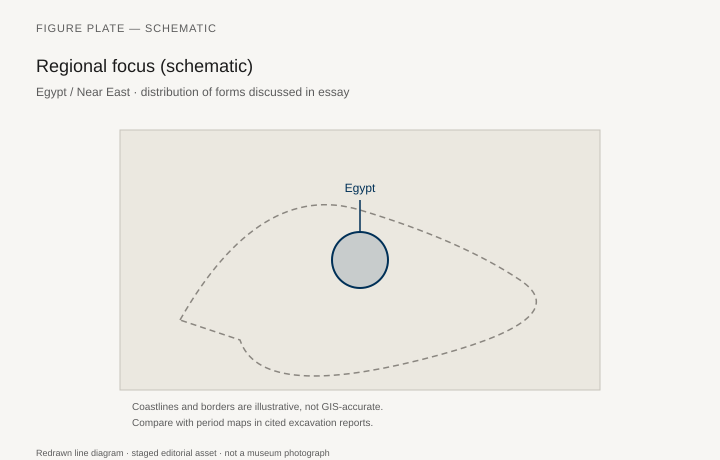
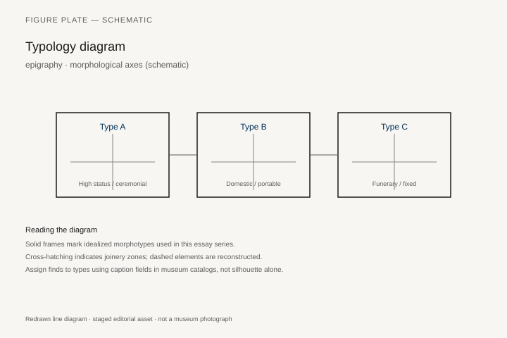
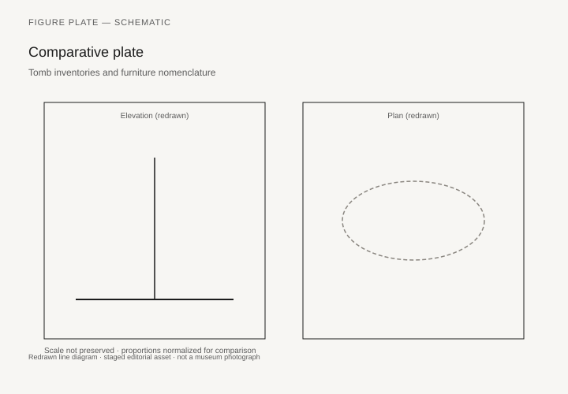

# Tomb inventories and furniture nomenclature

*Fig. 1.* Chronological anchors for the evidence discussed below. Schematic redrawn line diagram; staged editorial asset (2026). Not a photograph of a museum object.

*Fig. 2.* Regional focus for circulation and local workshop traditions. Schematic redrawn line diagram; staged editorial asset (2026). Not a photograph of a museum object.

*Fig. 3.* Morphological typology for epigraphy (idealized morphotypes). Schematic redrawn line diagram; staged editorial asset (2026). Not a photograph of a museum object.

*Fig. 4.* Comparative elevation and plan plate for epigraphy. Schematic redrawn line diagram; staged editorial asset (2026). Not a photograph of a museum object.

## Evidence and argument

Tomb inventories in Egypt and the Near East **2000 BCE–500 CE** list beds, chairs, and chests with terms that lexicographers still map to morphotypes.

Epigraphy supplies quantity and order of deposit; rarely dimensions.

Typology ties **determinative shapes** to proposed furniture classes.

Timeline spans Old Kingdom lists through Late Antique bilingual texts.

Egypt / Near East schematic.

Translation disagreements flagged rather than resolved by fiat.

## Sources to consult

- Excavation reports and corpus volumes for Egypt / Near East (primary).
- Museum catalog entries consulted as **textual descriptions**; figures in this article are redrawn schematics.
- Cross-references in `GRAPHICS_INDEX.md` for asset paths and reuse policy.

## Editorial note

Graphics for this slug live under `assets/furniture-in-tomb-inventory/`. External open-access museum URLs, when cited in prose elsewhere in the series, must document license terms in `LICENSES.md`. Prefer these redrawn diagrams when rights are unclear.
