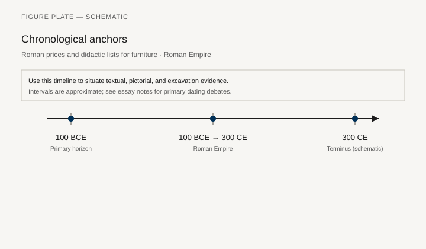
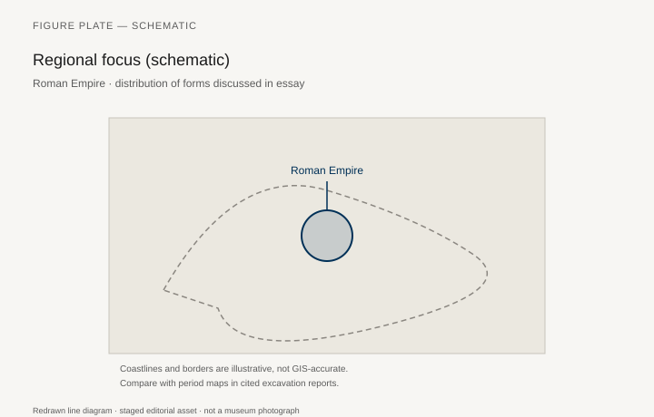
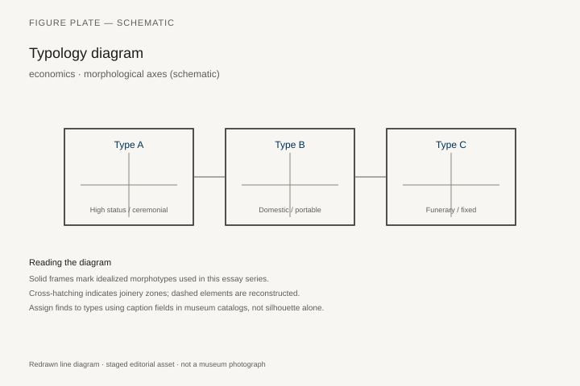
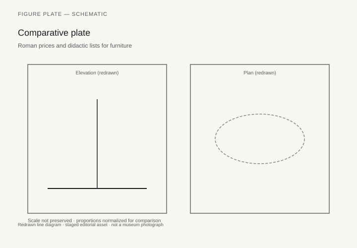

# Roman prices and didactic lists for furniture

*Fig. 1.* Chronological anchors for the evidence discussed below. Schematic redrawn line diagram; staged editorial asset (2026). Not a photograph of a museum object.

*Fig. 2.* Regional focus for circulation and local workshop traditions. Schematic redrawn line diagram; staged editorial asset (2026). Not a photograph of a museum object.

*Fig. 3.* Morphological typology for economics (idealized morphotypes). Schematic redrawn line diagram; staged editorial asset (2026). Not a photograph of a museum object.

*Fig. 4.* Comparative elevation and plan plate for economics. Schematic redrawn line diagram; staged editorial asset (2026). Not a photograph of a museum object.

## Evidence and argument

Roman price lists, legal maxima, and school declamations **100 BCE–300 CE** mention furniture values in sesterces—didactic texts as much as market reality.

Diocletian’s Price Edict entries for beds and couches anchor high-end benchmarks; satire supplies low-end ridicule.

Typology by price band, not morphology alone.

Timeline crosses Republic auction culture through late antique edicts.

Empire schematic map for regional price variation caveats.

Economics essay does not invent exact shop receipts.

## Sources to consult

- Excavation reports and corpus volumes for Roman Empire (primary).
- Museum catalog entries consulted as **textual descriptions**; figures in this article are redrawn schematics.
- Cross-references in `GRAPHICS_INDEX.md` for asset paths and reuse policy.

## Editorial note

Graphics for this slug live under `assets/roman-furniture-prices-didactic/`. External open-access museum URLs, when cited in prose elsewhere in the series, must document license terms in `LICENSES.md`. Prefer these redrawn diagrams when rights are unclear.
