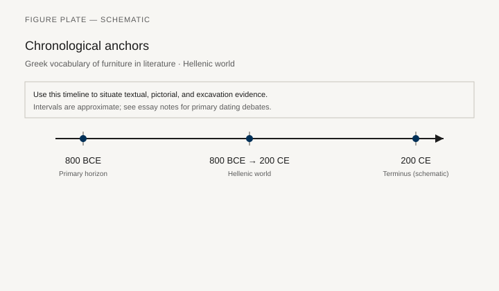
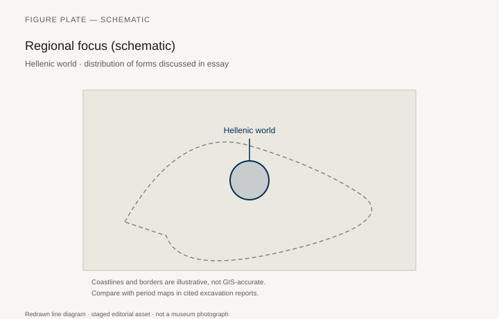
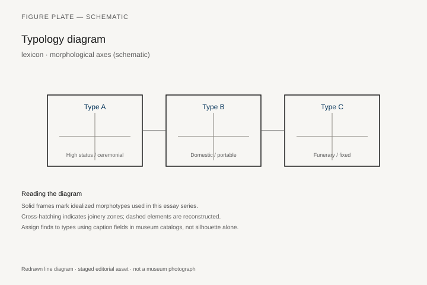
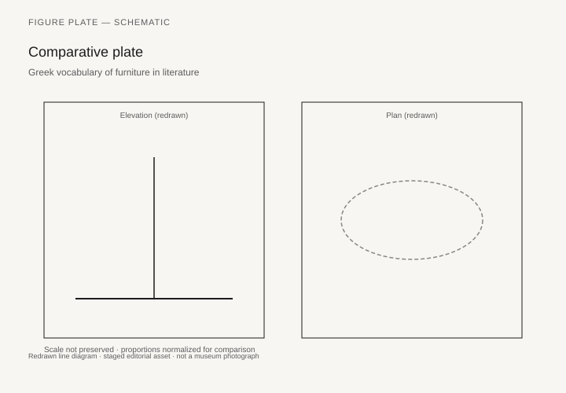

# Greek vocabulary of furniture in literature

*Fig. 1.* Chronological anchors for the evidence discussed below. Schematic redrawn line diagram; staged editorial asset (2026). Not a photograph of a museum object.

*Fig. 2.* Regional focus for circulation and local workshop traditions. Schematic redrawn line diagram; staged editorial asset (2026). Not a photograph of a museum object.

*Fig. 3.* Morphological typology for lexicon (idealized morphotypes). Schematic redrawn line diagram; staged editorial asset (2026). Not a photograph of a museum object.

*Fig. 4.* Comparative elevation and plan plate for lexicon. Schematic redrawn line diagram; staged editorial asset (2026). Not a photograph of a museum object.

## Evidence and argument

Greek literary vocabulary **800 BCE–200 CE** for beds, chairs, and couches feeds modern typology: **kline**, **klismos**, **thronos**, **skimpous**.

Contexts span Homer, Aristophanes, inscriptions, and medical writers describing bed rest.

Typology crosswalks terms to schematic morphotypes without claiming one-to-one archaeology.

Timeline tracks Attic drama through Hellenistic koine spread.

Hellenic world map.

Philology disputes noted inline; no fake lexical citations.

## Sources to consult

- Excavation reports and corpus volumes for Hellenic world (primary).
- Museum catalog entries consulted as **textual descriptions**; figures in this article are redrawn schematics.
- Cross-references in `GRAPHICS_INDEX.md` for asset paths and reuse policy.

## Editorial note

Graphics for this slug live under `assets/greek-vocabulary-furniture/`. External open-access museum URLs, when cited in prose elsewhere in the series, must document license terms in `LICENSES.md`. Prefer these redrawn diagrams when rights are unclear.
