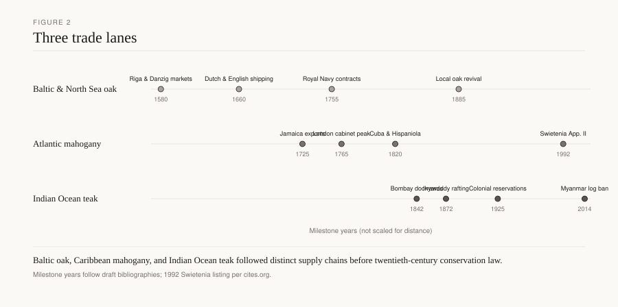
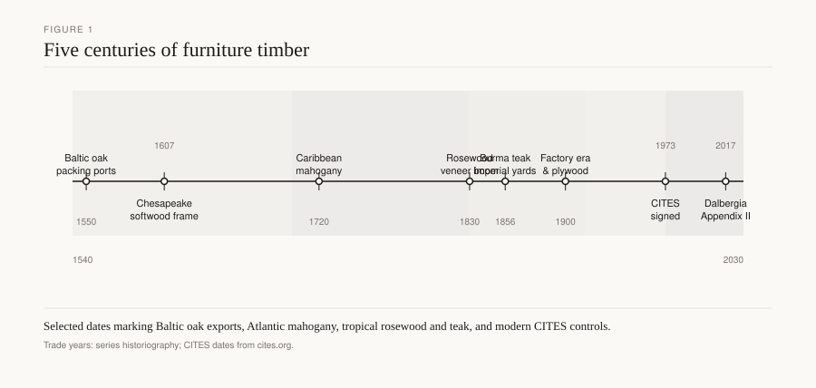

# Navy oak and the reserved forest

A grown crook lies in a dockyard slip at Deptford or Portsmouth: a knee, the angle between a branch and a trunk that a sawyer cannot invent. Surveyors of the Woods marked such trees in the Forest of Dean and the New Forest. Straight balks for planks might come from the same English stands, or from the Baltic, or later from North American white oak. Robert G. Albion’s *Forests and Sea Power: The Timber Problem of the Royal Navy, 1652–1862* (Harvard, 1926) is the book that treats those marks as strategy. Furniture shops lived on what the yards did not take. A joined press and a seventy-four’s frame are not the same object. They are often the same genus in a fight over the same bole.

*Figure 2. Three parallel supply chains — Baltic oak, Atlantic mahogany, and Indian Ocean teak — with documentary milestone years.*

*Figure 1. Milestone years in the long furniture-timber trade, from Baltic oak through tropical hardwoods to CITES enforcement.*

## What the navy wanted that a chair does not

A ship wants compass timber — naturally crooked pieces for knees, futtocks, and stem parts — and long straight oak for planking and beams. Furniture wants straight, dry, often radial boards and stiles. The navy’s hunger for crooks left some straight furniture wood in the civilian market. Its hunger for straight oak of ship length did the opposite: it reserved forests and imported what England could not grow fast enough.

Albion’s dates, 1652–1862, run from the first Dutch wars through the ironclad. John Evelyn’s *Sylva* (1664) is the planting sermon in the middle of that span: sow oaks for a fleet your grandchildren will float. The fashionable London room was already turning toward walnut. The dockyard was not. Figure 1’s furniture milestones and Figure 2’s three lanes sit beside this third demand. Baltic oak fed wainscot *and* some ship planking. Atlantic mahogany later entered the Admiralty’s own buildings (Bowett on Thomas Ripley: mahogany cheaper than deal or wainscot if Navy ships brought it home, *Georgian Group Journal*, 1997). Indian Ocean teak became a dockyard wood in another draft. This one stays with oak and the reserved pine mast.

New England white pine (*Pinus strobus*) — Weymouth pine in English bills — was the mast tree. The Broad Arrow tradition and the Massachusetts charter of 1691 reserved large pines for the Crown (Albion; Manning’s Broad Arrow notes). The exact 1691 wording wants a charter page before a writer quotes it `[CITE NEEDED]`. Furniture shops used the smaller stems and the later cut-over. The white-pine drafts take that civilian half. Here the pine matters as the navy’s other reserved species: oak for the hull, pine for the stick that held the sail.

American white oak (*Quercus alba* and the white group) entered as colonial and then United States timber: tyloses, tight cooperage, ship planking. FPL-GTR-190, table 5–3a: Janka about 1,360 lbf, specific gravity 0.68. Northern red oak: 1,290 lbf, 0.63 — open pores, less loved for wet work. European *Q. robur* / *Q. petraea* sit in the same hardness band `[CITE NEEDED for a single FPL-equivalent]`. Eastern white pine: 380 lbf, SG 0.35. A mast is not a hardness story. It is a length-and-taper story. A knee is not a Janka story. It is a grain-that-already-turns story.

## Reserved forests and imported balks

The Forest of Dean, the New Forest, and other Crown woods were not romantic leftovers. They were inventories. Surveyors marked trees. Enclosures and common rights fought the mark. Albion walks the politics: a navy that could not trust the next Baltic war to keep the Sound open had to plant, reserve, and buy abroad. Gdansk hinterland oak, already provenanced in furniture by Haneca et al. (2005), was also a naval store. Riga and the eastern ports sold ship timber and wainscot as related grades, not as one cargo with two names.

Home English oak built frames of ships and frames of presses. The conversion differed. A dockyard sawyer takes length and a grown angle. A joiner takes a dry radial face. A compass oak that makes a knee is a poor table top: wild grain, reaction wood, a plane that chatters. Furniture from “navy oak” in today’s salvage market is often a beam or a plank, not a knee. Name the part.

The Naval Stores Act of 1721 (in force 1722) is Bowett’s mahogany statute: duty off British West Indian timber. It belongs in the mahogany draft. It belongs here only as proof that the navy’s freight and the furniture trade shared ships and statutes. Ripley’s sentence — mahogany cheaper than deal or wainscot when carried freight-free — is an Admiralty accountant talking. Wainscot was still the comparison wood.

Do not invent a price per load or a named convoy. Albion and the port books are the place to read those numbers when a library copy is open. An invented ledger is worse than a gap.

## Joinery

Ship joinery and furniture joinery share the mortise and the trenail and almost nothing of the grammar.

A grown knee is bolted or trenail-fastened to a beam and a timber. The grain already turns. You do not draw-bore a knee the way Chinnery’s stool is draw-bored; you capture a crook that grew the angle. Treenails are oak or locust in later American practice `[CITE NEEDED for a dated Royal Navy trenail specification]`. Iron drifts stain tannic oak black — the same chemistry as a furniture clamp mark, at a larger scale.

Furniture from reserved-forest offcuts uses the ordinary English joints: draw-bored mortise and tenon, frame-and-panel, boarded chests. The wood may be quicker grown if the best crooks and the longest straights went to the yard. A wide, slow Baltic panel in a civilian chest can be better furniture wood than an English oak reserved for a futtock and then rejected.

Dockyard joiners also made chests, stools, and office furniture for the yards themselves. That work is oak or deal, nailed and pinned, not a distinct “navy style.” Look at the secondary wood and the tool marks, not at an anchor carved on a Victorian revival.

When old dockyard oak is reused as a table — a later salvage fashion — the joints are new. The beam may still hold a bolt hole, a drift stain, a shipwright’s mark. Those are evidence. A breadboard glued tight across a flatsawn naval plank will split the same as any oak. Frame the top or slot-screw it. The navy did not solve furniture movement. It solved a hull.

A mast pond is not a kiln. Mast pines sat in water. Furniture pine wants dry stock. Mixing the two stories without a moisture meter is how a “historic mast” table moves an inch the first winter in a heated house.

## What furniture shops actually got

Chinnery’s joined oak and Macquoid’s Age of Oak are the civilian record. Albion is the reason some of that oak was second choice. Tanbarks, charcoal, and house carpentry were other competitors. The great furniture did not wait for the navy to be satisfied. It used home oak, Baltic wainscot, and whatever the local mill had. After 1660 the polite room left oak; the dockyard did not. That split is the whole English timber politics of the late seventeenth century: Evelyn planting for a fleet, London veneering walnuts, a parish still sitting on joined stools.

American yards after independence used *Q. alba* and live oak (*Q. virginiana*) for specific naval parts `[CITE NEEDED before naming a particular frigate’s timber list]`. Furniture in the same ports used walnut, pine, and mahogany. The reserved-forest idea travelled as policy (Broad Arrow) more than as a furniture style.

## Conservation

Crown forests still exist as place-names and as working woods. Their furniture meaning is historic, not a permit category. *Quercus* in the American and European mains is not CITES-listed. Reclaimed “man-of-war oak” should be documented. A beam from a barn is not a ship because someone burned a rope mark into it.

Metal in dockyard salvage — bolts, drifts, copper — will ruin a saw. Scan. Old tannic stains around iron are stable if the metal is gone; if the metal remains, it keeps writing black.

Oak wilt and sudden oak death are living-forest facts `[CITE NEEDED for current range if counties are named]`. They are not a reason to strip a reserved ancient oak for a kitchen island. Plantation oak will not make a knee. Grown crooks take decades and a form of forestry few furniture mills practice.

## What to look for

On a period piece: ordinary English or Baltic oak joinery, not a hull joint. On a salvage table: bolt holes, drift stains, a shipwright’s mark that can be checked against a yard practice, or the absence of all three. On a “Broad Arrow” pine board: the mark is a naval-stores claim; ask for the object history. On a new English oak table: second-growth rings, a kiln ticket, no reserved-forest romance required.

Albion wrote a navy book. The press in the farmhouse is the other half of the inventory. A surveyor’s blaze on a Dean oak and a joiner’s pin in a stool are two claims on one genus. Only one of them floated.

## Sources

Albion, Robert G. *Forests and Sea Power: The Timber Problem of the Royal Navy, 1652–1862.* Harvard, 1926. Evelyn, *Sylva* (1664). Haneca et al., *JAS* 32 (2005). Bowett, “Thomas Ripley and the use of early mahogany,” *Georgian Group Journal* 7 (1997); Naval Stores Act notes. Manning on the Broad Arrow / 1691 charter `[verify wording]`. Chinnery, *Oak Furniture*. Macquoid, *Age of Oak*. USDA FPL, *Wood Handbook*, FPL-GTR-190, table 5–3a (white oak, red oak, eastern white pine).

See: `baltic-oak-renaissance`, `english-oak-great-furniture`, `dutch-golden-age-shipping`, `american-colonial-pine`, `white-pine-softwood-economy`.
