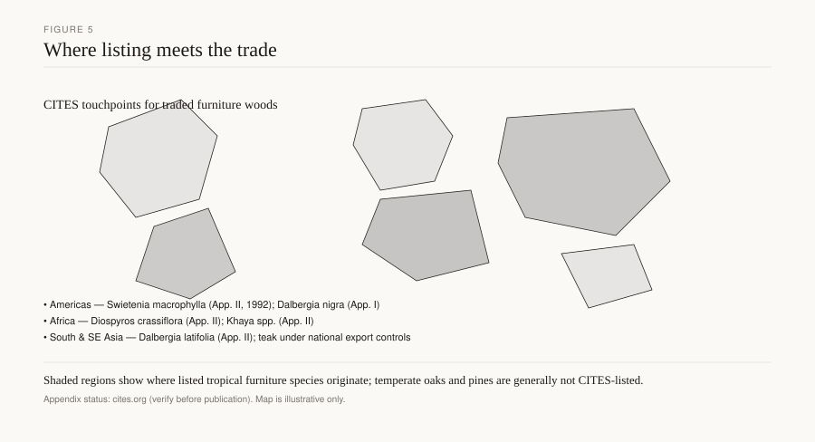

# Padauk as a modernist accent

African padauk arrives in the shop as an argument about color. Fresh heartwood of *Pterocarpus soyauxii* is a deep, almost unreasonable red. Kukachka (FPL-125) called it striking, the sapwood grayish-white and up to eight inches thick, sharply defined. Then light and time pull the red toward brown, the way cherry pulls toward a deeper red-brown, only louder. Modernists who used it as a stripe, a door, a pull, or a chair that was meant to be a flame were borrowing a dye-wood’s manners for furniture. The tree is not a mahogany and not a rosewood. The invoices that called it both were selling a hue.

*Figure 4. Mean Janka hardness and oven-dry density for ten species that anchor this series (USDA FPL / Wood Database means).*

*Figure 5. Illustrative origin regions for CITES-listed furniture timbers; confirm appendix status at publication time (cites.org).*

## What Kukachka measured

*P. soyauxii*: Nigeria, Cameroon, French Equatorial Africa, the Congo. Texture coarse and somewhat uneven; pore lines conspicuous. Grain straight or, more often, interlocking, with a narrow stripe on the quarter. About 44 pounds per cubic foot. Machines remarkably well; finishes and glues easily. Low total shrinkage; little movement in service. In the United States of 1970, utilized only as veneer for decorative purposes.

Compiled Janka for African padauk is commonly given near 1,970 lbf, specific gravity near 0.67–0.75 (Wood Database beside FPL/Kukachka). Figure 4 places that hardness above mahogany (about 800 lbf, SG 0.45–0.50) and in the neighborhood of a hard maple, below the rosewoods (Indian *D. latifolia* compiled near 2,440 lbf; Brazilian *D. nigra* a compilation near 2,790, and Kukachka’s empty table). White oak sits near 1,360 lbf and SG 0.68. Padauk is the hard, stable, coarse-pored red, not the oily palisander and not the carvable *Swietenia* of Bowett’s 1722 lane.

Narra (*P. indicus*) is the Pacific cousin: yellow and red forms, aromatic when fresh, interlocked, ring-porous, a local furniture prestige wood, veneer-grade logs costly on the quarter (Kukachka). Andaman padauk (*P. dalbergioides*) is another trade name in the older English books. Camwood and barwood (*P. tinctorius* and related) are dye woods first. Kosso, *P. erinaceus*, rode into the 2010s as “African rosewood” and onto CITES Appendix II — a different species, a furniture-and-china trade, not this accent wood. Keep the binomials. Figure 5 is the later map; *P. soyauxii* has generally sat outside the rosewood listings `[CITE NEEDED: confirm Species+ status for P. soyauxii at publication]`. *P. santalinus* (red sandalwood) and *P. erinaceus* have not.

## Accent, not carcase — until someone tries

A dye-wood genus tempts a designer to use the heart as a signal: a through-tenon wedge, a door in a pale oak case, a laminated stripe in a table top, a chair that is all one red until it isn’t. That is a modernist habit, not an 18th-century one. Chippendale shops spent Jamaica mahogany in the solid because the Naval Stores Act made it cheap enough to carve (Bowett). They did not stripe it into oak for a color shock. Biedermeier and the pale northern shops used local birch and cherry. Padauk as a flash is a 20th-century idea: aniline was already teaching the eye to want a pure hue, and here was a hue that grew.

I will not invent a particular Gerrit Rietveld or De Stijl commission in padauk. Pin named objects at publication `[CITE NEEDED: a documented modernist piece in Pterocarpus, museum accession]`. What the shop can still say: the wood shows up in studio furniture, in inlay, in mid-century and later pieces that want a red the cherry will not give, and in a lot of turning and knife handles. Kukachka’s “veneer only in the U.S.” is a 1970 trade note, not a law of nature. Solids exist. They are heavy for their size and they will brown.

The browning is the design problem. A padauk accent next to a white maple interior is a different object in year ten. Finish slows the shift; it does not cancel light. Some shops seal the red under a UV-filtering film and still lose the argument near a window. If you want a red that stays, you are in pigment, not in *Pterocarpus*. If you want a wood that starts loud and settles, say so to the client.

## Joinery: a stable, coarse, interlocked member

Low movement is the gift. A padauk door in an oak frame will still move — every hardwood does — but Kukachka’s “little movement in service” is why people try floating panels less carefully than they should. Do not glue a padauk panel tight in a groove. Frame-and-panel remains manners.

Interlock tears under a plane on the quartered stripe. A scraper. Coarse pores drink filler if you want a glass top; they look honest if you oil and leave them open. Glue is friendly for the density class, he says, which is a relief after rosewood’s oil. Dust is still dust; some *Pterocarpus* dusts are irritants `[CITE NEEDED: a named occupational-health note]`. Collect it.

As a wedge or a key in a through tenon, padauk is a hard, visible lock. As a face on plywood, it is a sliced leaf on a core — the same sandwich as crotch mahogany on yellow-poplar, louder. As a molded-ply shell it is rare; birch and the Eames-Aalto line own that hour. A padauk stripe in a laminated bench is a color layer in a structural stack. Name the glue. Count the plies.

A whole chair in padauk is possible and usually a mistake of weight and of color change. The coarse pore will read as oak-loud under a stain someone used to “calm” the red. Let it be padauk or pick another wood. A table top that is a padauk field with maple breadboards is a movement problem dressed as a stripe problem: the field is stable for its density, the maple is not the same species, and the breadboard still needs elongated fasteners. Low movement is not no movement. Hoadley’s geometry still applies.

Piano cases are rosewood and mahogany stories. Boulle is ebony and brass. Padauk does not belong in those contracts except as a later repair someone’s uncle tried. Name that too.

## The name traps

“African rosewood” in the last twenty years often means *P. erinaceus* (kosso), listed, a different trade. “Vermilion” and “padauk” trade across *Pterocarpus* species. “Coralwood” and “mutenye” wander in. Mahogany it is not: no *Swietenia* anatomy, no Bowett statute, a harder, coarser, redder wood. Rosewood it is not: not *Dalbergia*, not the oily Bahia smell, not Appendix I. A stained padauk trying to be palisander is a waste of a red.

Narra in the Philippines and the old East Indies is a prestige furniture wood with its own colonial ledger. Do not flatten it into African padauk because both are *Pterocarpus*. The Pacific tree and the West African tree shared a genus and a dye reputation, not a shop.

Studio furniture after 1970 is where American shops actually met padauk as a solid: a box lid, a banded table top, a turned bowl that was never meant to stay red. The wood machines cleanly enough that a weekend maker treats it as friendly. Then the window does its work. A banded top that was maple-and-flame in year one is maple-and-brown in year twelve, unless someone kept it in a drawer. That is not a defect. It is the species. If the band is a through-stripe, the glue lines will telegraph slightly as the padauk and the maple move their small, different amounts. Kukachka’s low-movement note is comparative, not zero.

Inlay as a modernist accent — a padauk disc in an oak door, a dovetail of red in a pale carcase — wants the same scratch-stock manners as Federal ebony stringing, in a louder hue. Route shallow. Glue clean. Do not let a proud padauk inlay stand above a soft pine ground; the pine will wear, the red will become a ridge, then a snag.

## Law, without pretending this is jacaranda

*D. nigra* is Appendix I. *Dalbergia* spp. went onto Appendix II on 2 January 2017, Annotation #15. Neotropical *S. macrophylla* entered Appendix II on 15 November 2003. Those are the papers in the next bin in the yard. *P. soyauxii* has been the unlisted bright red that shops reached for when they wanted color without a rosewood permit. That can change. Figure 5 and Species+ are the check, not this sentence. *P. erinaceus*, *P. tinctorius*, and *P. santalinus* already demonstrate that the genus is not a free-for-all.

Lacey (2008 amendment) and APHIS Phase VII (1 December 2024) still want a binomial and a country. “Padauk” on a crate is a color. *Pterocarpus soyauxii*, Cameroon, is a specification.

## What to look for

A red that has gone brown in the sun and stayed red inside a cupboard; coarse pores; a stripe on the quarter; a veneer line; an accent in a pale case. On a piece sold as rosewood: weigh it, smell it, look at the pore — padauk is a different contract. On a piece sold as mahogany: too hard, too red, too coarse. On a new “African rosewood” dining table: ask which *Pterocarpus*, and whether it is the listed one.

Arkansas does not grow *Pterocarpus*. Cherry will give you a red-brown that moves with the years and a Janka near 950 lbf (FPL). It will not give you the first-year flame. That is an honest difference. Use padauk as an accent if the papers are clean and the client will live with the brown. Do not use it as a false name for a genus that is already on an appendix.

A turning blank of padauk is how most American shops first meet the wood: a bowl, a handle, a finial. The coarse pore throws tear-out on the end grain of a bowl if the gouge is dull. The red dust stains a bench and will pink a maple board left on top of it. Wipe the bench before you plane the pale wood. That is not a conservation note. It is an ordinary Tuesday in a small shop.

## Sources

Kukachka, FPL-125, *P. soyauxii* and *P. indicus*. USDA FPL-GTR-190. Wood Database compilations for Janka (named as compilations). CITES: App. I *D. nigra*; *Dalbergia* App. II, 2 January 2017, Annotation #15; *S. macrophylla* App. II, 15 November 2003; check *Pterocarpus* listings on Species+. Bowett on mahogany (contrast). USDA APHIS Lacey Phase VII.

See: `brazilian-rosewood-midcentury`, `mahogany-chippendale`, `cites-dalbergia-2017`, `workability-hand-tools`.
