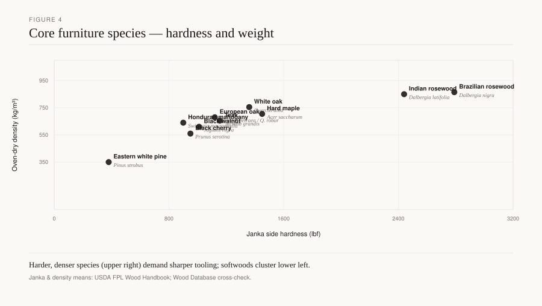
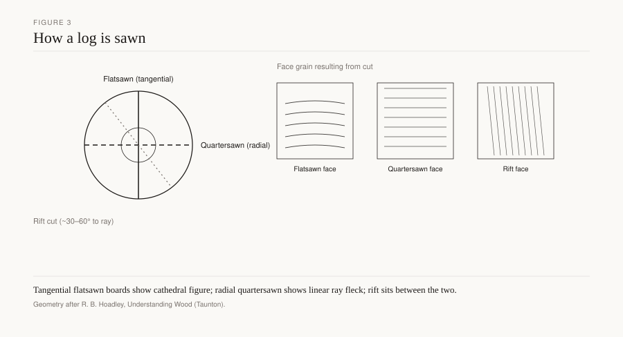

# Walnut and the Queen Anne chair

A cabriole leg ends in a pad foot. The knee may carry a shell. The splat is a solid vase, not yet the pierced lace of a *Director* plate. In London the show wood is still often *Juglans regia*, a veneer on oak or deal, or a solid leg joined to a veneered seat rail. In Philadelphia or the Virginia Piedmont the same silhouette can be *Juglans nigra* in the solid, sap streak and all. Queen Anne is an English reign (1702–1714) and an American style that runs later, into the 1750s. Bowett’s *English Furniture 1660–1714* and *Early Georgian Furniture 1715–1740* are the London books. Winterthur and Hurst and Prown are the American rooms. The chair is one fashion. The fiber is two continents.

*Figure 4. Mean Janka hardness and oven-dry density for ten species that anchor this series (USDA FPL / Wood Database means).*

*Figure 3. Tangential, radial, and rift cuts through a log and the face-grain patterns they produce in finished boards.*

## The famine that will not sit still

Connoisseurs liked a tidy prelude to mahogany: frost, overcutting, a “walnut famine” in the 1720s, then the new wood. Bowett has been cautious. What the port books show after the Naval Stores Act of 1721 (in force 1722) is mahogany becoming cheap enough to carve in the solid. Walnut stays in provincial shops and in American ones. Fashion moved. Ledgers are messier than a famine story. Macquoid’s Age of Walnut ends at 1720 as a London clock. A Boston high chest in black walnut does not read that page.

*Juglans nigra*: FPL-GTR-190, table 5–3a — specific gravity 0.55, Janka 1,010 lbf at 12 percent moisture. Softer than white oak (1,360 / 0.68), kinder than maple, strong enough in the right section for a cabriole that tapers to a pad. The handbook still calls it much valued for furniture. *J. regia* is the greyer, more streaked European cousin, often sliced. Figure 4 places *nigra* among the anchors. Figure 3 is the cut on a solid American leg: a cabriole wants rift or a careful selection so two faces do not flash a cathedral and two stay quiet. A veneered English seat rail can hide a deal core; the knee, if carved, wants solid wood.

Walnut planes, carves, and takes a molding without oak’s trenches. A shell on a knee is a gouge job. The splat — vase, solid, sometimes a simple piercing later in the run — is thinner than an oak splat and thicker than a Chippendale interlaced back. R. W. Symonds argued that mahogany’s strength let chairmakers go more slender still. Bowett quotes him and complicates the credit. The Queen Anne splat is already a walnut idea: a flat, shaped board tenoned into a shoe and a crest, not a joined Gothic tracery.

## London veneer, American solid

English Queen Anne and early Georgian case work continues the Baroque sandwich: walnut face, oak or deal hide. High chests, dressing tables, bureau-bookcases. Cross-banding, herringbone, a herringed edge on a top. The carcase joinery is the same family as 1690, the silhouette slighter, the turnings fewer, the cabriole the new line.

American shops in Philadelphia, New York, Newport, Charleston, and the backcountry built the silhouette in the woods they had. Black walnut was a primary, not a jacket. Cherry and maple took the same forms in New England and Pennsylvania. Southern shops used walnut beside cherry and southern pine (Hurst and Prown). A sap streak on a 1730 American rail is ordinary. Steaming to blend sap and heart is a later mill habit; do not demand it of a period piece.

Winterthur holds the high-style end: a Philadelphia walnut easy chair, a high chest with a broken arch, cabriole knees with shells. County museums hold the country cousins: a pad foot that is a pad, a splat that is a board, a rush seat. Forman’s earlier seating survey stops at 1730; the Queen Anne chair is the next grammar — less turned post-and-rung, more shaped solid.

An easy chair is a test of the knee joint under upholstery. The wings and the loose cushion hide a pine or poplar subframe; the show legs are *nigra*, carved, with a shell that must survive a vacuum cleaner for two centuries. Take the loose seat out if a curator will let you. The corner block, the tenon shoulders, and the secondary species are the shop. Newport’s related work can be finer in the ankle and more willing to drop stretchers. A backcountry Virginia chair keeps the stretcher and a thicker pad. Hurst and Prown’s plates are the place to see that range without collapsing it into one “southern Queen Anne.” The rush-seat cousin — a vase splat, a pad foot, a seat that was recaned or re-rushed twice — is the chair that actually furnished a room. High style is the archive. Rush is the census.

Do not invent a shop price. Chippendale’s *Director* (1754) is already a mahogany book for ambitious plates. Some “Queen Anne” chairs that now wear a London attribution are walnut because the shop still had it, or because the client was provincial. A lens on an unseen rail ends the species argument.

## Joinery

The cabriole is a shaped solid. The knee meets the seat rail in a joint that must take side load: a mortise in the rail, a tenon from the leg, often a glue block in the front corner. Stretchers return on country chairs and drop on high-style ones that trust the joint and the wood. When they drop, a failed glue line is a broken chair. Oak of 1620 would have pinned and stretched. Walnut of 1710 often glues and hopes. Surviving chairs are the ones whose blocks were fitted.

The splat sits in a shoe — a separate piece on better work — and in a crest-rail mortise. The crest may be carved; the ears are fragile. A repaired ear is common. The shoe hides the bottom tenon and gives the splat a finished start. A splat tenoned through the rear rail without a shoe is cheaper work or a later simplification.

Seat frames are mortised. Upholstered seats (drop-in or upholstered over) hide webbing and a pine or deal subframe. Slip seats in walnut-framed chairs can be pine. Rush seats appear on country pieces. A plywood drop-in is a replacement.

Case pieces: dovetailed drawers, deal or pine or yellow-poplar sides in America, oak or deal in England. Dustboards. A “Queen Anne” highboy with fiberboard dustboards was assembled after the form was already a reproduction style. Hand-planed bottoms, bevelled to a groove, are the period test.

Veneer on a cabriole chair is mostly on flat rails and on case work, not on the shaped leg. A carved knee in veneer is a later trick or a break. Solid *nigra* legs in America are the honest version of the line.

Rule-jointed leaves on tables still want room to shrink. Breadboards glued tight across a walnut top split it the same as oak. Buttons and slots at the aprons are the manners.

## Toward mahogany without a neat famine

After 1722 Jamaica wood enters the port books in quantity (Bowett’s thesis and the RFS Naval Stores Act notes). London high style can afford to carve mahogany in the solid. The splat gets thinner and more open. The Queen Anne vase remains in the country and in America, sometimes stained to look like the new wood. A walnut chair with a mahogany stain is a period possibility and a later one. A lens, not a label.

Provincial England kept walnut. So did the American interior, long after Macquoid turned his page. The Chippendale draft takes the statute and the splat. This draft stops at the pad foot and the two walnuts that wore it.

## Conservation

Neither *J. nigra* nor *J. regia* is the CITES problem mahogany became. High-grading of figured logs is the quiet harm. Stolen eastern walnut trees are a documented crime class `[CITE NEEDED: named prosecutions]`. A reproduction “Queen Anne” suite in steamed, even-colored walnut is a modern mill product. Name the steam. A 12 mm veneer on MDF is a kitchen door if sold as such.

Original finishes are thin: oil, wax, a spirit varnish. French polish on a 1710 American chair is often a later gift. Polyurethane is a different object. Sun fade on one leaf of a drop-leaf is a record. Matching it with dye is a choice; disclose it.

Hide glue at the knee block is reversible. A chair that racks wants the block refitted, not a metal bracket on the show face.

## What to look for

Pad foot, vase splat, a shoe, a glue block in the front corner, sap on an American rail, a deal or poplar drawer side, veneer on an English rail and solid on the knee. Stretchers present or absent. An ear that has been replaced. A *Director* piercing on a chair called Queen Anne — that chair has changed reigns.

The English reign was short. The American chair kept the name and the walnut tree that grew in the yard. A pad foot worn flat on the inner edge still points to how the sitter rose. That wear is a census mark. A replaced foot that does not wear is a restoration.

## Sources

Bowett, *English Furniture 1660–1714*; *Early Georgian Furniture 1715–1740*; *The English Mahogany Trade 1700–1793* (duty change vs famine). Macquoid, Age of Walnut. Hurst and Prown, *Southern Furniture 1680–1830*. Forman, *American Seating Furniture, 1630–1730* (the seating culture just before). Winterthur collection practice. USDA FPL, *Wood Handbook*, FPL-GTR-190, table 5–3a. Chippendale, *Director*, 1754/1762 (the next splat). Hoadley, *Understanding Wood*.

See: `walnut-baroque`, `mahogany-chippendale`, `american-colonial-pine`, `intro-500-year-timber`.
