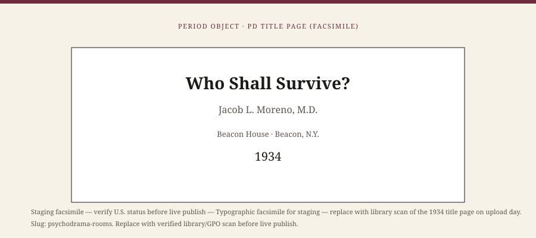

**Educational note.** This is history for a general reader. It is not a diagnosis, not a treatment plan, and not a substitute for care with a licensed clinician.

<!-- figure-id: psychodrama-rooms.lead-period-object -->
<figure class="wow-figure wow-figure--era wow-figure--period-object">
  
  <figcaption>
    <strong>Who Shall Survive?</strong> (1934) — Moreno's stage, audience, and the 1934 book that named sociometry.
    PD period object (facsimile for staging). Staging facsimile — verify U.S. status before live publish. See <code>assets/era/psychodrama-rooms/RIGHTS.md</code>.
  </figcaption>
</figure>

Jacob Levy Moreno liked a stage. He also liked a fight. In Vienna after the First World War he organized the Theatre of Spontaneity — evenings in which a scene was not rehearsed so much as dared. In the United States, after he arrived in 1925, he built Beacon, a small empire of journals, a sanitarium, and a method he named as if he had invented the human being: psychodrama, sociometry, group psychotherapy. He would spend decades insisting that S. R. Slavson's AGPA circle had stolen a word and missed a revolution.

This essay is part of a WOW Therapies series on the history of group therapy. It is a history of rooms. It is not a lesson in role reversal, doubling, or the empty chair. Those techniques have teachers. This site is not one of them.

## Vienna, a newspaper, and a claim

Moreno was born in 1889 (Bucharest is the usual city; the family story moves). He studied medicine in Vienna, wrote, provoked, and ran spaces that looked more like cabaret than clinic. The Theatre of Spontaneity asked strangers to play. The later myth says he discovered that play could heal. The plainer file says he discovered that a public who had just survived a war would pay attention to unrehearsed life. Healing was one of the words he used. Theater was another. Religion — a private cosmology of encounter — was a third. Readers who want a single secular inventor will be disappointed. Moreno did not want to be secular or single.

Sociometry, which he developed as a way of mapping who chooses whom in a group, looked like science to some mid-century Americans and like a parlor diagram to others. *Who Shall Survive?* (1934) is the book a historian can put on the table. It is grandiose. It is also an attempt to count something clinicians still fumble: attraction, rejection, the invisible seating chart. A later research tradition would try to measure cohesion with questionnaires. Moreno wanted a diagram that could be acted.

## Beacon, and the American quarrel

Beacon, New York, became the address. Beacon House published. The sanitarium took patients. Visitors came to see a method that used a stage, auxiliaries, a protagonist, and an audience that was not allowed to be only an audience. Zerka Toeman, later Zerka T. Moreno, entered that world as a student and collaborator and, after 1949, as his wife; her own essay in this series is not a footnote. She kept the method alive after 1974 in a way his self-myth could not.

The American quarrel with Slavson was jurisdictional and temperamental. Slavson, at the Jewish Board of Guardians, wanted children's activity groups, psychoanalytic respectability, and a professional association that psychiatrists would join. Moreno wanted the word *group psychotherapy* and a universe in which the stage was more honest than the couch. Both men wrote as if the other were a threat to the young. AGPA's early decades leaned Slavson. Psychodrama built its own institutes, trainers, and a parallel world that still exists.

A heritage series that picks a winner is doing fandom. Both rooms mattered. Hospitals that never owned a stage still borrowed Moreno's words: role, encounter, here-and-now. Process groups that never admitted a protagonist still used an audience. The theft, if it was theft, went both ways.

## What a psychodrama room is, historically

It is a room that admits it is doing something. The chairs face a space that can become a kitchen, a grave, a boss's office. The leader is a director. The group lends bodies. The protagonist lends a night. Consent, in the later ethical literature, is a problem this early file does not solve to a contemporary standard. People were asked to play their mothers in front of strangers. Some found it a relief. Some found it an ambush. Lieberman's later encounter-group research (1973) is not about psychodrama proper, but it is a cousin warning: heat in a group is not automatically help.

Moreno also worked in prisons, schools, and communities, mapping choices. Sociometry as a research tool and sociometry as a charismatic practice are easy to confuse. The first can be a quiet questionnaire. The second can become a public ranking. Historians should keep the two apart. This series will not teach either.

## Why a clinic still reads this

Because every therapy group has a stage, even when the furniture denies it. Someone is on. Someone is the chorus. Someone is waiting to be cast as the difficult one. Moreno named the theater that other traditions pretend is only conversation. A clinician who has never watched a psychodrama can still use the naming: this comment was an aside; that silence was a refused role.

Because the profession's origin stories are a fight. Pratt, Slavson, Moreno, Foulkes — each has a constituency. A small-city clinic that tells only the Yalom story has chosen the textbook that residency programs already own. That is a fine choice if it is a choice. It is a poorer choice if it is ignorance of Beacon and of the children's rooms on the other side of the fight.

The next essays leave the stage and enter a military hospital near Birmingham, where the group was a ward and a war.

## Words that escaped the stage

*Role*, *encounter*, *here-and-now*, *warm-up*, *auxiliary* — a later process group can use four of those five without ever admitting a protagonist. (This series will not define a warm-up as an exercise. The word is listed because it traveled.) Sociometry escaped into organizational consulting and into classrooms that asked children to name whom they would sit with. The classroom use has a research history and a cruelty history. Ranking children in public is not a game this site will reconstruct.

Moreno founded journals the way other men founded clinics: *Sociometry*, later titles, a stream of house organs that kept the method visible when AGPA's journal would not. The fight over the phrase *group psychotherapy* was a fight over a dictionary and over students. Students went where the training was. Psychodrama built trainers. AGPA built a membership committee. Both are professions. Neither owns the circle.

European psychodrama after 1945 — institutes in Germany, France, the Mediterranean — is a separate map this short essay will not fake. Marineau's biography is a door. House websites are not sources for dates you would print without a second check. Mark `[VERIFY]` before you put a founding year for a national institute on a public page.

What a small-city clinic can do with Beacon is limited and honest. It can stop saying "Moreno invented group therapy." It can notice when a group has cast someone as a villain and is enjoying the play. It can refuse to run a technique it was not trained to hold. Refusal is part of heritage too.

## Sources

Moreno 1934 and the Beacon House *Psychodrama* volumes from 1946; Marineau 1989 for a biography that is not a house organ. Zerka Moreno's 2012 memoir is a primary source for the later decades; treat it as memoir. Slavson 1943 and AGPA histories are the other side of the quarrel.

*WOW Therapies educational series. Group-therapy heritage only. Complementary to the individual psychotherapy history pack and to SLPWOW speech-pathology history.*
