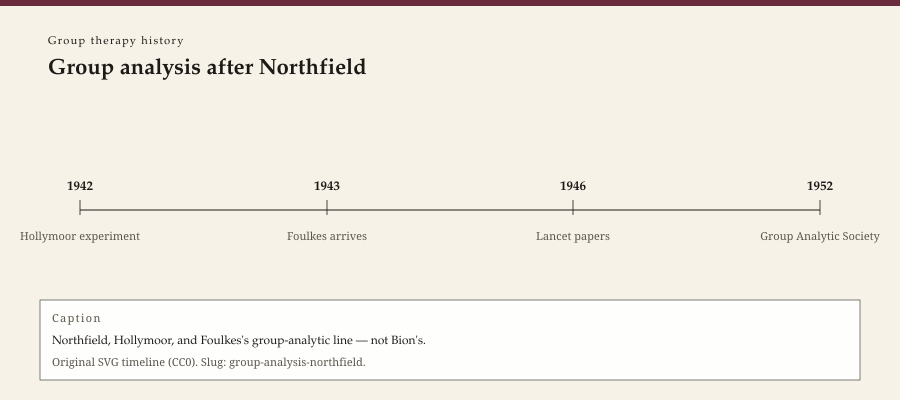

**Educational note.** This is history for a general reader. It is not a diagnosis, not a treatment plan, and not a substitute for care with a licensed clinician.

<!-- figure-id: group-analysis-northfield.lead-timeline -->
<figure class="wow-figure wow-figure--era">
  
  <figcaption>
    <strong>Group analysis after Northfield</strong> — Northfield, Hollymoor, and Foulkes's group-analytic line — not Bion's.
    Original editorial timeline (CC0). No AI-generated faces.
  </figcaption>
</figure>

Hollymoor Hospital, in Northfield on the edge of Birmingham, was a large brick complex the British Army used as a military neurosis centre. In the autumn of 1942, psychiatrists were asked to do something with men who could not, or would not, return to duty as they were. The something became two experiments that later group analysts still argue about as if they were present.

This essay is part of a WOW Therapies series on the history of group therapy. It is not a group-analytic manual. It does not teach a conductor how to sit.

## The first experiment, and a six-week bruise

Wilfred Bion and John Rickman ran what historians call the first Northfield experiment: a ward treated as a group whose task was to study its own tensions. They published in *The Lancet* in 1943, "Intra-Group Tensions in Therapy." The army, which had wanted men repaired for war, was not uniformly grateful. The experiment lasted on the order of six weeks. Accounts differ on whether it was closed for being too disturbing, too insubordinate, or simply too early. Tom Harrison's later book is the place to watch the disagreements rather than a textbook sentence that says "the army shut it down."

What survived the bruise was a sentence: the study of the group's tensions *is* the treatment. That sentence would travel farther than the ward. It would also be mistaken for a claim that a group has no job but to talk about itself. Bion and Rickman were in a military hospital. The job, officially, was still the war.

## The second experiment, and a longer cast

S. H. Foulkes — born Siegmund Heinrich Fuchs in Karlsruhe, a Frankfurt analyst before exile — arrived in 1943 as a specialist psychiatrist. He had already been thinking about groups. Northfield gave him a hospital. With Thomas Main, Harold Bridger, Patrick de Maré, and others, the second experiment treated not only a ward but the institution: staff meetings, activities, the idea that the hospital itself could be the treatment. Main would later call such a place a therapeutic community. Bridger would carry the organizational half into peacetime industry. Foulkes would carry the small-group half into a civilian profession.

Foulkes published "Group Analysis in a Military Neurosis Centre" in *The Lancet* in 1946 and *Introduction to Group-Analytic Psychotherapy* in 1948. He wrote of a conductor rather than a leader, of a group as a matrix in which every remark is a communication to more than one person, of analysis *through* the group rather than of a patient who happens to have neighbors. The vocabulary is his. Students still learn it as if it were weather.

He was not Bion. Historians who collapse the two into "Northfield" lose the quarrel. Bion's later *Experiences in Groups* (1961) is a theory of basic assumptions and a prose that does not comfort. Foulkes's group analysis is a practice that wants the group to become the therapist. They shared a hospital and a war. They did not share a temperament.

## After the uniforms

When the war ended, the cast scattered. Foulkes and colleagues built the Group Analytic Society (1952) and later the Institute of Group Analysis in London. *Group Analysis*, the journal, became a house organ and a quarrel organ. de Maré would push toward larger rooms (his own essay is later). Pines would become an editor of the memory. Main went to the Cassel. Bion went, eventually, into a late style that left groups for a more private psychoanalysis, though the early papers never stopped being read.

Northfield the building returned to civilian psychiatry and then to the fate of many asylums: closure, reuse, a conference now and then in the old rooms. The method did not close. It became, in Britain and then abroad, one of the two or three ways a serious person could say "group" without meaning an encounter weekend.

## Why a clinic still reads this

Because a county clinic that has never heard of Hollymoor still inherits a question Northfield made unavoidable: is the group a collection of patients, or is the group the patient? American textbooks often answer with Yalom's interpersonal learning. British group analysis answers with the matrix. A reader does not have to join a school to hear that the answers disagree.

Because war is an honest motive. These rooms were not founded to grow the self. They were founded to return soldiers to a machine. That origin does not invalidate the later civilian hour. It does forbid a pious story in which group therapy springs only from kindness.

The next essay stays with Bion long enough to name the basic assumptions, then leaves him before he becomes a poster.

## What the 1948 book is, and is not

*Introduction to Group-Analytic Psychotherapy* is a short book written while the war was still in the furniture. Foulkes describes groups at Northfield and then the civilian translation. He writes of the conductor who does not make a speech, of the group as the more important physician, of free-floating discussion rather than a set topic. Later handbooks turned those sentences into rules. The 1948 sentences were closer to field notes: this is what we did when the hospital would let us.

He had already published, with Eve Lewis in 1945, "A Study in the Treatment of Groups on Psycho-Analytic Lines" in the *British Journal of Medical Psychology*. The hyphenated adjective is a claim: this is analysis, not a lecture, not a revival, not Moreno's stage. The claim was aimed at colleagues who thought a group was a watering-down. It was also aimed, silently, at Bion's bleaker animal. Foulkes wanted a group that could become, in his word, a matrix — a communicating network in which a remark to one person is a remark to all.

Harold Bridger's 1946 note on "the Northfield experiment" and Bion's 1946 "leaderless group project" are the other primary pages. They do not agree in tone. Bridger is interested in the hospital as an organization that can use activity and responsibility. Bion is interested in the tensions a group will produce if you let it. Main, who stayed with the hospital-as-community idea, would write "The Ailment" in 1957 about what staff do to patients when they cannot bear the work. That paper is a later document. Its root is this wartime permission to treat the institution as the case.

Civilian London after 1945 was not Hollymoor. The Group Analytic Society (1952) and the Institute of Group Analysis (1971 is the usual teaching-institute date; `[VERIFY]` against IGA's own file before you print a founding plaque) turned a military improvisation into a profession with a journal, a training, and a house style. House styles age. The 1943–46 file does not. It remains the moment when British psychiatry admitted, in *The Lancet*, that a group could be the treatment and not only the waiting room.

A Southeast Arkansas clinic will not become the IGA by reading Foulkes. It can still hear the question he took from the hospital: if you stop lecturing, what does the room do? The answer is not a technique. It is a reason to be trained, supervised, and unwilling to sell the circle as a cheaper hour.

## Sources

Foulkes 1946, 1948; Bion and Rickman 1943; Harrison 2000. Main 1957 belongs to the therapeutic-community essay and to Main's figure piece. Wellcome holds Foulkes papers; catalogue records are not a license for photographs.

*WOW Therapies educational series. Group-therapy heritage only. Complementary to the individual psychotherapy history pack and to SLPWOW speech-pathology history.*
