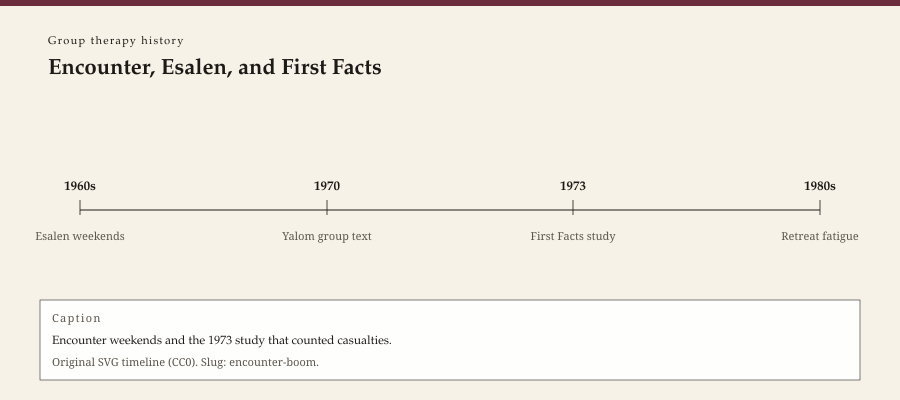

**Educational note.** This is history for a general reader. It is not a diagnosis, not a treatment plan, and not a substitute for care with a licensed clinician.

<!-- figure-id: encounter-boom.lead-timeline -->
<figure class="wow-figure wow-figure--era">
  
  <figcaption>
    <strong>Encounter, Esalen, and First Facts</strong> — Encounter weekends and the 1973 study that counted casualties.
    Original editorial timeline (CC0). No AI-generated faces.
  </figcaption>
</figure>

By the late 1960s an American who wanted a group did not have to find a clinic. Weekend marathons, church basements, university extras, and the more famous addresses — Esalen Institute at Big Sur among them — offered encounter: a circle that would, the advertising implied, strip a false self in two days and return a truer one to the parking lot.

Carl Rogers wrote *On Encounter Groups* in 1970, the same year Irvin Yalom published *The Theory and Practice of Group Psychotherapy*. The two books did not want the same reader. Rogers was willing to sound like a believer in process. Yalom was writing a craft book for residents who would inherit process groups whether they believed or not. Between them, and around them, a market grew.

This essay is part of a WOW Therapies series on the history of group therapy. It will not teach a marathon. It will not name a local retreat as a prescription.

## Heat as a product

Encounter borrowed from T-groups, from psychodrama's appetite for the unrehearsed, from humanistic psychology's faith in regard, and from a decade that already distrusted institutions. Leaders varied. Some were licensed clinicians. Some were charismatic people with a weekend certificate and a taste for other people's secrets. The difference was not always visible in the brochure.

Esalen, founded in 1962 by Michael Murphy and Dick Price, was a place, not a method. Gestalt, sensory work, and visiting names passed through. To blame Esalen for every basement marathon is like blaming Vienna for every couch. To ignore Esalen is to ignore where the cameras went. This series will not reconstruct exercises. The historical fact is enough: Americans paid to sit in rooms that promised transformation and sometimes delivered humiliation.

William Schutz's *Joy* (1967) and other period books sold openness as if it were a vitamin. The prose is dated in a way that still teaches. A culture that had just begun to talk about feelings in public was willing to industrialize the talk.

## First Facts

Morton Lieberman, Irvin Yalom, and Matthew Miles published *Encounter Groups: First Facts* in 1973. They had studied a set of groups, with different leaders and styles, and they had looked for casualties as well as benefits. The book is not a sermon. It is a research monograph that refused the brochure. Some participants improved. Some were unchanged. Some were worse — the word *casualty* is theirs, and it was meant to be ugly.

Leaders mattered. Aggressive, intrusive styles correlated with more harm in their sample. That sentence has been repeated so often it sounds like folklore. It was an empirical claim about particular groups in a particular study. Later reviewers have argued about measures and generalizability. They have not made the casualties disappear.

The book also punctured the idea that "more feeling" is a dose-response curve. A group can be hot and useless. A group can be quiet and useful. Heat is not a virtue. It is a temperature.

## After the boom

The fashion receded. Insurance, licensure, and a more cautious university left the marathon to niches. Process groups in clinics continued, often shorter, often with screening that the weekend world had treated as a buzzkill. The humanistic claim — that a person already has a tendency toward health if the conditions are right — survived in gentler forms. The corporate offsite survived as a farce of the T-group. The therapy group survived as a job.

A fair history does not smirk at everyone who went to Big Sur. Some people were lonely in a way a lecture could not reach. A fair history also does not recycle the smirk's opposite: that the boom was a renaissance the profession later betrayed. The profession later counted. Counting is the adult act.

## Why a clinic still reads this

Because patients still arrive with stories of a weekend that "opened them up" or a circle that scapegoated them. Those stories have a decade. 1968–1975 is not the only decade, but it is the one that published both the promise and the body count.

Because a small-city practice that offers a group is not offering Esalen. Saying so is not snobbery. It is a historical distinction: closed membership, a licensed clinician, a chart, a stop time. The boom taught, by disaster as much as by success, why those boring things exist.

The next essay leaves the paid weekend and enters a fellowship that refused to be called therapy at all.

## Stanford, and a study that refused the brochure

Lieberman, Yalom, and Miles did not write from Big Sur. They wrote from a research project that assigned people to different kinds of encounter groups — including, in their design, leaders of several schools — and then looked at who was better, the same, or worse afterward. The sample is not the whole country. It does not have to be. It is the first widely cited attempt to treat the boom as a set of outcomes rather than as a vibe.

Their "casualty" was not a person who had a hard Tuesday. It was a person who was, by the study's measures and clinical follow-up, harmed in a lasting way. Leaders who pushed hard, who attacked, who confused heat with work, showed up more often in those files. The finding is ugly because the brochures had been pretty. A heritage series that skips it is doing the brochure's job.

Rogers's 1970 book is more hopeful. He had already been filming and facilitating large groups, including political encounters that later viewers still argue about. The individual-history pack can keep the 1957 conditions and the Gloria film. This pack keeps the fact that a founder of the individual hour also blessed a public circle whose rules were thinner than a clinic's. Blessing is not the same as a protocol. This page will not reconstruct his groups.

Esalen remained a place people went. The cameras moved on. Clinics kept offering weekly groups with doors that locked from the inside in the ordinary way: a start time, a stop time, a chart. The boom's gift to those clinics, if a disaster can be a gift, was a vocabulary for harm. Scapegoat. Leader intoxication. The member who is opened and then abandoned in a parking lot. Those are historical objects. They are also why a small-city practice that never ran a marathon still writes a consent form.

Arthur Janov's primal work, nude marathons, and other period fashions sat at the edge of this boom and sometimes in its advertising. This series will not reconstruct them. Naming that the edge existed is enough. A history that only mentions Rogers and Yalom has cleaned the decade for a syllabus. The decade was louder, cheaper, and more willing to sell a personality in a weekend than a syllabus likes to admit.

## Sources

Lieberman, Yalom, and Miles 1973; Rogers 1970; Yalom 1970. Schutz 1967 as a period document. Esalen institutional dates: 1962 founding. For T-group ancestry, see the Bethel essay.

*WOW Therapies educational series. Group-therapy heritage only. Complementary to the individual psychotherapy history pack and to SLPWOW speech-pathology history.*
