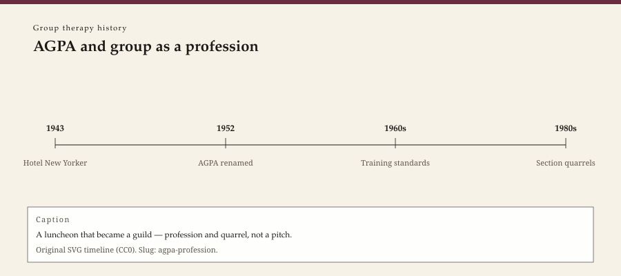

**Educational note.** This is history for a general reader. It is not a diagnosis, not a treatment plan, and not a substitute for care with a licensed clinician.

<!-- figure-id: agpa-profession.lead-timeline -->
<figure class="wow-figure wow-figure--era">
  
  <figcaption>
    <strong>AGPA and group as a profession</strong> — A luncheon that became a guild — profession and quarrel, not a pitch.
    Original editorial timeline (CC0). No AI-generated faces.
  </figcaption>
</figure>

In February 1943, at the American Orthopsychiatric Association's annual meeting in New York, two sessions were given to group therapy. Lawson G. Lowrey chaired. S. R. Slavson, Nathan W. Ackerman, Harris B. Peck, and two clinical social workers, Helen Glauber and Dorothy Spiker, spoke. With Lowrey's approval, Slavson chalked a note on the registration-desk blackboard inviting anyone specifically interested in group therapy to a luncheon at the Hotel New Yorker, where the conference was being held. About fifty people came. It was decided, there, to create an organization. The logo later emblazoned 1942. The meetings the association's own historians can document were 1943.

This essay is part of a WOW Therapies series on the history of group therapy. It is a history of a guild. It is not a membership pitch, not a training advertisement, and not a claim that a small-city clinic must belong to anyone. The individual psychotherapy-history pack keeps other guilds (APA, analytic institutes). This pack keeps the one that tried to make the circle a profession.

## June 16, 1943, and a steering committee

The first organizing meeting took place on June 16, 1943, at the Jewish Board of Guardians, Slavson's employer. Aims were sketched. A steering committee was elected to draft a constitution: Ackerman, Saul Bernstein, Elizabeth Hobbie (standing in for Lowrey), George Holland, G. Pederson-Krag, Peck, and Slavson. Slavson was asked to write the draft. Scheidlinger and Schamess, in "Fifty Years of AGPA 1942–1992" (*International Journal of Group Psychotherapy*, 1992), noted the committee's mix as a forecast: several psychiatrists, one social group worker. The young organization would spend years deciding whether it was a big tent for people who work with groups or a narrow tent for people who do psychotherapy.

A November 1943 meeting, again at Slavson's office, drew about twenty people, half from the Jewish Board. The enacted constitution named the American Group Therapy Association. Membership was restricted to psychiatrists, psychologists, and psychiatric caseworkers with postgraduate supervised practice — or, without those credentials, longer supervised experience "with psychiatrists participating." Slavson became the first president. The next twelve presidents were psychiatrists. Scheidlinger and Schamess read that sequence as Slavson's wish to attach a new interdisciplinary shop to psychiatry's prestige. A special invitation went to members of the American Psychiatric Association. The social workers who had actually been in the children's rooms were already, in the bylaws, guests of a medical story.

Temple Burling, a psychiatrist who served as president, resigned in 1947 rather than accept Slavson's restriction of membership to trained psychotherapists. His note, as later quoted in AGPA histories, said it was group dynamics that did the therapy, not the skilled use of psychotherapy. The quarrel — dynamics versus treatment, tent versus guild — did not end with the letter. It is still the quarrel between a T-group trainer, a social group worker, and a psychoanalyst who all say they "run groups."

## 1951, a journal; 1952, a name

Slavson edited a bulletin until the *International Journal of Group Psychotherapy* appeared in April 1951, with Lewis Loeser as editor. Calling a national organ "international" was, among other things, a move in the long fight with J. L. Moreno, whose own journals and institutes already claimed the world. The first issue described the association as professional persons studying and encouraging sound practice in group psychotherapy: psychiatry, psychiatric casework, clinical psychology. Contributors did not have to be members. The journal became the guild's window and its quarrel organ. Slavson remained a de facto editorial power into the early 1960s. His Jewish Board office was the association's headquarters until he retired from the agency in the mid-1950s.

In 1952 the organization was incorporated under New York law and renamed the American Group Psychotherapy Association. "Therapy" to "psychotherapy" is a one-word history of aspiration. Membership had grown from some sixty people in 1944 to a few hundred. In 1953 the board, still courting psychiatrists, made physicians eligible without the supervised-experience requirement asked of psychologists and social workers. The double standard is not a rumor. It is in the institutional narrative Scheidlinger and Schamess summarized.

A training institute attached itself to the annual conference in 1957 (Milton Berger and Maurice Linden), two hundred registrants. Affiliate societies spread — Delaware Valley, Eastern, Louisiana, New Jersey, and others by the late 1950s — and immediately wanted autonomy Slavson did not trust. He had already been chairman of the administrative committee for a decade after his presidency. Founders who cannot stop founding become the association's first chronic problem. Younger presidents pushed back. Board meetings, in the mid-1950s accounts, were not polite.

## What the guild included, and what it would not

Slavson never hid his preference for a Freudian group therapy, children's activity rooms included. For more than two decades that preference, plus membership rules, isolated AGPA from psychodrama's institutes, from Moreno's word *group psychotherapy*, from some of social group work, and from the humanistic circles that would later embarrass the guild by becoming famous. Alexander Wolf, Helen Durkin, Hyman Spotnitz, and others built American analytic-group crafts inside or beside the association. Foulkes and Bion were names in the journal, not bosses of it. The 1954 attempt at an international conference with Moreno's world collapsed on the old personal-professional feud.

The 1960s changed the census. Community mental health centers needed groups faster than AGPA could mint conductors (see the TC/CMHC essay). Encounter weekends made "group" a magazine word (see the encounter essay). Clifford Sager's presidency from 1968 pushed the association toward community services. In 1970 Emanuel Hallowitz, a social worker, became the first nonmedical president since Slavson. Henriette Glatzer became the first woman president in 1976. A women's task force followed the wider movement. Alonso and Rutan's "Women in Group Therapy" (1979) is a dated marker inside the journal, not a how-to.

By the 1980s, after membership dips and a more plural board, AGPA opened further to models it had once treated as rivals. Scheidlinger and Schamess's closing chapters describe an "umbrella" that had decided single-school zeal was clinically limited and politically out of date. That sentence is an institutional self-report from 1992. It is not proof that the umbrella covered everyone. It is proof the guild had noticed the weather.

## Why a clinic still reads this

Because "group therapist" is a job that had to be invented, staffed, and defended against people who ran groups without wanting the job. Pratt did not need AGPA. AA refused it. CR groups mocked the premise. Encounter leaders sometimes billed themselves as more alive than a member. The association's early exclusivity looks snobbish until one remembers Lieberman, Yalom, and Miles counting casualties in 1973. Standards are a fence. Fences keep people out. They also, sometimes, keep a method from becoming a weekend injury.

Because the profession's origin is a luncheon, a child-guidance agency, and a fight about psychiatrists. Not a mythic sole inventor the guild can put on a poster, but a blackboard at the Hotel New Yorker and a June meeting at the Jewish Board of Guardians. Origin stories that start with Pratt, or Moreno, or Yalom, are choosing a different ancestor. Choice is allowed. Amnesia is not.

Because this is history of a guild, not a manual for becoming a member, not a fee schedule, and not a substitute for a licensed clinician. WOW Therapies is a practice brand that publishes heritage education. It is not AGPA, and these pages are not a chapter newsletter.

The next essay leaves the bylaws and enters the books that tried to count what a group does: Yalom's factors, *First Facts*, cohesion reviews, and Jerome Frank's older argument that persuasion is the common engine.

## Sources

Scheidlinger and Schamess 1992 (*IJGP* 42: 1–22) is the backbone; check dates against it rather than against the logo's 1942. AGPA's own history pages are institutional narrative. Slavson 1943 for the book on the luncheon table. *IJGP* vol. 1, no. 1 (April 1951), Loeser editor. Pattison's earlier AGPA histories are cited inside Scheidlinger; use them as secondary. Moreno's side of the feud is the psychodrama essay.

*WOW Therapies educational series. Group-therapy heritage only. Complementary to the individual psychotherapy history pack and to SLPWOW speech-pathology history.*
