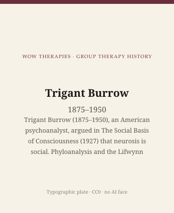

**Educational note.** This is history for a general reader. It is not a diagnosis, not a treatment plan, and not a substitute for care with a licensed clinician.

<!-- figure-id: trigant-burrow.lead-plate -->
<figure class="wow-figure wow-figure--portrait wow-figure--portrait-typographic">
  
  <figcaption>
    <strong>Trigant Burrow</strong> (1875–1950) — Trigant Burrow (1875–1950), an American psychoanalyst, argued in The Social Basis of Consciousness (1927) that neurosis is social. Phyloanalysis and the Lifwynn Foundation — early theory, not a protocol.
    <em>Typographic plate — no likeness embedded.</em>
    Original editorial plate (CC0). See <code>plates/trigant-burrow/RIGHTS.md</code>.
  </figcaption>
</figure>

In 1927 Harcourt, Brace in New York and Kegan Paul in London issued Trigant Burrow's *The Social Basis of Consciousness*. The book told the psychoanalytic century something it did not want to hear: that the trouble called neurosis was not only a private drama inside one person, and that the analytic pair was too small a sample of human life. The same year he published "The Group Method of Analysis" in *The Psychoanalytic Review*. He had already been president of the American Psychoanalytic Association. Within a few years the association would ask him to leave. `[VERIFY]` sources disagree on 1932 versus 1933 for the resignation-as-expulsion; the fact of the breach is not in doubt.

This essay is part of a WOW Therapies series on the history of group therapy. It is a life of an American analyst who got to social theory early and to a following late. Phyloanalysis and the Lifwynn Foundation are historical names. They are not a method this page will teach. Some of his terms are marked `[VERIFY]` because house vocabularies drifted, and because later admirers have claimed more for him than the file will bear.

## Norfolk, Jung, a founding

Nicholas Trigant Burrow was born on 7 September 1875 in Norfolk, Virginia. He studied literature at Fordham, medicine at the University of Virginia (M.D., 1900), and experimental psychology at Johns Hopkins (Ph.D., 1909), with a dissertation on attention. Adolf Meyer, then the American face of a scientific psychiatry, was a teacher. In 1909, around the Clark University lectures, Abraham Brill introduced him to Sigmund Freud and Carl Jung. Burrow took his family to Zurich for a year's analysis with Jung — a costly year, and one he later cited as making him the first U.S.-born person to study psychoanalysis in Europe. Treat that "first" as his pride and as a period claim.

He returned to Baltimore, practiced, and in 1911 joined Ernest Jones and others in founding the American Psychoanalytic Association. Between 1911 and 1918 he published a run of papers on infant-mother unity, a "preconscious" that was not quite Freud's, and the mother as "love subject" rather than object. When Freud and Jung split, Freud invited him to Vienna for analysis. Burrow declined. He later offered Freud refuge in Baltimore if the European war required it. Correspondence exists in the 1958 selected letters. The friendship did not survive Burrow's next turn.

## Shields, a group, a name

In 1918 Clarence Shields, an analysand, challenged the gap between Burrow's talk of mutuality and the authoritarian structure of the hour. Burrow, by his later account, took the challenge as data. He experimented with reversing the chairs: analyst and patient swapping positions. The experiment is easy to romanticize. It was also, by the reports of Burrow and Shields, tense enough that people wanted to flee. By the early 1920s students had joined. A household in Baltimore took meals in common. Physicians, nurses, business people. In 1927 he closed his psychoanalytic practice, resigned from the university as Meyer required, and became scientific director of the Lifwynn Foundation for Laboratory Research in Analytic and Social Psychiatry.

The founding year of Lifwynn is a `[VERIFY]`. Some accounts say 1922; some say 1926; 1927 is when Burrow's public practice ended and the foundation's name is solid in the record. The foundation still exists. Its materials have their own terms. They are not a web license for photographs.

He called the later work **phyloanalysis**: analysis at the level of the phylum, the species, a "social neurosis" in which the "I"-persona of everyday life was already a group symptom. The vocabulary is his, and it is easy to make fun of. Otto Fenichel, speaking for a more orthodox psychoanalysis, treated phyloanalysis as inspirational pressure rather than analysis. Freud did not accept the work as a legitimate extension of his own. Burrow thought it was. That disagreement is the history.

He also wrote *The Structure of Insanity* (1932), *The Biology of Human Conflict* (1937), and *The Neurosis of Man* (1949). He measured physiological accompaniments of attention and conflict; later writers have connected that laboratory to biofeedback and even to trauma therapies Burrow never named. Those connections are `[VERIFY]` at best and, in the stronger versions, a category error. This series will not make him a secret inventor of a later brand.

D. H. Lawrence read him with respect. John Dewey, W. B. Cannon, Kurt Goldstein, and, later, Eric Berne said kind or priority-granting things from outside the psychoanalytic club. Inside the club, the amnesia was thorough. Foulkes in Frankfurt could still find the papers. Many American group therapists could not.

He died on 24 May 1950. *Science and Man's Behavior* appeared posthumously in 1953.

## What this life is not

It is not a protocol for mutual analysis, household living, or "cotention." History may record that a Baltimore group ate together and studied their own tensions. History may not invite a reader to try it.

It is not a neat American origin of group analysis. Foulkes built the British profession. Burrow built a foundation and a stack of books the profession half-forgot. "Alongside Pratt and Schilder" is the kind of honorary triad later encyclopedias print. Pratt ran a tuberculosis class. Schilder ran hospital groups and wrote *Psychotherapy*. Burrow argued that the pair was the wrong unit. Three different objects.

It is not a story in which Freud secretly agreed. He did not. The letters and the expulsion are the evidence.

## Portrait

No clean public-domain still. Type only, plus a 1927 title page if a public-domain scan of the *page* exists. Lifwynn Foundation materials have their own terms. Do not generate a face.

## Why a clinic still reads this

Because every serious group theory has to decide whether the person is the unit or the group is. Burrow answered early, loudly, and at a cost. Later interpersonal, relational, and group-analytic writers often discovered a social unconscious without filing his name. That amnesia is itself a piece of group history: a guild forgetting the member who said the guild was the symptom.

Because "social neurosis" is a dangerous phrase if it becomes a diagnosis of everyone. Burrow used it as a species-level claim. A clinic that borrowed it as a way to tell a patient their culture is their disease would be doing propaganda. The useful inheritance is smaller: the analytic pair is not the only sample of a life, and a room of people will show what a couch can hide.

Because forgotten founders attract rescue missions. Some of the rescue is fair. Some of it overclaims. Marking `[VERIFY]` is the adult habit. Burrow, who wanted laboratory honesty about attention, would recognize the habit even if he hated the brackets.

The next essay leaves the foundation for a Viennese neurologist at Bellevue who put body image and hospital groups into a 1938 book, and who was dead by the end of 1940.

## Sources

Burrow 1927 (book and *Psychoanalytic Review* paper); later books named in the text. *A Search for Man's Sanity* (1958) for letters. E. Gatti Pertegato and G. Pertegato's later documentary work, and Nick Drury and Keith Tudor (2022), for the biographical sequence; where they disagree with Wikipedia on Lifwynn's year and the APA date, the article marks `[VERIFY]`. Foulkes's Frankfurt reading of Burrow is in the Foulkes biographical record. Do not cite later EMDR or "trauma therapy" origin claims; they are not established.

*WOW Therapies educational series. Group-therapy heritage only. Complementary to the individual psychotherapy history pack and to SLPWOW speech-pathology history.*
