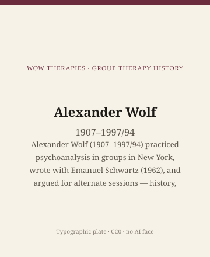

**Educational note.** This is history for a general reader. It is not a diagnosis, not a treatment plan, and not a substitute for care with a licensed clinician.

<!-- figure-id: alexander-wolf.lead-plate -->
<figure class="wow-figure wow-figure--portrait wow-figure--portrait-typographic">
  
  <figcaption>
    <strong>Alexander Wolf</strong> (1907–1997/94) — Alexander Wolf (1907–1997/94) practiced psychoanalysis in groups in New York, wrote with Emanuel Schwartz (1962), and argued for alternate sessions — history, not a method to copy.
    <em>Typographic plate — no likeness embedded.</em>
    Original editorial plate (CC0). See <code>plates/alexander-wolf/RIGHTS.md</code>.
  </figcaption>
</figure>

*No licensed still. Type only: Alexander Wolf, 1907–1994 `[VERIFY]` (a New York Times paid notice dates his death to 25 September 1997).*

In 1962, Grune & Stratton published *Psychoanalysis in Groups*, by Alexander Wolf and Emanuel K. Schwartz. The book told a New York story that had been running since the late 1930s: an analyst sat with several of his own patients at once, used the old psychoanalytic verbs — dream, association, resistance, transference — and added a meeting the therapist did not attend. They called those meetings alternate sessions. The phrase became a controversy. This series will treat the controversy as history. It will not teach a reader to send a group home without a clinician and call the gap treatment.

This essay is part of a WOW Therapies series on the history of group therapy. It is not a workshop in "going around," pairing, or extra-group contact.

## 1938, ten analysands, a New York quarrel

AGPA's institutional history records that in 1938 Wolf started a group of ten of his own analysands, kept psychoanalytic principles, and added meetings in his absence. By 1942, the same narrative says, he had five groups, including a couples group. He knew the earlier hospital work of Burrow, Schilder, and Wender and borrowed while refusing their conclusions. He preferred the older phrase "psychoanalysis of groups," which Trigant Burrow had used for a different project. Wolf meant psychoanalysis of individuals who happened to be sitting together. Foulkes, in London, was moving toward analysis *through* the group. Bion was moving toward the group as a creature. Wolf stayed with the person in the chair. The American/British split is easier to cartoon than to live. Wolf is the cartoon's American pole, drawn from life.

He taught at the Postgraduate Center for Mental Health in New York, was associated with a Workshop for Group Psychoanalysis, and later with the Contemporary Center for Advanced Psychiatric Analytic Studies. Colleagues remembered him as a founding presence in a group department. Those affiliations are public. This page will not reconstruct his consulting room.

A paid death notice in the *New York Times*, 27 September 1997, says Alexander Wolf, M.D., died on 25 September 1997. This pack's calendar prints 1907–1994 `[VERIFY]`. Copy editors should reopen the year before a plaque is ordered. The birth year 1907 is the date the catalogues use. The notice's claim that he "originated" psychiatric analysis in groups is the usual obituary inflation. Pratt, Moreno, Schilder, Wender, and Burrow were already in the file. Wolf originated a New York analytic style and a fight about meetings without the analyst.

## The 1962 book, and what reviewers heard

Dorothy Stock (later Whitaker), reviewing *Psychoanalysis in Groups* in 1963, heard a premise: traditional psychoanalysis remained the treatment of choice, and the group was an advantage over the pair, not a replacement philosophy. The innovations she listed were individual preparatory sessions, sometimes long; alternate sessions without the therapist; and the temporary removal of a member for individual work. Wolf and Schwartz, in the book's opening, stressed dream interpretation, free association, and the analysis of resistance and transference in a group setting. Those are their words as a program, not a script this site will reprint as steps.

Gisela Konopka reviewed the same book for *Social Work* in 1963. The social-work review is a useful accident. Konopka's own tradition (see her later essay) did not need Wolf's couch. That two professions reviewed one New York analytic volume shows how crowded the word *group* had become by the early 1960s.

Eric Berne, in *Principles of Group Treatment* (1966), mentioned the American habit of an alternate meeting and told clinicians to run their own comparisons rather than believe the literature. Even a rival school treated Wolf's innovation as an experiment, not as a commandment. The controversy was already inside the textbooks: some leaders wanted the extra meeting as a place where transference to peers could show without the analyst's gravity; others thought the gap was an abandonment, a boundary mess, or an invitation to a social life the treatment could not see. History may record the disagreement. A contemporary reader who wants a rule will have to find a licensed supervisor. They will not find a rule here.

Wolf also wrote *Beyond the Couch* (1970), dialogues on teaching psychoanalysis in groups, and later volumes on the primacy of the individual in group analysis. The titles advertise the polemic. He did not want the group-as-a-whole to eat the person. Group analysts in the Foulkes line found that fear revealing and, often, wrong. The quarrel is the heritage. Picking a winner is fandom.

## Alternate sessions as a dated fight

Why did the extra meeting scandalize people? Because it touched three nerves that still twitch: confidentiality (who is in the room when the professional is not), liability (who is responsible if harm happens at 9 p.m. in someone's apartment), and theory (is the treatment the analyst's presence or the group's talk). 1938 New York was not a 2020s risk-management seminar. Wolf's patients were his analysands. The arrangement was an extension of a private practice, not a community-mental-health protocol. Later decades would make unsupervised peer meetings look, to many boards, like a lawsuit with a coffee pot. That later caution is part of the history too. It does not require this series to sneer at 1938 or to revive it.

Wolf served in the wartime generation of American psychiatrists who came home talking about groups. AGPA lists him among experimenters in uniform, alongside Samuel Hadden, Irving Berger, and Donald Shaskan. The military essay is elsewhere. Wolf's civilian fame is the analytic circle with a hole in it: the hour the doctor missed on purpose.

## Why a clinic still reads this

Because every therapy group still has a shadow meeting — the parking lot, the text thread, the two members who ride the same bus. Wolf named a version of that shadow and tried to put it on the treatment calendar. Other traditions tried to forbid it, interpret it, or ignore it. A small-city clinician who has never scheduled an "alternate session" still lives with the shadow. Knowing the 1962 name for the fight is better than discovering the parking lot as a surprise and calling it resistance.

Because American psychoanalytic group therapy is not only Yalom's interpersonal factors and not only Slavson's children. Wolf is the New York analyst who insisted the individual remained the unit of treatment even when the furniture was a circle. Durkin surveyed him. Yalom would later occupy the syllabus. Wolf's book is what the 1962 quarrel looked like in hard covers.

Because controversy is easier to copy than to understand. This pack will not offer alternate sessions as a vintage technique. It will say they happened, that Schwartz coauthored the canonical statement, and that the later profession spent decades arguing about the hole in the week.

## Sources

Wolf and Schwartz 1962 and the 1958 alternate-meeting paper; Wolf 1970; AGPA history for the 1938–42 dates; *New York Times* paid notice 27 September 1997 for the death-year `[VERIFY]`. Burrow, Schilder, and Foulkes are neighbors, not interchangeable. Portrait: type only.

*WOW Therapies educational series. Group-therapy heritage only. Complementary to the individual psychotherapy history pack and to SLPWOW speech-pathology history.*
