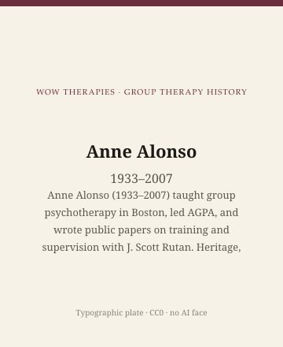

**Educational note.** This is history for a general reader. It is not a diagnosis, not a treatment plan, and not a substitute for care with a licensed clinician.

<!-- figure-id: anne-alonso.lead-plate -->
<figure class="wow-figure wow-figure--portrait wow-figure--portrait-typographic">
  
  <figcaption>
    <strong>Anne Alonso</strong> (1933–2007) — Anne Alonso (1933–2007) taught group psychotherapy in Boston, led AGPA, and wrote public papers on training and supervision with J. Scott Rutan. Heritage, not a supervision manual.
    <em>Typographic plate — no likeness embedded.</em>
    Original editorial plate (CC0). See <code>plates/anne-alonso/RIGHTS.md</code>.
  </figcaption>
</figure>

*No licensed still. Type only: Anne Alonso, 1933–2007.*

In February 1992, at the fiftieth-anniversary meeting of the American Group Psychotherapy Association, Anne Alonso gave a presidential address later printed as "AGPA and the Village Well." She used a public metaphor: a profession as a well where different parties have to draw water — other guilds, universities, managed-care payers, and the people who sit in groups. The address is a period document of a craft association under financial pressure. It is not a speech this series will turn into a business plan.

This essay is part of a WOW Therapies series on the history of group therapy. Alonso belongs here as a Boston teacher of groups and of the people who lead them. It will not excerpt her supervision papers as guidelines. J. Scott Rutan, her long collaborator, is living as of 2026-09-14. Public papers only. No workshop gossip.

## MGH, Harvard, a Boston tradition

Anne W. Alonso's professional home was Massachusetts General Hospital, from an internship in 1968 through decades as a clinician, teacher, and founder of a Center for Psychoanalytic Psychotherapy (the exact center name varies slightly across obituaries `[VERIFY]`). She was among the founders, in 1975, of a General Psychiatry Practice that hospital historians treat as a seed of MGH's later outpatient psychiatry. She taught Harvard Medical School trainees. She took a master's in education at Harvard in 1969 and a Ph.D. in clinical psychology from Fielding Graduate University in 1980, remaining on Fielding's faculty. At retirement in 2001 she and her husband, Ramon, endowed the Alonso Center for Psychodynamic Studies there. She died at MGH on 22 August 2007, of complications from surgery, at seventy-three, living in Cambridge. Those facts are in the *Boston Globe* and the *Harvard Gazette*. This page will not add medical color.

She served as president of the Northeastern Society for Group Psychotherapy and of AGPA. In 2001 she received Harvard Medical School's Clifford Barger Award for Excellence in Mentoring and was named Woman of the Year by AGPA. AGPA later put her name on an award; MGH hosts a lecture in her name. Institutional naming is not canonization. It is how a guild remembers a teacher who spent more ink on training than on a single magnum opus.

The Boston group-therapy tradition that trainees still nickname "Rutan and Alonso" was, in the public record, an observation group and a training pipeline at MGH in the 1970s–90s. Rutan directed a Center for Group Psychotherapy there (1985–1996, in NSGP's later oral history). Residents were expected to watch and to lead under supervision. Alonso and Rutan alternated leadership of an observation group rather than always sitting as co-leaders, according to that same public recollection. This series will not describe that observation format as a protocol. The historical fact is that a major teaching hospital once treated group leadership as something you had to watch, for a year, before you were trusted with a roster. Many later residencies quietly dropped that requirement. The drop is also history.

## Public papers, not case reprints

The papers to name, as objects, include Rutan and Alonso, "Some guidelines for group therapists" (*Group*, 1978) — a title this site will not unpack into a list; Alonso and Rutan, "Object relations theory and its impact on psychodynamic group therapy" (*American Journal of Psychiatry*, 1984); "The Experience of Shame and the Restoration of Self-respect in Group Therapy" (*IJGP*, 1988); "Shame in Supervision" (1988/89); and "Separation and individuation in the group leader" (*IJGP*, 1996). Rice, Alonso, and Rutan wrote on training-center grief and fights ("The Fights of Spring," 1985). The 1996 *Group* paper on activity and nonactivity in the leader has a title that looks like advice. It is a journal article with a date. This pack will not translate it into "sit there" as counsel.

*The Quiet Profession: Supervisors of Psychotherapy* (1985) is her book. It is mostly about the individual supervisory pair, a "quiet" craft she thought the academy undervalued. It belongs in this group essay only as a public object from the same teacher who also wrote about shame in group supervision. Do not treat the book as a group manual. Do not reprint its vignettes.

Alonso's published interests — shame, the over-helpful therapist, the leader's own separation from a group — sit in a psychodynamic Boston that read object relations into the circle. That is a school, not a national law. Yalom's Stanford interpersonalism is another school. Foulkes is another. Alonso did not try to replace those. She tried to train people who could bear a room.

Obituaries quote colleagues on her humor and her appetite for very disturbed patients in the Acute Psychiatric Service. Those tributes are public. They are still not patient stories. This series will not build a composite from them.

## Why a clinic still reads this

Because group psychotherapy in the United States had a teaching capital in Boston as well as in New York and Stanford. Alonso is how that capital looks when you follow AGPA presidencies and *IJGP* rather than a single textbook. A Southeast Arkansas clinic that never sent anyone to MGH still inherits the later, thinner version of that training: a weekend workshop, a book, a hope that leading a group is obvious. Alonso's career is evidence that a teaching hospital once thought it was not obvious.

Because supervision is group history. Shame in the supervisor's office, the 1988–89 papers, is a historical claim that the people who hold groups also sit in a small room with someone who can humiliate or rescue them. Training is a group form. Main's "Ailment" was about hospital staff. Alonso wrote the outpatient, educational cousin.

Because she is not a living person, but her collaborator is. The ethical rule does not change: no private life, no guessed conflict, no "what Rutan really thought." The papers are enough.

No portrait. Conference photographs remain under copyright. Type only: name, dates, a Boston hospital as the object if a designer needs an object that is not a face.

## Sources

Alonso 1993 (the 1992 address); Alonso 1985; the dated Alonso–Rutan *IJGP* and *Group* papers listed above; *Boston Globe* 2 September 2007 and *Harvard Gazette* 2008 for the public biography. Center-name variants: `[VERIFY]`. Rutan's later textbooks are his; do not import them as Alonso's.

*WOW Therapies educational series. Group-therapy heritage only. Complementary to the individual psychotherapy history pack and to SLPWOW speech-pathology history.*
