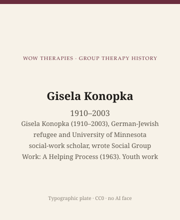

**Educational note.** This is history for a general reader. It is not a diagnosis, not a treatment plan, and not a substitute for care with a licensed clinician.

<!-- figure-id: gisela-konopka.lead-plate -->
<figure class="wow-figure wow-figure--portrait wow-figure--portrait-typographic">
  
  <figcaption>
    <strong>Gisela Konopka</strong> (1910–2003) — Gisela Konopka (1910–2003), German-Jewish refugee and University of Minnesota social-work scholar, wrote Social Group Work: A Helping Process (1963). Youth work — not psychiatry.
    <em>Typographic plate — no likeness embedded.</em>
    Original editorial plate (CC0). See <code>plates/gisela-konopka/RIGHTS.md</code>.
  </figcaption>
</figure>

Prentice-Hall published Gisela Konopka's *Social Group Work: A Helping Process* in 1963. The book is a social-work text. It is not a psychiatric manual and not a group-analytic primer. Konopka (1910–2003) taught at the University of Minnesota, directed its Center for Youth Development and Research, and spent a career insisting that a group of young people in a settlement, a club, a correctional cottage, or a community program was already a method of help — with its own profession, ethics, and failures. American psychotherapy would later borrow her circles and forget her guild. This essay puts the guild back.

This essay is part of a WOW Therapies series on the history of group therapy. It is heritage of social group work. It does not teach a youth group. It does not tell anyone how to sit with adolescents.

## Berlin, Hamburg, and the cost of remaining

Gisela Peiper was born in Berlin on 11 February 1910 to a Jewish family that had left Polish lands under pogrom pressure and kept a small shop. University of Minnesota archival finding aids are the clean public chronology: Staatsexamen at the University of Hamburg in 1933 in education, history, philosophy, and psychology — the year the Nazis took the state. As a Jew she was barred from the professional life the degree had promised. She joined underground resistance work. In 1936 she was arrested and held in Hamburg. After an unexpected release she fled: Czechoslovakia, Vienna in 1937 (nursery and kindergarten work), France after the Anschluss, then the United States in 1941.

The refugee file is not a sentimental preface. It is the reason a later Minnesota professor kept talking about justice, about institutions that punish children, and about groups that can humiliate as easily as they can hold. Her autobiography *Courage and Love* exists. This page will not mine it for color. Andrews's biographical work and the Minnesota papers are the place for letters; the pack bibliography already marks `[VERIFY]` before quoting them.

She earned a Master in Social Service Administration at the University of Pittsburgh in 1943, with a concentration in social group work, and worked as a psychiatric group worker at the Pittsburgh Child Guidance Clinic. "Psychiatric" here is a clinic adjective, not a conversion into psychiatry. She was a social worker in a child-guidance building. She lectured at Carnegie Institute of Technology's school of social work. In 1947 Minnesota appointed her assistant professor. Full professor followed in 1956. The Doctor of Social Welfare from Columbia came in 1957, a mid-career doctorate on top of a teaching life already in motion.

## A helping process, not a cheaper analysis

*Social Group Work: A Helping Process* (1963; later editions 1972, 1982) gave generations of students a definition of the method as social work: individuals helped, through purposeful group experience, with social functioning and with problems that were personal, group, or community. Translations followed — Dutch, German, Japanese, Portuguese, Spanish, Norwegian, and partial Persian among those listed in public biographical encyclopedias. The translation list is a historical fact about a textbook. It is not proof that every country practiced the same kindness.

Konopka's other titles keep the camera on youth and institutions: *Therapeutic Group Work with Children*; *Group Work in the Institution*; *The Adolescent Girl in Conflict*. The last belongs to a 1960s argument about girls labeled delinquent — an argument that now reads as both pioneering documentation and a period vocabulary of "conflict" that later feminist and abolitionist writers would push harder. She interviewed, taught, sat on committees, and, after the war, returned to Germany at U.S. State Department request to help rebuild social services and education. Germany later decorated that work. A heritage series can record the medal without turning it into a cleansing of anyone's past, including the country's.

Social group work in the United States already had a settlement ancestry (Addams, the next but one figure in this wave) and a professional fight with casework for the soul of social work education. By the 1960s William Schwartz, Helen Northen, and others were writing competing maps of "the group." Konopka's 1963 book is a monument in that library. It is not AGPA. It is not Northfield. A psychotherapy history that files her under "also women" has misunderstood the profession.

## Minnesota, youth research, and the limit of a clinic's claim

From 1970 until retirement in 1978 she directed Minnesota's Center for Youth Development and Research. She had already coordinated urban-affairs community programs at the end of the 1960s. She continued, after emeritus status, around adolescent health at the medical school. University photographs of those years are copyright. `PORTRAIT_SOURCES.md` says no-portrait; type only. Do not scrape a departmental headshot.

What she would not have recognized as her work is a billing code for "group psychotherapy" applied to a club that was never a clinic. The reverse error is also common: imagining that because she wrote "therapeutic" in a title, she was secretly a psychiatrist. Child-guidance clinics mixed professions. The method she spent decades specifying was social group work. Mutual aid in Schwartz's later theoretical sense, settlement clubs in Addams's earlier civic sense, and Konopka's youth groups share a family resemblance. They are still not interchangeable with a process group at a medical school.

## Why a clinic still reads this

Because a county program that runs a skills group for teenagers is standing in a hallway Konopka already occupied, even if the binder on the table now says CBT. The honest inheritance is not her exercises. It is the reminder that youth groups have always been moral and political: who is called delinquent, who is called a client, who is paid to sit in the room, and whether the group exists to adjust the young person to an institution or to help the young person survive it.

Because social work is not a footnote to Freud. This pack's era essay on children's activity groups and the figure essay on Slavson tell the psychotherapy side of children's circles. Konopka is the other door. A reader in Southeast Arkansas who has met a school social worker, a girls' group in a church basement, or a juvenile program has already met her problem. The next essay stays in social work and names William Schwartz, who in 1961 called the group an enterprise in mutual aid — a theory of the profession, not a fellowship slogan and not a treatment protocol.

## Sources

Konopka 1963 (Prentice-Hall) and later editions. University of Minnesota Archives finding aid for degrees, appointments, and the Center for Youth Development and Research. Jewish Women's Archive and VCU Social Welfare History Project for the refugee chronology; letters remain `[VERIFY]`. Andrews biographies: same caution. Portrait: none. University of Minnesota photographs are not a web license.

*WOW Therapies educational series. Group-therapy heritage only. Complementary to the individual psychotherapy history pack and to SLPWOW speech-pathology history.*
