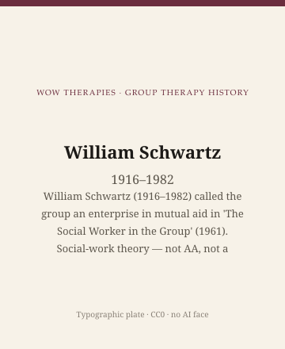

**Educational note.** This is history for a general reader. It is not a diagnosis, not a treatment plan, and not a substitute for care with a licensed clinician.

<!-- figure-id: william-schwartz.lead-plate -->
<figure class="wow-figure wow-figure--portrait wow-figure--portrait-typographic">
  
  <figcaption>
    <strong>William Schwartz</strong> (1916–1982) — William Schwartz (1916–1982) called the group an enterprise in mutual aid in 'The Social Worker in the Group' (1961). Social-work theory — not AA, not a protocol.
    <em>Typographic plate — no likeness embedded.</em>
    Original editorial plate (CC0). See <code>plates/william-schwartz/RIGHTS.md</code>.
  </figcaption>
</figure>

In 1961 the National Association of Social Workers issued a volume, *New Perspectives on Services to Groups*, that included William Schwartz's essay "The Social Worker in the Group." He was forty-five. He would die in 1982. The essay is short, cited past all proportion to its length, and easy to steal. Later textbooks boiled it into a slogan: the group as an enterprise in mutual aid. This pack keeps the phrase inside social-work theory, where he put it. It is not Alcoholics Anonymous. The fellowship of 1935 refused the name therapy and wrote a different literature. Historians may compare forms. The brand must not collapse them. Schwartz's mutual aid is also not a session protocol. No "all in the same boat" worksheet lives here.

This essay is part of a WOW Therapies series on the history of group therapy. It describes a profession arguing with itself. It does not tell a reader to join, leave, or start a group.

## A social worker's curriculum vitae, without embroidery

The Social Welfare History Archives at the University of Minnesota hold his papers. The public finding aid is the chronology this page will trust. Schwartz spent early years in Jewish social-service agencies in New York. He took an MSSW at Columbia University's School of Social Work, taught at Ohio State and then at the University of Illinois in Chicago, and returned to Columbia from 1962 to 1977. From 1977 until his death he was a visiting professor at Fordham. He consulted to hospitals and children's agencies. He wrote about camps. The 1960 paper on the group experience in camping is, in Lawrence Shulman's later commentary, a way-station toward the 1961 statement. Camp is not a metaphor. American group work actually happened in cabins.

He is easy to confuse with other Schwartzes. Emanuel K. Schwartz coauthored *Psychoanalysis in Groups* with Alexander Wolf (1962). That is a different book and a different man. This essay is the social-work William (1916–1982).

## Mutual aid as a theory of the worker, not a fellowship brand

Schwartz's 1961 vision, as later social-work historians quote it, pictured the group as an alliance of people who need one another, in varying degrees, to work on common problems. The worker's job, in his language, was to mediate: to help members find their need for each other when obstacles hid it. Later writers called this the mediating model, the reciprocal model, the interactionist model, the mutual-aid model. Papell and Rothman, in 1966, set "reciprocal" beside a social-goals model and a remedial model and gave American classrooms a trio that still organizes survey chapters. Schwartz did not always like the labels. He preferred, in later papers, "social work with groups" to "social group work" as a brand. The fight over names is a professional fight. It is not a technique lesson.

What he was pushing against is as important as what he named. Mid-century group work had a "remedial" temptation: the worker as the person who treats, the group as a handy setting, outcome as a change in the identified client. It also had a "social goals" temptation: the group as a little democracy whose purpose was citizenship. Schwartz's 1961 paper tried to locate the worker in the relationship between person and system — a third position that later became, in Shulman and Alex Gitterman's hands, a long American textbook tradition of its own. Those later textbooks are not this page. They are the afterlife.

Mutual aid in Kropotkin, in immigrant lodges, and in AA is a different library. Schwartz knew he was borrowing a political and cooperative word into a licensed profession. The 1961 essay is that borrowing, dated. A clinic website that used it to imply that WOW Therapies runs Schwartz groups, or that reading this paragraph is help, would be doing the collapse this pack exists to prevent.

## Columbia, NASW, and the books around the essay

*The Practice of Group Work* (Columbia University Press, 1971), edited with Serapio Zalba, gathered practice papers. It is a period collection: hospitals, children's services, the hope that a method could be written without becoming a medical-school psychotherapy. Readers who come to Schwartz from Yalom will notice the absence of "therapeutic factors" as a research list. What they will find instead is role: what the social worker is for, in a group that already has a life.

NASW's 1961 volume is itself a document of a profession professionalizing. Social work in the United States was sorting casework, community organization, and group work into curricula that could survive universities and public agencies. Schwartz's essay is a bid in that argument. Konopka's 1963 textbook is another. Addams is the settlement grandmother neither of them invented. A psychotherapy series that only mentions social work in a closing "diversity" paragraph has not read the 1961 table of contents.

The papers at Minnesota include teaching notes, correspondence, and files from the Welfare Council of Metropolitan Chicago, 1958–1961 — a municipal stretch just before the NASW essay. Camp, council, classroom, hospital consult: the group, for Schwartz, was already a social-work instrument before American psychiatry finished arguing about who owned the word therapy. Shulman and Gitterman's later textbooks are the afterlife of that instrument. They are not assigned here.

## Why a clinic still reads this

Because people still say "mutual aid" as if the words were a warm feeling. Schwartz meant a theory of a paid worker's job in a group of people who need one another. That is a colder, more useful sentence. It asks who is being paid, for what, and whether the worker is quietly stealing the members' work. AA asked a version of that question by refusing professional authority. Schwartz asked it from inside a profession. The answers disagree. A reader does not have to pick a church.

Because a community mental-health group, a psychoeducation hour, and a social-work support group can look identical from the parking lot and still be different objects. Schwartz is a tool for telling them apart: look at the worker's claimed function, not at the chairs. The next essay leaves the North American social-work library for Buenos Aires, where Enrique Pichon-Rivière was building operative groups and an ECRO that will not shrink to a footnote on Bion.

## Sources

Schwartz 1961 in NASW, *New Perspectives on Services to Groups*. Schwartz and Zalba 1971. Minnesota Social Welfare History Archives finding aid for teaching posts. Papell and Rothman 1966 as later classroom map, not as Schwartz's own title. AA comparison: see this pack's fellowship essay and Kurtz 1979; do not reprint Steps. Portrait: none. Type only.

*WOW Therapies educational series. Group-therapy heritage only. Complementary to the individual psychotherapy history pack and to SLPWOW speech-pathology history.*
