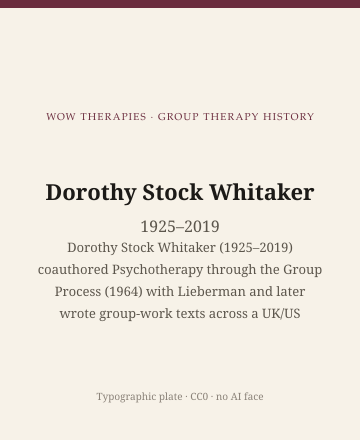

**Educational note.** This is history for a general reader. It is not a diagnosis, not a treatment plan, and not a substitute for care with a licensed clinician.

<!-- figure-id: dorothy-stock-whitaker.lead-plate -->
<figure class="wow-figure wow-figure--portrait wow-figure--portrait-typographic">
  
  <figcaption>
    <strong>Dorothy Stock Whitaker</strong> (1925–2019) — Dorothy Stock Whitaker (1925–2019) coauthored Psychotherapy through the Group Process (1964) with Lieberman and later wrote group-work texts across a UK/US career. Thin dates marked [VERIFY].
    <em>Typographic plate — no likeness embedded.</em>
    Original editorial plate (CC0). See <code>plates/dorothy-stock-whitaker/RIGHTS.md</code>.
  </figcaption>
</figure>

Atherton Press published *Psychotherapy through the Group Process* in 1964, Dorothy Stock Whitaker and Morton A. Lieberman as authors. Library catalogues list her dates as 1925–2019. The book is a theory of how the properties of a group — not only the leader's interpretations, not only the individual's private conflict — shape what a patient can use. It grew out of small-group studies and clinic observation, not out of a laboratory of strangers. Later she wrote group-work texts from a career that crossed the United States and the United Kingdom. Some of the institutional dates in that crossing remain thin in the open web. This page will mark `[VERIFY]` rather than invent a neat CV.

This essay is part of a WOW Therapies series on the history of group therapy. *Using Groups to Help People* (1985; later editions) is a professional book. This site will not excerpt it as a plan.

## Chicago papers, a 1958 culture book, then 1964

Before the married name, Dorothy Stock published with Herbert A. Thelen *Emotional Dynamics and Group Culture* (1958), experimental studies of individual and group behavior out of the University of Chicago's group-dynamics world. Thelen's name places her, for a stretch, in the American small-group research culture that also held NTL and the aftermath of Lewin — a different hallway from Foulkes, and a cousin of the hallway Lieberman would later take toward encounter research. In 1958 she also published, with Roy M. Whitman, on the "group focal conflict" in *Psychiatry*. Focal conflict became the phrase later clinicians attached to her: a group, like a person, can be understood as organized around a conflict and a solution, some of it visible, some not.

Papers with Lieberman and others in the *International Journal of Group Psychotherapy* at the turn of the 1960s show the workshop: early sessions, deviation from group standards, the difference between what patients and therapists think happened. *Psychotherapy through the Group Process* (1964) is the book that gathers the wager. The authors say they want a view of groups that can stand the diversity and fluidity of actual rooms. They studied a relatively small number of groups intensively rather than running a large experiment. Clinical examples in the book include adolescent and adult groups. This essay will not retell those examples. Composite patients are forbidden here even when the original book had permission in its own decade.

Lieberman's later fame in this pack is *Encounter Groups: First Facts* (1973), with Yalom and Miles. Whitaker's 1964 collaboration is earlier and cooler: therapy groups, not marathons. Do not collapse the two books. Do not promote 1964 as a friendlier First Facts. Different question, different heat.

## A UK/US career with honest gaps

Affiliation lines on papers move. A 1975 paper in the *British Journal of Social Work*, "Some Conditions for Effective Work with Groups," lists the University of Chicago. A 1987 paper in the *International Journal of Group Psychotherapy*, connecting group-analytic and group-focal-conflict views, lists the University of York. Those two printed affiliations are solid. The year she left Chicago, the year she took York, and the precise titles belong on a plaque only after `[VERIFY]` against a university calendar or a colleague's obituary, not against a guessed timeline.

Wellcome holds a thin file of correspondence with S. H. Foulkes, 1963–1967. The existence of the file is a fact. The letters are not quoted here. They suggest that a Chicago-trained group researcher was already in conversation with British group analysis before the York byline. The conversation is not a merger. Her 1987 paper is explicit about connections and limits between a group-analytic picture and a focal-conflict picture. Readers who want a single transatlantic theory will have to do without.

*Using Groups to Help People* appeared in 1985, with a later second edition around the turn of the century (Routledge). It is the book training courses still put on lists when they want a planning-and-thinking text rather than a school manifesto. Because it is practical, it is the book this educational series must handle with a closed hand. History may say the chapters cover purposes, planning, beginnings, errors, and the therapist in the group. History may not reprint the planning questions as a worksheet. The 1964 Atherton book is already closer to this pack's job: a dated theory of process.

Death in 2019 is the date this calendar uses. Open obituaries on the web are noisy with other Dorothy Whitakers. Until a colleague's notice is in the bibliography with a publisher, treat the 2019 year as the pack's working date and do not invent a city. Library authority records that print "1925–" without a death year are not a contradiction; they are incomplete.

## What she refused to separate

Whitaker's published habit, from the 1958 focal-conflict paper through 1964 and into the York years, was to refuse a clean split between "the individual" and "the group." The patient is in the group; the group is the context of the patient's experience; a solution that works for the group may trap a person, and a person's private war may become the group's weather. Group analysts hear Foulkes. Chicago social psychologists hear a field. She wrote as if both libraries were usable and neither was enough. That is a historical stance. It is not a prompt to diagnose your committee.

No licensed portrait. Died 2019. University photographs remain copyright. Type only.

## Why a clinic still reads this

Because every therapy group still produces events that no one person owns. Whitaker and Lieberman, in 1964, tried to write that fact without drowning the patient in "the group" and without pretending the leader's theory was the only process in the room. A contemporary clinician can take the humility and leave the diagrams on the page where they belong.

Because the American research line and the British group-analytic line did meet in actual careers, not only in textbooks. Whitaker's affiliations are a map of that meeting, even where the dates still want a librarian. This pack's last figure is not a closer. The route does not empty. The sixteen era essays and the other twenty-seven figures remain the rest of the house: Pratt's class, Northfield, Bethel, the fellowship that refused to be therapy, Yalom-as-group, Konopka's youth work, Pichon-Rivière's Spanish titles. Whitaker is one more door into the same argument — what, exactly, is the group doing when we say it is doing the work?

## Sources

Whitaker and Lieberman 1964 (Atherton). Stock and Thelen 1958. Whitman and Stock 1958 on focal conflict. *Using Groups to Help People* 1985 and later eds. — named, not excerpted as a plan. University of Chicago (1975 byline) and University of York (1987 byline) as printed affiliations; other institutional dates `[VERIFY]`. Wellcome PP/SHF correspondence file: existence only. Death year 2019 as this pack's working date pending a colleague obituary in the bibliography. Portrait: none. Type only.

*WOW Therapies educational series. Group-therapy heritage only. Complementary to the individual psychotherapy history pack and to SLPWOW speech-pathology history.*
