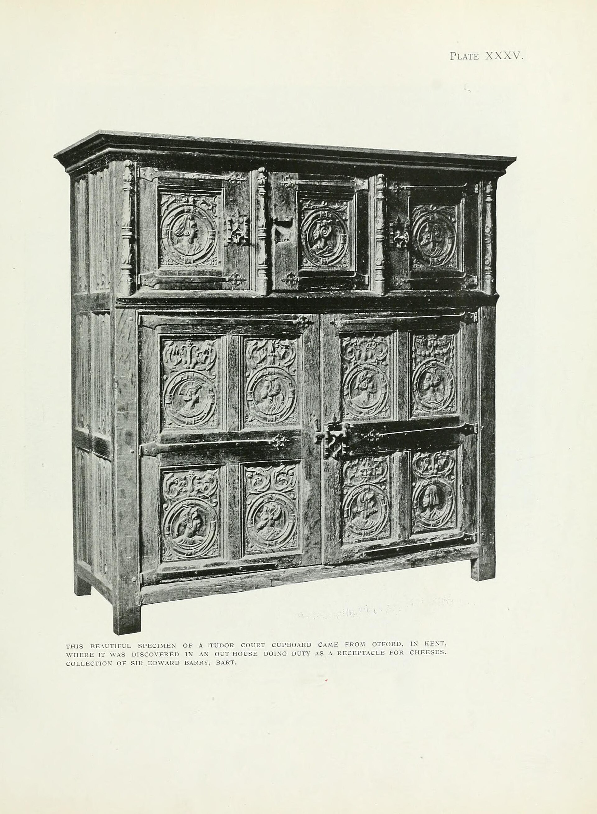

<figure>

<figcaption>Oak furniture catalog plates from 1920: four doors — consignment, wholesale, to-the-trade, dropship — all eventually fight over the same stolen words.</figcaption>
</figure>

Before the history, I want four doors in your head. If you keep these straight, the rest of the series will click. If you do not, every episode will sound like I am complaining about the internet.

Door one. Consignment.

You make the piece. You put it in someone else's room — a craft gallery, sometimes a shop with a curator. They do not buy it. They do not take title. They put it on the floor. If a buyer writes a check, the room takes a cut and you get the rest. If nobody writes a check, the piece comes home, or it sits there eating rent you are not paying and hope you are. Common gallery splits in American craft have often lived around the even cut. That is a pattern, not a commandment. The educational point is not the percentage. The point is who owns the object while it waits. You do. The gallery owns the wall, the lighting, the reputation, and the conversation with the buyer. That conversation is the product they sell you.

Door two. Wholesale.

A buyer takes title. A store, a catalog, a showroom that inventories, a boutique that believes in you enough to write a purchase order. They pay you less than the person who will eventually sit at the table. They accept the risk that the piece does not move. You accept a smaller check and a cleaner week. Wholesale is old. It is older than the web. High Point was built on it. Department stores were built on it. A lot of family factories in North Carolina and Indiana and Michigan were built on it. Wholesale is not a slur. It is a trade of margin for risk.

Door three. To-the-trade.

This one confuses civilians, and it is supposed to. A designer showroom is often a wholesale room that refuses the public as the customer. You, the homeowner, may be allowed to look. You are usually not allowed to write the order. The interior designer or the architect is the account. They get a net price. They charge you something else — a markup, or a flat fee, or an hourly bill — and they take responsibility for scale, finish, the fight with the window, the fight with the contractor, and the day the truck is late. The showroom's job is to make that professional fast and accurate. Memo samples. Sidemarks. A person who knows which finish will look like mud in a north room. This is not a mall with a velvet rope for fun. It is a labor split. You can argue about whether the rope is still justified. You cannot argue that it is the same as consignment.

Door four. Dropship.

A website takes the customer. They take the payment. They take the review. They take the return policy that was written by a lawyer who has never moved a dining table up a brownstone stair. You keep the object until a packing slip arrives, and then you become their warehouse. You may never hear the buyer's voice. You may hear it only when something is wrong. Title can get metaphysical here — sometimes the platform never owns the piece, sometimes they do for a minute — but the relationship is what matters. The buyer thinks they bought from the website. The website thinks they sold a catalog. You think you got an order. All three can be true and still leave you with a freight claim and a one-star paragraph about a box.

Those four doors assign three things differently: title, risk, and who owns the customer.

In consignment, you keep title and risk; the room owns the customer for a cut.
In wholesale, the buyer takes title and risk; you gave up the customer on purpose.
In to-the-trade, a professional owns the customer; you own the making; the showroom owns the translation.
In dropship, the platform owns the customer; you own the making and most of the physical risk; the photograph owns the sale.

A lot of shops died in the last twenty years because they walked through door four thinking it was door two. The purchase order looked like wholesale. The portal looked like a customer. It was not. A customer you cannot call is not your customer.

A lot of buyers got angry in the same years because they walked through door three thinking it was a store that hated them. They were standing in a translation room. The translator was the point.

And a lot of "handmade" listings are door four wearing door one's clothes. They borrowed the gallery language — artisan, crafted, one of a kind — and they used the dropship pipe. That costume is the educational target of this whole series.

When I say galleries, I mostly mean door one, with a little door two when a gallery actually buys a piece.
When I say showrooms, I mean door three, sometimes mixed with door two if they inventory.
When I say the Etsy era, I mean a website that tried to be door one at internet scale, then discovered volume and rewrote handmade so door four could come in the side.
When I say Overstock and Wayfair, I mean door four built as a business model, recruited on door two's old market floors.

Keep the four doors. I will point at them by number when the history gets crowded. If you forget everything else I say this week, remember who owns the customer when the truck pulls away.
