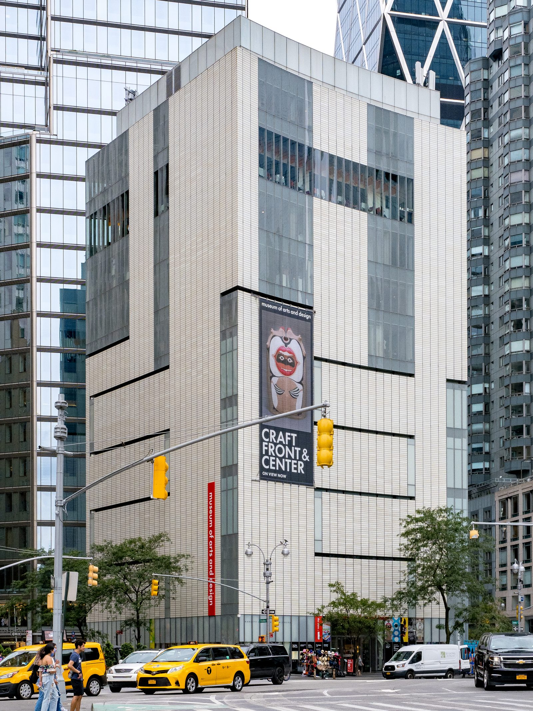

If you think handmade retail starts with a URL, you are starting sixty-five years late, and you are starting in the wrong city.
<figure class="hfrh-figure">
  
  <figcaption>America House and the Museum of Contemporary Crafts shared Aileen Osborn Webb’s impulse to teach craft and sell it in the same city.</figcaption>
</figure>

In 1940, a group around Aileen Osborn Webb opened a shop in New York called America House. The first address was 7 East 54th Street. It was not a hobby closet. It was a cooperative retail door for affiliated craft organizations. Rural makers — the people who actually had the material and the hours — could not reach a metropolitan buyer without someone in the city willing to keep a room, keep hours, and do the talking. That is the whole problem of handmade retail in one sentence. The work is made where the quiet is. The money is often where the noise is.

America House moved. 485 Madison. A cheaper address off the avenue. Then 44 West 53rd, the glamorous last room. It lasted until 1971. Thirty years is a long time for a shop whose product is objects that do not scale. They ran exhibitions that were not even for sale, because Webb's people believed the buyer had to be taught. Out of that teaching impulse came the Museum of Contemporary Crafts in 1956, the building we now call the Museum of Arts and Design. I want you to sit with that. The museum and the shop were cousins. Education and retail were not a content strategy. They were the same project.

I was not there. I was not born. I am not going to pretend I sold a bowl on 54th Street. I am telling you this because every later door in this series is either a child of that idea or a rejection of it.

The idea: a made object needs a room, a person, and a buyer who has been taught how to look.

The rejection: a made object needs a photograph, a price, and a shipping promise.

When America House tried a mail-order catalog in its last decade, that was already a crack in the idea. A catalog is a room you cannot stand in. It works for some things. It is how a lot of American households met furniture they would never see until the truck. It also trains the buyer to decide from a picture. Remember that. We will need it when we get to Wayfair.

They also tried an interior design consultation service — pairing clients with craftsmen. That sentence should make a showroom person sit up. The trade showroom system is, in one of its better moods, exactly that pairing with better paperwork. America House was reaching for door three before door three had a building with a badge policy. They were also still door one: a shop that edited, presented, and took a cut of a sale.

Why a cooperative? Because a single maker cannot rent East 54th Street. The rent is a tax on access. Every retail history that forgets rent is a fairy tale. Galleries, showrooms, market booths, Etsy ads — they are all rent in different costumes. America House socialized the rent across many makers and put a selection board in front of the door. Selection is the other tax. Somebody decides what is good enough to be in the room. The internet promised to abolish that tax. It abolished the editor and replaced them with a ranking. I will let you decide which one is ruder.

There were branch experiments — Sun Valley, Birmingham, Michigan, a department-store room in Seattle. That is the other temptation: if the New York door works, copy it. Sometimes a copy is a gift. Sometimes a copy is how a standard dies of dilution. Handmade retail keeps making this mistake. One good room becomes a chain of rooms that cannot afford the teaching.

What should a maker take from 1940?

You need a door that is not your driveway. Someone has to do the talking in the city where the checks are. That someone will take money or time or both. If you refuse the door, you will spend your life being your own America House, which is a full-time job that is not making.

What should a buyer take?

When a website says it is supporting makers, ask whether it is keeping a room and a teacher, or whether it is keeping a warehouse of photographs. America House was flawed and mortal and of its class. It was also a serious attempt to solve the handmade problem without pretending the object could travel as a JPEG.

The American Craft Council's later fairs — Stowe, Rhinebeck, Baltimore — are the next chapter of the same impulse. Take the mountain to the buyer twice a year instead of keeping the mountain in a Midtown lease. Different rent. Same problem.

We will go to the fair next. I want you to smell the booth, because a lot of people who now run furniture websites have never stood in one, and they still use the language that was invented there.
