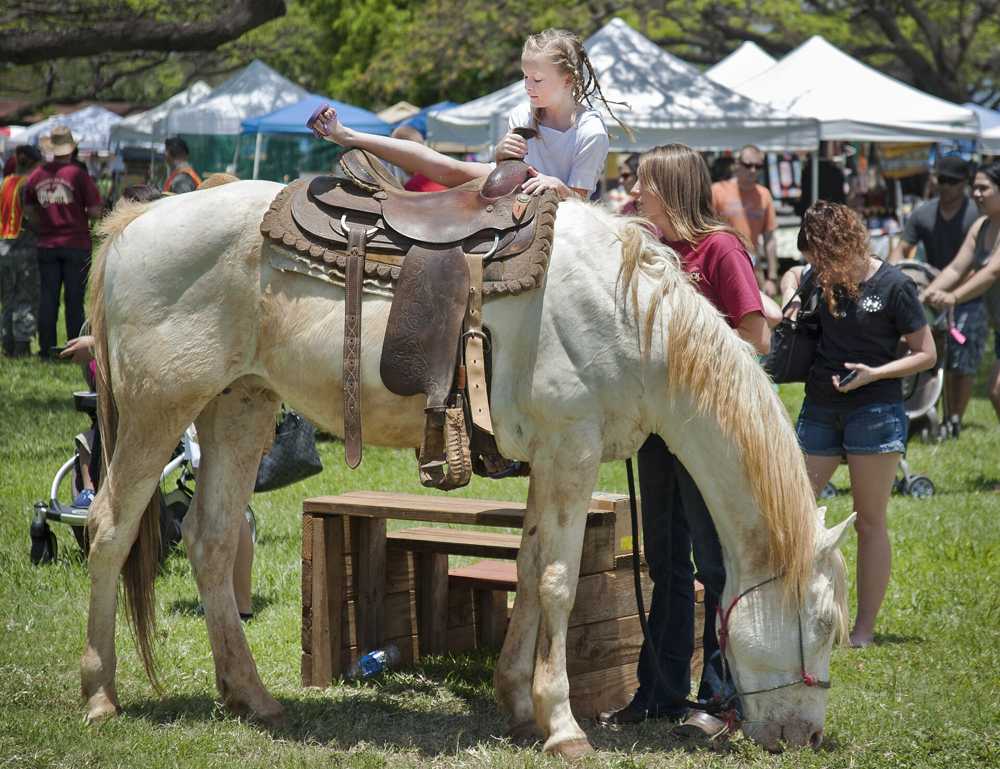

<figure>

<figcaption>State fair catalogs turned handmade retail into a portable gallery: jury, booth fee, public buyers, and store buyers with wholesale notebooks.</figcaption>
</figure>

A fair is a gallery that you have to assemble with a screwdriver before the doors open.

The American Craft Council did not invent selling under a tent. It did professionalize a circuit that American makers still use as a mental model, even when they have never applied. The Northeast fair starts in the mid-sixties — Stowe in 1966, then Mount Snow, Bennington, Rhinebeck in 1973, West Springfield later. Baltimore's Winter Market put hundreds of craftspeople in the Civic Center and told the East Coast that January could be a buying season. Those names are not nostalgia. They are infrastructure.

Here is the educational mechanics, without the romance.

You apply. A jury looks at slides, later jpegs, and decides whether you are in. Already you are in a selection system. America House had a board. The fair has a jury. The website has a feed. Only one of those will tell you no to your face.

You pay a booth fee. That is rent again. You also pay the van, the hotel, the days you are not in the shop, the sample that gets a wine glass ring on Saturday night, the smile. People who have only sold from a kitchen table underestimate the smile. Three days of explaining the same joint to strangers is a skilled trade.

Then two buyers walk the aisle, and they are not the same animal.

The public buyer is door one with cash. They fall in love. They take a bowl. Sometimes they take a chair if you are brave and they have a wagon. They want a story. You are the story. This is the closest most Americans ever got to watching a maker stand behind the work.

The wholesale buyer is door two with a notebook. They are a shop, a gallery, a catalog editor. They write an order for six, or for a line, or for "send me that finish in time for November." They want terms. They want to know if you can repeat yourself. Repeatability is a dirty word in some craft circles and the entire point in others. A furniture maker who cannot repeat a finish is a poet. A furniture maker who can repeat a finish is a shop. Both can be excellent. Only one can fill a store.

The ACC fairs were built to hold both animals in one building. That is why they mattered. A jeweler could leave Sunday with cash in the box and a winter's work on paper. A furniture maker — and I want to be honest — had a worse weekend more often. A table does not walk out under an arm. A table needs a deposit, a freight plan, a house with a wall long enough. The fair was kinder to objects that fit in a bag. That fact will chase us all the way to Etsy.

Still, the fair taught furniture something the internet later forgot. Presence. You could watch a person sit. You could watch them frown at a height. You could say no, that chair will not work in a room with a low window, and they would believe you because you were standing in front of the chair. A review cannot do that. A review can only punish you after the truck.

There is a shadow side. Fairs create a professional class of people who are good at fairs. Their work is sized for the booth, priced for the aisle, finished for the lights. That is not a sin. It is a selection pressure. Over years the circuit can start to look like itself. Juries get conservative. Trends move like weather. A maker who needs three years to change a line will look late. A maker who changes a line every season will look like a catalog. The fair does not resolve that. It just makes it visible twice a year.

I did not build this company as a booth business. I say that so you do not hear a memoir I did not live. I have walked fairs. I have watched the two buyers. I have seen a furniture maker spend more on the week than they made, and then go home and tell the shop it was good exposure. Exposure is a word that has bounced more checks than any platform fee.

If you are a maker considering the old circuit, do the ugly math before the pretty canopy. Booth plus travel plus lost bench days plus the probability that a dining table does not fit the aisle. If the math works, the fair is still one of the cleanest doors left, because the customer is in the room. If the math does not work, do not let Instagram tell you that you are a coward for staying home. You may be a shop.

If you are a buyer, a serious fair is still a place where the words are harder to steal. The person who made the joint is the person who is tired in the folding chair. Ask them who owns the next one if you buy this one. Ask them whether they can make it again. Ask them what happens if your floor is not level. Those questions are the education America House wanted, compressed into a weekend.

Next we go inside the permanent version of that aisle: the craft gallery, the consignment ticket, and why a wall is never free.
