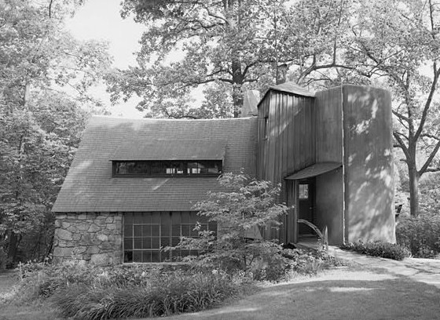

<figure>

<figcaption>Studio furniture climbed toward art in rooms like Wharton Esherick's — handmade tables and chairs with a museum shadow still meant for living.</figcaption>
</figure>

There is a fork in handmade furniture that a lot of websites flatten, and I need you to see it or the rest of the history will feel like snobbery.

One path is the useful beautiful object. You sit. You eat. You put socks in the drawer. The making is serious. The destiny is a house.

The other path is the object that happens to have a seat, made by a person whose name a museum already knows or soon will. You may sit. You may not be invited to. The destiny is a collection, a monograph, a secondary market.

Both paths are real. Confusing them is how a buyer pays art prices for a production chair, and how a shop gets insulted for charging shop prices for a table you can actually use.

The names you have heard — Wharton Esherick, George Nakashima, Sam Maloof, Wendell Castle — did not ask my permission to become a curriculum. They earned a public record. Esherick treating a house as a total work. Nakashima making a slab's defect into the event. Maloof making a chair that is a handshake. Castle making furniture that refuses to be polite about sculpture. I am not going to give you a college lecture. I am going to tell you what their market did to the rest of us.

It gave us a permission structure. A person in a city could spend serious money on wood without feeling foolish. That permission helped every shop that came after, including shops that will never be in a retrospective. When a client believes a table can be a life's object, my job gets easier. I do not have to start from a sofa sale.

It also gave us a shadow. Once the secondary market learned that a Nakashima table was not "used furniture from New Hope" — Moderne Gallery's origin story in the mid-eighties is the clean public version of that education — prices for the famous names left the atmosphere. Good. They should. The shadow is that everything else started getting measured against the monograph. A dining table from a living shop in Indiana is not a failed Nakashima. It is a different job. If I have to spend the first twenty minutes of a meeting explaining that we are not a museum and we are not a bargain bin, the art market has done me a mixed favor.

Studio furniture also trained a certain kind of photograph: object on a seamless floor, no crumbs, no kid's homework, no sunlight that would tell you the truth about a finish. Galleries needed that picture. Auction houses needed that picture. Websites later stole that picture and put it on objects that had never been near a studio. When you scroll a furniture site and every piece looks like it is waiting for a curator, you are looking at a visual dialect invented to move work from the art-craft fork. The dialect is now used to move work from a container.

I work the useful path. We make pieces you can live on. We will chase a leaf mechanism until it is boring, because boring is how a family uses a table on Thanksgiving without a speech. That is not a lesser ambition. It is a different covenant with the object. I have a lot of respect for the other path. I do not have to pretend I live there.

For a younger maker, the fork is a practical choice.

If you want the art path, you need rooms that speak that language — the serious gallery, the museum show, the critic, the collector who does not ask about kids. You will make fewer objects. You will live on reputation and scarcity. You will hate the word production, and you may be right to.

If you want the house path, you need rooms that speak to architects and designers and homeowners who have a wall and a date. You will repeat yourself. You will invent a catalog so the tenth table is not a first table. You will still make one-offs. You will not pretend every piece is a monument.

The tragedy of the Etsy years and the platform years is that both paths got poured into the same listing template. Title, five photos, a story paragraph, a shipping calculator. The template cannot tell a Castle from a carton. It can only tell a conversion rate.

When I walk a design showroom, I am closer to the house path with better lighting. When I walk a museum, I am a citizen enjoying the other path. I do not need those rooms to merge. I need buyers to know which ticket they bought.

If you have a famous chair in your house, good. Use it if the maker wanted that. If you have a table from a living shop, use it harder. The educational point is not which object is better. The point is that handmade furniture fractured into art and use, and retail never printed a legend on the map.

Next: why a dining table is a rude houseguest in a gallery built for objects you can lift.
