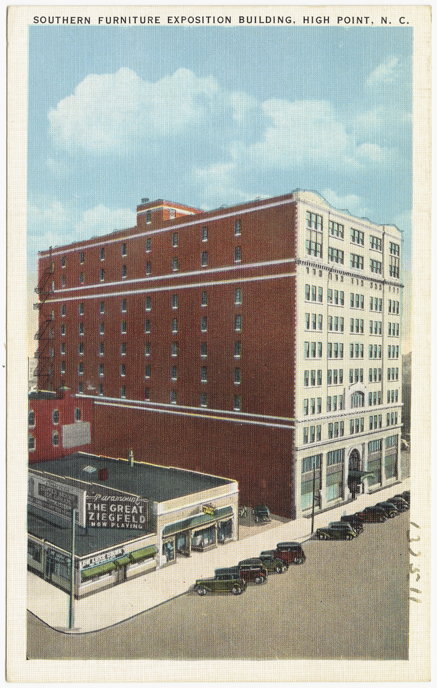

<figure>

<figcaption>Jury, booth rent, and a hall full of competitors: craft fair economics mirror gallery consignment with worse weather and better foot traffic.</figcaption>
</figure>

I want to say something kind about rejection, and I do not want it to sound like a poster.

When a fair jury or a gallery says no, they have done you a favor if the room was never going to be able to sell you. They have done you a harm if the no is fashion dressed up as quality. You will not always know which one you got. That uncertainty is the job.

A jury is a rationing system. There are only so many booths. There is only so much wall. Someone has to choose. The slides go down on a table. Later the jpegs go up on a screen. People who make objects all year are judged in a stack of minutes. That is unfair and it is also how every edited room on earth works, including a restaurant and a magazine and a design showroom that will not take your line.

The booth fee is rationing with a cash register. If you cannot pay the rent, you are out before the jury. That keeps out broke geniuses. It also keeps out tourists who would waste a weekend. I am not going to pretend the fee is noble. I am going to say it is legible. You know what you are paying. Compare that to an ad auction that charges you for the privilege of being seen by a person who was not looking for a table.

The useful no has a shape.

It says: we already have three chair makers.
It says: this work is production and we are a one-off room.
It says: this work is one-off and we need a store that can reorder.
It says: your photographs do not let us see the joint.
It says: you applied to a jewelry-weighted show with a dining table.

Those nos tell you which door you actually need. A lot of shops skip that lesson and apply again with a better story paragraph. Write a better photograph of the joint first.

The useless no has a shape too.

It says: this does not feel current.
It says: we loved it, we just had so many applicants.
It says nothing.

Fashion nos are real. Craft has fashion. Anyone who tells you handmade is outside the weather is selling a sweater. You can wait. You can change. You can go find a room that is not bored of your language. What you should not do is rebuild a serious line because a weekend jury was hungry for pastel that year.

I have watched makers treat a yes as a personality and a no as a funeral. Both are too much. A yes is a rental. A no is a closed door on a hallway with other doors. The internet arrived and offered an infinite hallway, which felt like mercy. It was a different rationing system. The jury became an algorithm. The booth fee became ads. The no became silence. Silence is harder to learn from than a letter.

If you sit on juries — and some of you who watch this will — write the useful no when you can. "We cannot freight furniture in this venue" is a gift. "Not a fit" is a shrug. You do not owe a novel. You owe a category.

If you apply, apply to the room that can hold your object. A table in a show built for wearables is not brave. It is a waste of a slide sheet. And build a sample program that does not depend on one yes. A shop that lives or dies on a single fair is not a shop. It is a gamble with a canopy.

Our own door, the trade showroom, has juries too. They just do not call themselves that. A principal looks at your line, your lead times, your ability to not embarrass them in front of a designer with a famous client. They say no in a nicer restaurant. Same rationing. Different silverware.

The educational point is not "rejection makes you stronger." The point is that handmade retail was never an open field. It was always a set of rooms with capacities. When someone tells you the old system was gatekeeping and the new system is freedom, ask them who owns the gate now and what they charge per click.

We close the gallery stage with what those rooms taught a buyer that a website still cannot teach — and then we hand the history to the showroom.
