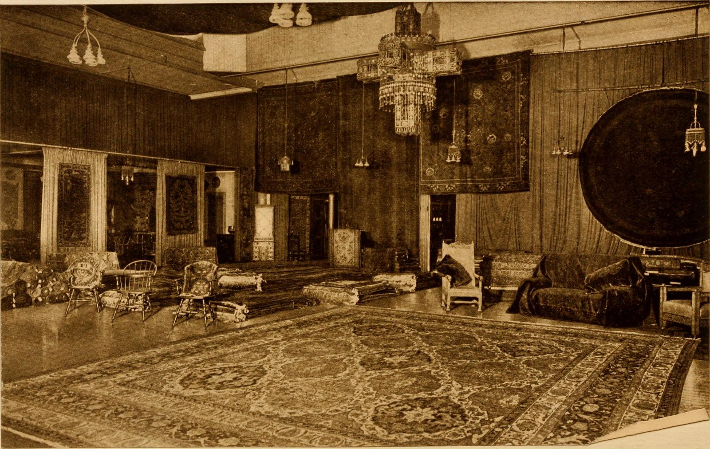

This is the hinge inside the hinge.
<figure class="hfrh-figure">
  
  <figcaption>The handoff from gallery to trade showroom trades the single object for lines, samples, and designer relationships.</figcaption>
</figure>

By the time a shop like ours is making dining tables for houses that have architects, the gallery door starts to feel like a beautiful hallway to the wrong building.

A gallery is built for a decision about an object. A trade showroom is built for a decision about a room. Those are different decisions. A room has a window, a rug already purchased in a moment of weakness, a contractor who will not move a soffit, a couple who do not agree about brown. The object has to survive that politics. The person who manages that politics, when the job is done professionally, is an interior designer or an architect. They need a place they can take a client without performing a craft-fair smile. They need a net price they can build a budget on. They need to know you can make the next one, in a slightly different length, without turning into a poet.

That is the handoff.

It did not happen on a Tuesday with a press release. It happened as design centers filled — the D&D in New York from 1965, the Mart in Chicago, later DCOTA in Florida, ADAC in Atlanta, the Washington Design Center, a dozen regional cousins. It happened as the profession of interior design got licenses and associations and a habit of specifying instead of shopping. Specifying is a particular verb. It means the object is a line item in a larger drawing. A gallery sale is a romance. A specification is a plan.

Handmade furniture that wanted to live in those plans had to learn catalog manners.

A catalog does not mean we stopped being custom. It means we admitted that the tenth table should not require reinventing a base. We named the lines. We made finish libraries. We learned to say yes, we can do that width, and no, we will not do that width because the proportion will die. A gallery can sell a one-off forever. A designer cannot build a practice on one-offs unless the client is a collector. Most clients are families.

We also had to learn the sample. In a gallery the object on the floor might be the object you buy. In a showroom the object on the floor is often the cousin. The real one will be made for a house we have not seen yet. That is a different promise. It requires trust in a shop's ability to repeat a feeling, not just a photograph.

Money changed clothes. Consignment splits make sense when the room is selling the object as an event. Net pricing makes sense when a professional is going to mark up or fee-bill a whole project. If you try to run a designer's job on gallery math, somebody gets cheated and it will not always be obvious who.

I do not say the gallery died. It did not. It kept the art fork. It kept portable craft. It kept the Saturday walker. Furniture shops that needed to talk to plans migrated. Shops that needed to talk to collectors stayed. Shops that tried to do both without knowing which day it was got confused, and confusion is expensive.

Our own path is the migrated path. Capitol Hill cold calls were already aimed at designers, not at a craft jury. The Clinton table in 2001 was a commission inside a design relationship, not a wall tag. The showrooms we use now are the grown form of those calls. I will not list cities on camera because lists go stale. The type is what matters: a trade room, a sample, a person who can translate.

If you are a maker trying to decide which side of the handoff you are on, look at your last ten invoices.

If they are named objects sold to people who found you, you may still be in gallery-or-direct land.
If they are line names, finish codes, and a designer's purchase order, you are in showroom land.
If they are portal PDFs from a website you cannot call, you are already in the platform chapter and you should skip ahead before you lose a year.

If you are a buyer, the handoff explains a feeling you may have had in a design center: why can't I just buy it? Because you walked into the building that was invented after the gallery, for a different student. You are welcome to look. The class is not pointed at you.

We leave the gallery stage here. Remember door one. Remember the rude table. Remember that teaching was the product.

Next stage: the badge, the net sheet, and the building on Third Avenue that taught America what to-the-trade means.
