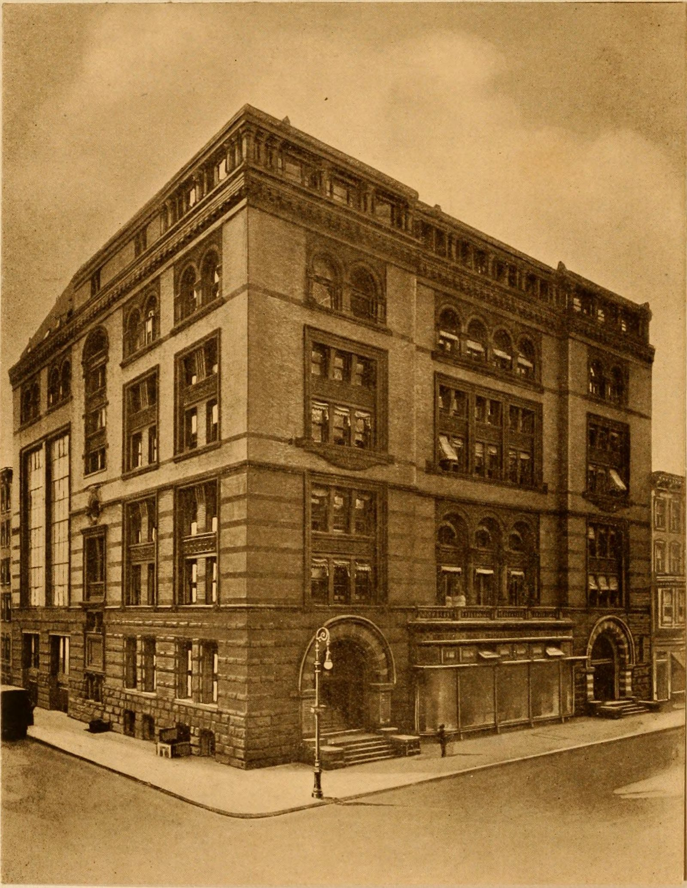

"To the trade" is a phrase that makes ordinary people feel insulted, and I understand why. It sounds like a club. Sometimes it behaves like a club. The educational version is drier, and more useful.
<figure class="hfrh-figure">
  
  <figcaption>To-the-trade showrooms sell through designers; the public price list is often a different document.</figcaption>
</figure>

To the trade means the account is a working designer or architect. The showroom's paperwork, pricing, samples, and apology calls are built for that person. You, the homeowner, may walk the hall. In many buildings you may walk into the room. You will usually not be the name on the order. The restriction is on buying, not on looking. People get that backward and then write a paragraph about elitism. Looking is allowed more often than the myth says. Buying is the professional act.

Why?

Because a custom dining table is not a toaster, and the person who specifies it is doing a job you may not want to do.

They take responsibility for scale against a drawing.
They take responsibility for finish against a north window and a red rug.
They take responsibility for the day the contractor moves a wall.
They take responsibility for the freight elevator that does not exist.
They take the phone call when something is late, which means I take their phone call, not twenty-two family group texts.

That labor is not imaginary. I have watched it save houses. I have also watched it get billed in ways that made a client feel trimmed. Both can be true. The showroom system does not invent the designer's fee. It assumes the fee, the same way a gallery assumes a split.

The badge at the door is a filter for time. A showroom salesperson who spends an hour quoting a civilian who will then buy a lookalike online has just donated the hour. Multiply that by a week and the room cannot afford to keep the sample of our table on the floor. The sample is not free. We built it. They house it. Somebody has to protect the hours around it.

Is the filter abused? Yes. Some rooms are rude. Some rooms confuse professional with social class. Some designers are not better buyers than a careful homeowner. I have met homeowners who can read a drawing better than a person with a business card. The system is a blunt instrument. Blunt instruments persist when the alternative is chaos.

The alternative we actually got, later, was the website that would sell to anyone with a card. That felt like justice. It also dumped the translation job onto a chat window and a return policy. You can have open buying. You then have to decide who does the labor the designer used to do. If the answer is "nobody," the table arrives in the wrong length and the one-star review is written in a tone of betrayal.

There are consumer exceptions. The D&D Building's Shop the Building program is the public one I can name: a limited buy at trade price plus a fee, with the building doing some of the translation. Other design centers have cousins. Those programs admit the tension. They do not abolish it.

For a maker, to-the-trade is a decision about who you want to be on the phone with for the next twenty years. Designers are repeat customers if you do not embarrass them. They are also demanding in a way a Saturday buyer is not. They will ask for a finish sample the size of a book. They will ask you to hold a slot. They will need a piece the week of a photograph. If you hate that, do not knock on this door. If you can live in that rhythm, it is a grown living.

For a buyer, here is the non-insulting way to use the system.

Hire a designer if the project is a room, not an object.
If the project is one object and you are competent, some shops will work with you directly. Ours will talk. We still prefer the professional when the house is a project.
If you want to look, look. Bring a tape. Bring a photo of the window. Do not demand a net price as a trophy. The net price is a tool for a person who is going to do the rest of the job.

I opened on Capitol Hill by calling designers because that is where the work was. I did not open a gift shop. The badge came later, on buildings I did not own. The logic was the same: find the person who already has the room in their bag.

Next we walk into the most famous of those buildings and I will tell you what a design center is, because a lot of you have walked past one and thought it was a mall that would not let you in.
