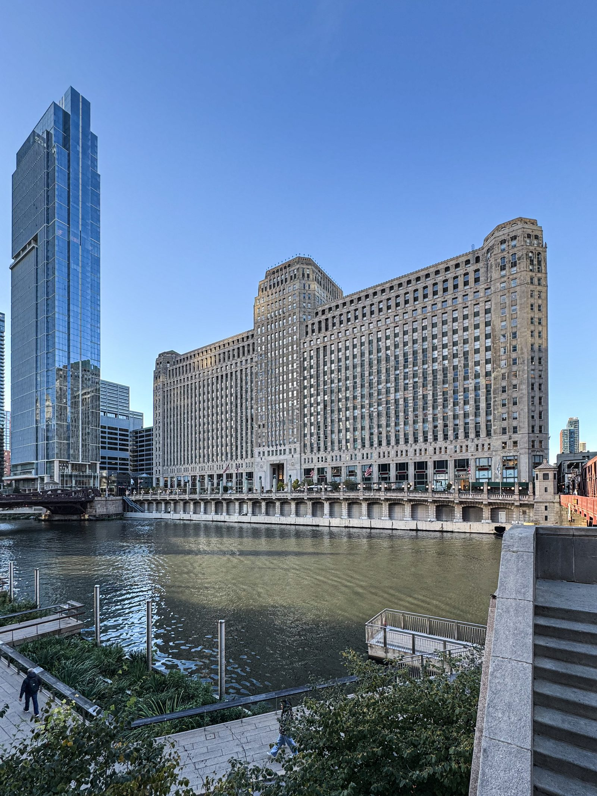

979 Third Avenue. The Decoration and Design Building. People in the trade just say the D&D.
<figure class="hfrh-figure">
  
  <figcaption>Design centers such as Chicago’s Merchandise Mart concentrate wholesale showrooms the way cities concentrate banks.</figcaption>
</figure>

It has been the type specimen since 1965. Eighteen floors, more than a hundred showrooms, thousands of lines if you believe the building's own counting. Fabric, furniture, lighting, carpet, the things a room is made of when money is serious. Albert Hadley called it the center of their lives, and whether or not you like Hadley, that sentence tells you the building's job. It is where the profession goes to work.

A civilian walking in from Third Avenue thinks: mall.
A maker walking in thinks: jury.
A designer walking in thinks: Tuesday.

All three are a little right. None is enough.

A design center is a cluster of door-three rooms sharing an elevator and a reputation. Each showroom is its own business. They represent lines. They fight quietly over designers. They keep samples. They write orders at net. They lend memo cuttings of fabric the size of a map so a person can tape them on a wall and hate them overnight. They tag orders with sidemarks so a project's purchases do not get lost across twelve vendors. None of that is retail as a civilian knows it.

It is also not High Point. I will do High Point in its own stage. High Point is a temporary city for the whole industry, twice a year, retailers and designers and importers and people who will never see a D&D badge. A design center is a permanent weekday machine for a local profession. Confusing them is like confusing a courthouse with a state fair. Both have booths. They are not the same institution.

Other cities built cousins. The Merchandise Mart in Chicago. DCOTA in Dania Beach. ADAC in Atlanta. The Washington Design Center. Houston and Dallas have their rooms. Boston. San Francisco. The names change. The type persists: a building that makes it efficient for a designer to touch ten lines in an afternoon without driving to ten factories.

That efficiency is the product. A shop in Ferdinand cannot afford to host every designer in America. A designer in New York cannot afford to fly to Ferdinand for every client who wants a table. The showroom is the treaty. We send a sample and a catalog and a person who can tell the truth when we are not in the room. They send us an order that already survived a conversation about the window.

What a design center is not:

It is not a museum. You may treat it like one. The objects are working.
It is not a liquidation floor. If a room looks like a sale, be suspicious.
It is not open buying, except where a building has invented a consumer program on purpose.
It is not proof of quality by itself. Bad lines get into good buildings. Good lines fail to get in. The elevator is not a halo.

I have a personal bias I will not hide. I think a person should touch a table before they buy a table. The design center is one of the last public-ish places where that is still normal, even if the public is standing next to their designer. When I told an interviewer that purchasing online makes me cringe, this is what I meant. Not that computers are evil. That the journey got deleted.

If you are a designer new to a center, do the unglamorous work. Meet the salespeople before you need a miracle. Tell them what you will never specify. Tell them your lead-time reality. A showroom that knows your habits will save you from a finish that photographs well and lives badly.

If you are a maker hunting representation, do not confuse a pretty building with a partner. Ask how they sell. Ask whether they inventory or they sell from sample. Ask what city they actually cover, not what city they print. Ask what happens when a designer is angry. Then ask yourself whether you can support that room with the number of pieces you actually make. Several hundred a year sounds like a lot until you divide it across a country.

If you are a civilian who wants to see the building: go with your designer, or call the building about their consumer path, or look without performing outrage at the desk. You are in a workplace. Behave like you walked into a law office that happens to have sofas.

Next: how a line actually gets into one of those rooms, and why most shops should not want every city.
