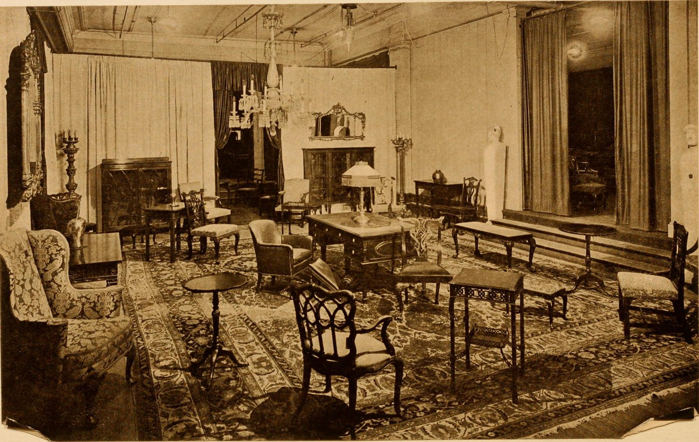

If two rooms in the same city sell the same table, they will eventually hate each other, and they will be right.
<figure class="hfrh-figure">
  
  <figcaption>Territory exclusivity maps a city to one showroom; the map only works if the room is actually selling.</figcaption>
</figure>

A showroom spends money to make your name feel inevitable. They train staff. They put your sample in the light. They take a designer to lunch and say, this is the one. If the designer can walk down the hall and buy the same name from a rival who did none of that work, the first room will stop doing the work. That is not pettiness. That is arithmetic.

So we draw maps.

Exclusivity can be a city, a metro, a state, a building, a channel. It can be furniture only, or furniture plus mirrors, or a collection but not a custom one-off. The good contracts are boring and specific. The bad contracts say "the South" and then everyone pretends they know what that means.

I am for exclusivity when it matches effort. A room that is actually selling you has earned a fence. I am against exclusivity when it is a souvenir. A room that wants the name for the website and then lets the sample collect dust is not a partner. They are a trophy case. You have just signed away a city for a photograph.

There is a maker-side temptation to say yes to everyone, because yes feels like growth. Then you spend a year refereeing. Designer X saw it at Room A and bought it at Room B because Room B answered the phone. Room A calls you. You are now in a custody fight over a table. Nobody makes a better table during a custody fight.

There is a showroom-side temptation to ask for the moon. National exclusivity from a regional room. Adjacent categories they do not understand. A veto on your own shop sales. Read those paragraphs twice. You can lock yourself out of your own driveway.

Direct sales are the sore tooth. If a homeowner finds us and we sell them a table, has the local showroom been cheated? Sometimes. If that homeowner was already the showroom's client, yes — send it through the room, or pay the room, or do whatever your contract said when you were sober. If the homeowner was never walking into that building, you have to decide whether you are a brand or a hostage. I will not give you a single rule. I will say: write the rule down before the phone rings. The phone will ring.

Platforms made this uglier. A website does not care about your Dallas fence. A designer in Dallas does. If your work shows up on a national catalog at a price that makes the showroom look foolish, the fence was a paper fence. We will get to MAP and private label in the platform stage. Remember the feeling: the local room did the teaching, the website did the harvesting.

How to think about a map without becoming a lawyer:

One serious room per metro unless the city is actually two markets.
A written list of exceptions: your own shop, an existing designer relationship, a charity piece, a museum.
A review date. Exclusivity without a review is how dead rooms keep names in a drawer.
A performance conversation that is not a surprise. If they are not selling you, you both should know before year three.

If you are a designer, exclusivity is why you can trust that the story you were told on Tuesday will not be contradicted on Wednesday down the hall. If you are a buyer, it is why the same table is not in every window. Scarcity here is not always art. Sometimes it is a peace treaty.

I like a peace treaty that lets the shop work. I do not like a peace treaty that lets a quiet floor own a skyline.

Keep the map smaller than your pride and larger than your fear. That is the whole draft.

Next we take the sheet of paper that makes civilians furious: list, net, and the designer's multiplier.
