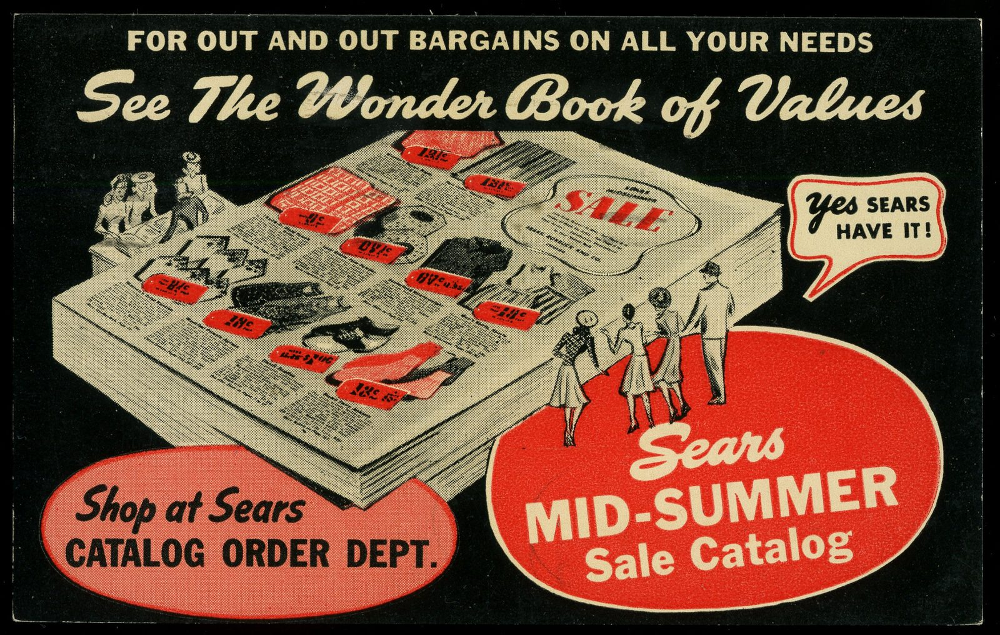

I am still a pen-and-paper person. The company is not. Both of those sentences are true, and the second one saved us from becoming a myth.
<figure class="hfrh-figure">
  
  <figcaption>Showroom orders still ride on paper trails: acknowledgements, deposits, and change orders with signatures.</figcaption>
</figure>

A custom table has too many names.

The client couple, who may not agree.
The designer.
The junior who actually sends the email.
The showroom salesperson.
The principal who promised a date at a dinner.
The person on our floor who will pull the lumber.
The finisher.
The driver.

If any two of those people remember a different stain name, we will build the wrong quiet. Paper is how we refuse to guess.

A sidemark is a short name on an order that ties every vendor's work to one project. The rug people see it. The lighting people see it. We see it. When a truck is late, the sidemark is how a designer does not have to tell the story of the house from scratch to five companies. It is a humble invention. It is also the opposite of a website cart, which knows a SKU and an address and almost nothing about a life.

A memo sample, in fabric, is a large cutting you can tape on a wall and live with. In wood we do cousins: finish boards, sometimes a corner, sometimes a small top. The point is the same. Do not decide a color in a fluorescent hallway on a Monday and then act shocked in a west room on a Saturday. Take the sample home. Hate it. Bring it back. That loop is design. A click is not a loop.

An acknowledgement is the shop saying: this is what we think you asked for. Dimensions. Wood. Finish. Leaves. Date we are willing to say out loud. If you do not read the acknowledgement, you have not ordered. You have wished. I have had people skip that page and then argue with a finished table. I have less patience for that than I used to. The paper was the chance to fight cheaply.

None of this is bureaucracy for its own sake. It is how a bench in Ferdinand stays connected to a room we will not see until the truck. The internet promised to delete paperwork and replace it with a dashboard. Dashboards are fine. They still have to encode the same facts. If your dashboard cannot say which leaf mechanism and which sidemark, it is a toy.

Early on, the paper was a fax. Before that, a phone call and a note in a book. I am not nostalgic for the fax. I am nostalgic for the moment when two people agreed in writing before a tree was cut into a promise.

Platforms inverted the sequence. The click is the agreement. The details are a chat after the credit card. That works for a phone case. For a table, it is how you get a chargeback from a person who never read a line.

If you are a designer, send the boring email. Confirm the boring email. Put the sidemark on the boring email. Your future self, at 9 p.m. the night before an install, will want to send me a fruit basket.

If you are a client, ask to see the acknowledgement. You are not being difficult. You are being the fourth person in a chain that cannot afford a whisper-down-the-lane finish.

If you are a maker, do not start a piece on a verbal. I have done it. I have regretted it. The romance of "we understand each other" dies on a Wednesday when someone remembers a different brown.

The educational point: trust in handmade furniture is not a feeling. It is a trail. Galleries had a ticket. Fairs had an order pad. Showrooms have sidemarks. Websites have a cart. Only some of those trails are rich enough to carry a dining table.

Next, before we leave the human origin of our own shop: the cold call, the Capitol Hill years, and why I still believe a voice is a door.
