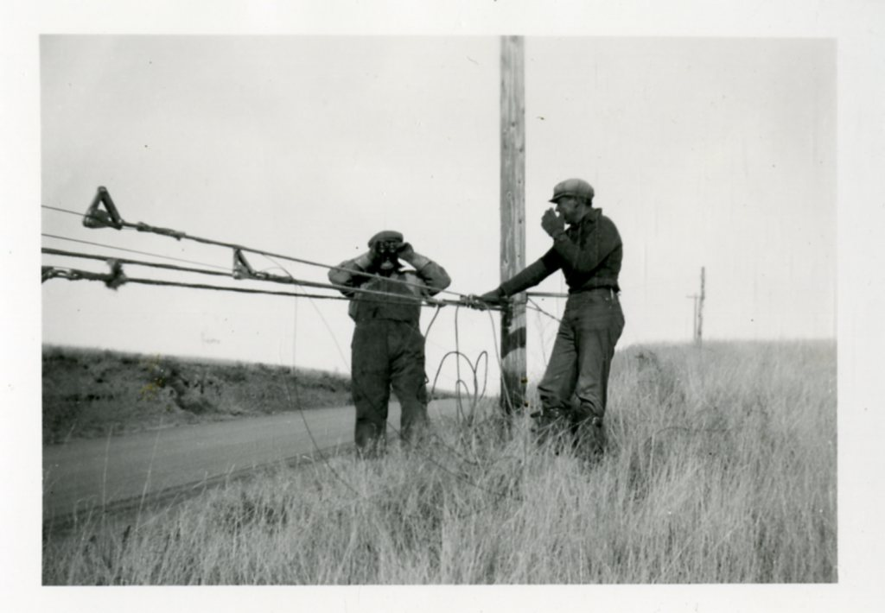

<figure>

<figcaption>Cold-calling designers was door-to-door work with a dial tone: persistence, samples, and a finish story that survived hang-ups.</figcaption>
</figure>

I opened a woodshop in Washington. Storefront. Apartment above it. A few other people. A phone.

The phone is the part the photographs leave out.

I would get a name. I would call. I would say who I was and what I could make. Most of the time the answer was no, or a silence that is a no with manners. Every so often the answer was send me something, or come by, or we have a client who might. Then the real work started, because a yes that you cannot keep is worse than a no.

That is not a cute origin story. That is door three without the building. The designer was already the customer. The showroom, later, is a way to make that call at scale without destroying your week.

Why designers, not a street of walk-ins?

Because the objects I wanted to make did not fit a walk-in life. A serious table needs a room, a budget, a person who has already survived the argument about the sofa. On Capitol Hill you can get walk-ins. You will get a lot of compliments and a lot of people who wanted a frame for a print. I needed the person who already had a floor plan.

Cold calling is unfashionable now. It feels like a violation of someone's day. I would rather violate a day with a clear sentence than violate a feed with a hundred ads. A call is honest about the ask. An ad pretends it was invited.

What I learned on those calls, that still applies:

Do not lead with a famous job you have not done yet. Lead with a thing they can use. A dining table. A finish they are struggling to find. A lead time you can defend.

Do not send twelve photographs. Send two that tell the truth and one that tells the hope.

Do not badmouth the line they already specify. You are asking to be added, not to be a critic.

Do not promise Friday if you mean six weeks. Washington is a city that remembers a late object because the dinner is on a calendar with names.

When a call went well, the work taught me faster than any fair jury. A designer will tell you the height is wrong because a client's chair is already bought. That is a better lesson than a like.

We did a table in 2001 for President Clinton, through people I still work with. I said I would mention it once as a job, not as a personality. The educational use of that job is this: it did not arrive because a website ranked us. It arrived because a relationship could carry a serious object into a serious house. Relationships are slow to build and fast to ruin. A late table ruins them. A dishonest finish ruins them. A leaked photograph can ruin them. Treat the relationship like a finish — once it is scratched, everyone sees it.

I still think the phone is a legal door. If you are a young maker waiting to be discovered by an algorithm, consider the older humiliation. Make a list of ten designers whose work you actually respect. Call them. Most will not answer. One might. That one is worth more than a thousand saves.

If you are a designer who hates cold calls, I understand. Have a way for a shop to be invited. A day. A form that a human reads. The profession needs new makers, and the buildings do not automatically find them.

If you are a client, ask your designer how they found the shop. If the answer is "the showroom," good — that is the scaled cold call. If the answer is "I don't know, it was on a site," slow down. Someone should know.

The Capitol Hill apartment was small. The Ferdinand loft is larger. I still live above the work. I still believe a voice in a door is more honest than a banner. The trucks are the other half of that honesty — we will not leave the last mile to a stranger if we can help it.

That is the next draft: why a shop that cares about the quiet also owns the steering wheel.
