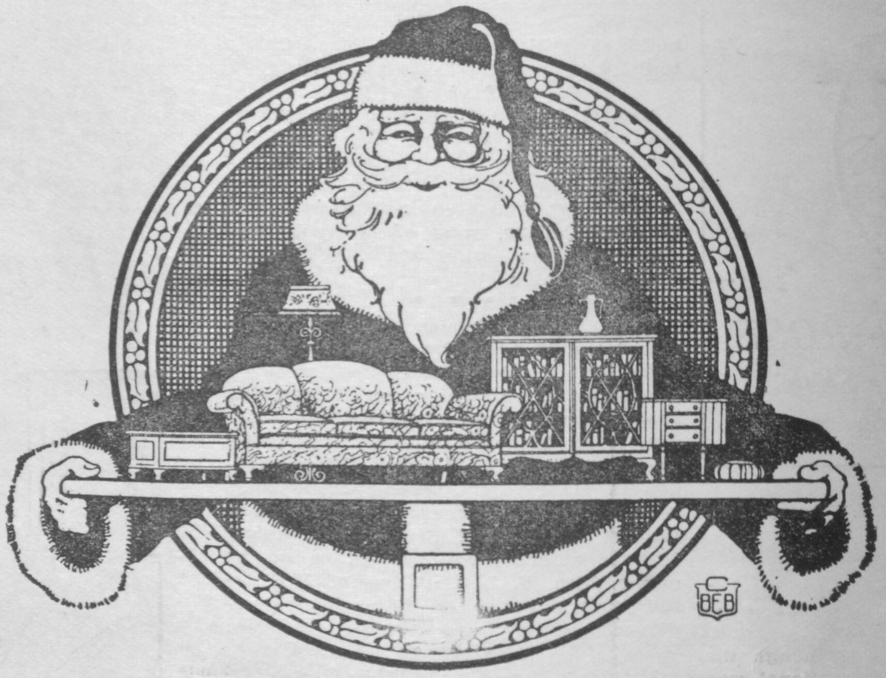

Before there was a product page, there was a page.
<figure class="hfrh-figure">
  
  <figcaption>Tear sheets and mail-order catalogs trained buyers to decide from paper decades before lifestyle photography.</figcaption>
</figure>

A catalog. A binder. A tear sheet — a single page a salesperson could pull and leave on a designer's desk like a calling card. Front: a picture. Back: sizes, woods, a finish list, a note that said "see shop for custom." That page is the ancestor of every furniture website, and I want the ancestor to get credit so the websites stop acting like they invented looking.

America House already tried mail order in its last decade. Department stores mailed books that trained households to want a bedroom suite they had not sat on. High Point exhibitors lived and died by the binder a buyer carried back to a store in Ohio. The photograph is old. The argument that you can decide from a photograph is old.

What the old page had that a lot of new pages do not:

A person attached. The tear sheet was not the sale. It was the reminder after the sale started in a room.
A limited edit. A binder has a spine. A spine forces someone to choose. A website can have seven million spines.
A finish list that admitted it was a list, not the wood. "Walnut" on a tear sheet meant a conversation. "Walnut" on a filter means a click.

What the old page already got wrong:

It flattered. Lighting has always been a liar.
It froze a line that would change.
It made custom look like a footnote when custom was the job.

I like a good catalog. We keep one so a designer can start without inventing a table from fog. I do not like a catalog that pretends it is the shop. The shop is the shop. The catalog is a map. Maps leave things out. Good maps admit it.

When CSN Stores later built hundreds of niche websites — one for barstools, one for stands — they were making tear sheets that could take money. That is a genuine innovation. It is also a genuine loss. The page no longer needed the person. The page became the salesperson, the showroom, the market aisle, and the acknowledgement, all at once, with a chat window for the parts that did not fit.

If you design product pages for a living, try this test. Print your page. Hand it to a designer as a tear sheet. Stand there and see what they ask. Every question they ask is a hole in your page. You may not be able to fill all the holes. You should know they are holes.

If you are a maker, do not outsource the catalog mindlessly. The photograph teaches the next specification. If you only photograph the hero angle, you will only sell the hero angle, and then you will be asked why the other side looks like a surprise.

If you are a buyer, a beautiful page is doing what a tear sheet did: advocating. Ask what it is not showing. The underside. The seam. The leaf. The person.

We close the market stage here. High Point is the old wholesale city. The order was thick. The page was already thinning it.

Next stage: the early web — eBay, Yahoo storefronts, the first shops that tried to be a gallery in a modem — and then the two scars that still define furniture online: photography as showroom, and freight as not shipping.
