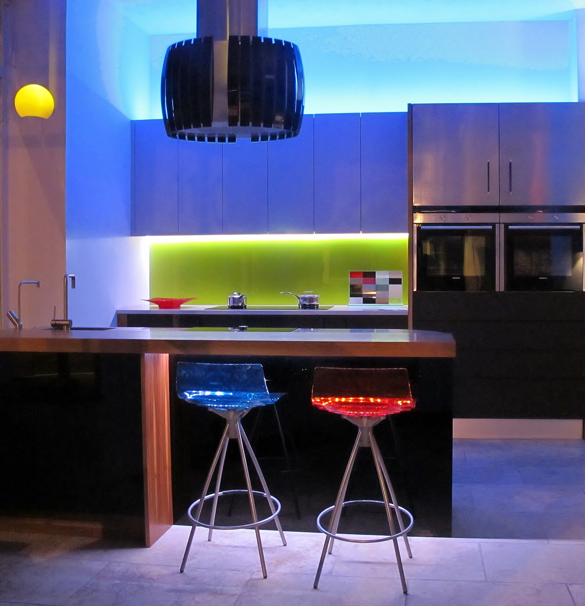

<figure>

<figcaption>When the photograph becomes the showroom, handmade furniture competes on light, crop, and honesty about scale.</figcaption>
</figure>

I said a sample is how we manufacture belief. The web said a picture is cheaper.

Both can be true. Only one of them lets you sit.

When a photograph can close a cart, the shop starts making objects for a lens. I have watched it. I have felt it in my own hands. A wild grain that is the whole point of a board can look like a stain in a thumbnail. A quiet proportion can look like nothing. A high-contrast inlay can look like a million dollars and live like a circus. The lens has taste. The lens is not your client.

So lines drift.

Tops get glossier because gloss reads as expensive on a screen.
Edges get sharper because sharp reads as modern.
Color gets pushed because the feed is a competition.
The underside disappears because the underside does not click.

A showroom sample can fight some of that. A person walks around it. A photograph cannot walk around unless you do the work of filming, and even then the buyer is watching a tour, not taking one.

The studio-furniture world already had a visual dialect — object on a seamless, no crumbs. Galleries needed it. Auction houses needed it. The early web borrowed it and then the platforms industrialized it. Now a carton from a container and a table from a living shop can wear the same lighting. That is not a small cultural fact. That is how language theft gets a camera department.

I still take photographs. I would be a hypocrite to pretend I do not. A designer in another time zone needs a start. A finish library needs a record. The question is whether the photograph is a map or a substitute. Maps we keep. Substitutes we should be ashamed of when the object is a table.

How to keep a shop honest in a camera world:

Photograph the typical piece, not only the pony.
Photograph a failure of the light — a window, a corner, a hand.
Write what the camera cannot see. The weight. The way a drawer closes. The smell of the finish if you are allowed to be that human.
Do not let the marketing person, if you have one, be the only person who approves a picture. Let a finisher look. They will see the lie.

How to keep a buyer honest:

If you can, go to a room. Design center. Shop. A cousin piece.
If you cannot, buy from a shop that will send a physical finish sample and will talk.
Do not trust a lifestyle photo with a bowl of lemons. The lemons are not coming with the table. The light in that kitchen is not your light.

There is a particular scar in furniture: color. Wood is not a hex code. A screen is a hex code factory. I have had people approve a walnut on a phone at midnight and hate it at noon. That is not them being fickle. That is physics. The old memo-sample habit was a technology for physics. We still mail boards.

Platforms learned to show reviews with photos from living rooms. That helped, sometimes. It also trained shops to fear the living room photo, which is a kind of honesty, and to chase a finish that survives a bad phone camera, which is a kind of cowardice. I would rather a finish be right in the room and difficult on a phone than the other way around.

The educational point: when photography became the showroom, the teacher left the building. The remaining teacher is whoever writes the caption and whoever is willing to send a sample. Prefer the shop that still sends the sample.

Next: the other scar, the one that does not care how pretty the picture was — freight. Furniture is not shipping. Furniture is moving a room.
