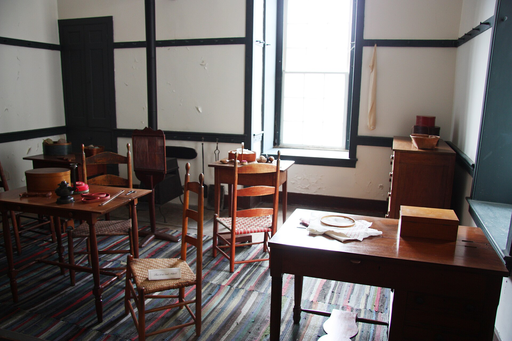

<figure>

<figcaption>Jewelry economics on Etsy trained buyers to compare hours and materials; furniture makers imported those expectations at a loss.</figcaption>
</figure>

A pair of earrings can absorb a listing fee. A dining table can too, if you only list one. The problem is not the twenty cents. The problem is the whole weather system that grew around the twenty cents.

Jewelry — I am using jewelry as a type, not an insult — has traits a marketplace loves.

It photographs in a grid.
It ships as a parcel.
It can be made in multiples without a factory, at least for a while.
It can be returned without a crew.
It can be impulse-bought.
It can live in a search for "bridesmaid" or "birthday" and not feel absurd.

A dining table has the opposite traits.

It photographs as a rumor.
It moves as freight.
It is slow to multiply if you are honest.
It cannot come back without a second move.
It is not an impulse unless the buyer is unwell.
It lives in a search for "dining table" next to objects that are not its cousins, and the search does not know that.

When a marketplace is tuned for the first list, the second list looks like a failure of the seller. You should take better photos. You should offer free shipping. You should list more SKUs. You should run ads. Each of those sentences is jewelry advice put on a table. Some of it is useful. Most of it is a category error.

Fees compound in the wrong direction. A small cut of a pair of earrings is a small number. A small cut of a table is a larger number, and then the ads to make the table visible are a larger number still, and then the freight surprise at checkout kills the cart, and then you lower the object price to make the cart friendlier, and then the shop is working for the weather system.

Returns are the quiet killer. A jewelry return is a day. A table return is a project. Marketplace policies like to be uniform. Uniformity is how a company scales trust. Uniformity is also how a dining table gets treated like a necklace.

I have seen makers try to solve this by selling only small furniture — stools, shelves, things that pretend to be parcels. That can be a living. It is not a solution for a dining table. It is a retreat to a size the weather allows.

The browsing habit is the other mismatch. Etsy taught a scroll of plenty. Plenty is unkind to an object that needs boredom and a sit. A buyer who has just liked forty things will not give your table the twenty minutes it needs. They will give it the same two seconds they gave a candle.

So what was a furniture maker supposed to do in the Etsy years?

Use the site as a sign, not as the shop. Put the phone number. Take the conversation off the weather.
Or refuse the site and go where the object is less rude — a showroom, a commission, a fair that can hold the weight.
Or build small work as a door and keep the large work in a thicker document.

What they were not supposed to do is take jewelry advice from a blog and then hate themselves when a table did not behave like a hoop.

This is not Etsy being evil in 2005. It is a marketplace having a body type. Body types do not fit every object. The later policy changes tried to grow the body so more objects and more volume could fit. That growth is the next draft. I want you to see first that even the honest handmade years were already a bad room for our kind of work.

A rude guest in a gallery. A rude guest on a fair aisle. A rude guest in a feed. The table keeps being rude. The grown response is to change the room, not the table.

Next: 2013, when the company said the quiet part about manufacturers, and the handmade wars started.
