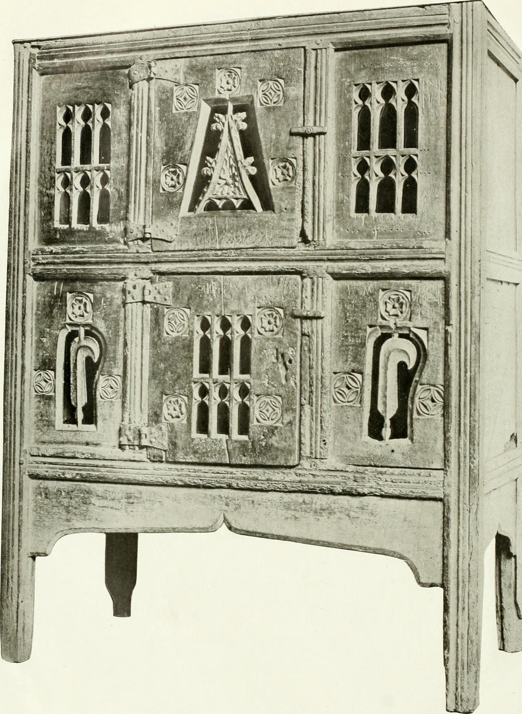

<figure>

<figcaption>Fees and promoted listings turned craft retail into media buying; the split still looked like a gallery cut without the gallerist.</figcaption>
</figure>

A twenty-cent listing is a booth fee I will respect.

It is legible. It is small. It says: you may stand in the room. Whether anyone walks to you is a different question, and in the early years that question was answered by search, by hearts, by the odd editorial feature, by luck. Luck is unfair and cheap.

Ads are a different rent.

Promoted listings, off-site ads, the whole family — I will not recite a rate card that will be stale by the time you hear this. The educational object is the auction. You bid for the chance to be seen by a person who typed a word. The person may not have been looking for you. They were looking for the word. You paid to intercept the word.

That is not evil. It is how a lot of the modern web eats. It is also the end of the fantasy that a handmade marketplace is a community that will find you if the work is good. Good work still matters. Oxygen costs extra.

I have watched makers treat ads as a moral failure, as if paying for a booth at Rhinebeck was purity and paying for a click is sin. Both are rent. The difference is feedback. A booth you can see. A click auction you cannot. You pour money into a weather system that changes its rules, and then you blame yourself for not being a marketer.

The company, after it became a public company in April 2015, had a duty to grow. Growth in a marketplace often means more take-rate and more ads, because the easy listing fee does not feed a stock story. I am not scandalized by a stock story. I am noting the pressure. Pressure changes rooms. A room that needs ads will slowly make organic discovery worse, or feel worse, because otherwise nobody would buy the oxygen. You do not have to believe in a conspiracy. You can believe in incentives.

For furniture, ads are a particularly dumb weather. You will pay to intercept "dining table" next to people who are selling objects that are not your cousins. You will get clicks from hunters. Hunters bounce. Bounces teach the auction that you are a bad bet, so you pay more. The jewelry body type again.

What I tell a shop that asks me, when they ask:

Use ads as a test, not as a living. If the test cannot show you a customer you can take off-platform into a thicker document, you are buying noise.
Count the full stack: ad, cut, freight, the hour of chat, the probability of a return.
Do not use ads to paper over a photograph that does not tell the truth. You will only buy faster disappointment.

What I tell a buyer:

The first listing you see is not the best. It is the one that paid or the one the weather liked today. Scroll like you are walking a fair, not like you are obeying a ranking.

The phrase I want retired is "the algorithm loves me." The algorithm does not love. It allocates oxygen. A gallery owner could love you. A designer can love you. A ranking can only prefer you until the bill changes.

This is the moment the Etsy era stops being a craft story and becomes a media story. The sellers are no longer only makers. They are inventory for an ad product. Some of them wanted that. Some of them wanted a room. The company wanted a company.

Next: the last Etsy dream that connects this stage to the Overstock/Wayfair stage — Etsy Wholesale, the idea that a growing handmade seller could walk through a big-box door without becoming a factory first.
