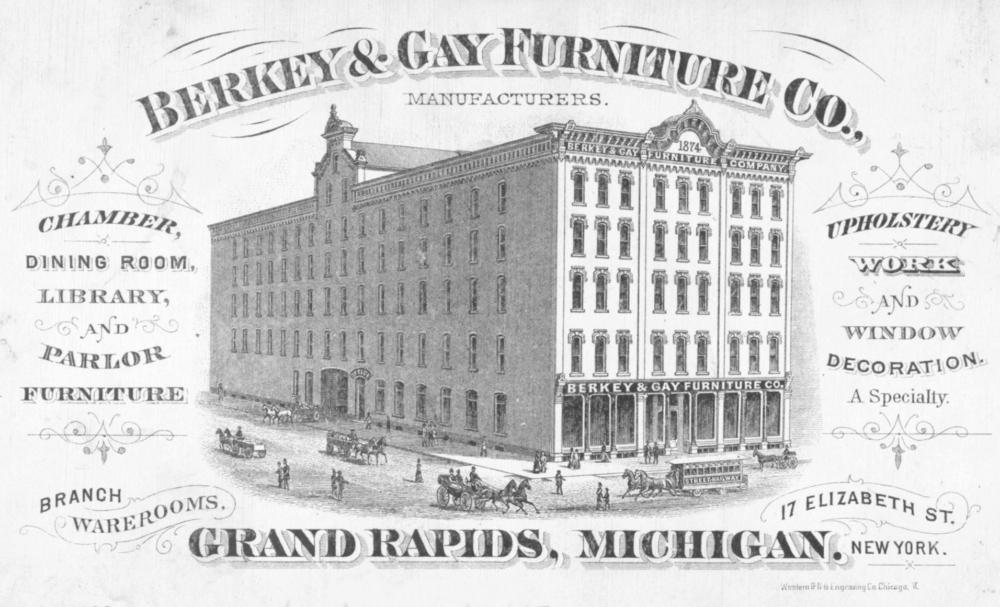

<figure>

<figcaption>Etsy Wholesale tried to connect growing handmade sellers to brick retailers — gallery consignment logic at spreadsheet scale.</figcaption>
</figure>

There was a moment, in the mid-2010s, when Etsy tried to build door two on purpose.

Etsy Wholesale. The idea was clean enough to be attractive: a seller who had outgrown the cart could meet a store that wanted a line. Not a dropship portal dressed as a partner. A retailer. A buyer with a shop. The old ACC wholesale aisle, software.

I want you to hear why that dream had to exist.

The handmade wars had said: grow, hire, manufacture with disclosure. Growth without a wholesale door means growth into more ads and more carts. That is a funnel, not a practice. A practice wants a store that takes title sometimes, or at least a store that repeats. Wholesale, the real kind, is how a shop plans a season.

TIME's piece on the handmade wars even mentioned the separate wholesale site as part of Dickerson's tenure. The company was trying to be an ecosystem, not only a search bar. I respect the attempt. I do not automatically respect every attempt that uses the word wholesale.

Because the word, by then, was already being emptied by other websites. Overstock's fulfillment partners. Wayfair's supplier portals. Amazon's later versions. A seller could hear "wholesale" and think "I will have a buyer," and land in door four.

So Etsy Wholesale sits in this series as a hinge sentence, not as a product review. I will not swear to its current life on camera. Products get renamed, folded, retired. Verify before you teach it as a living door. The educational object is the need it pointed at.

A handmade seller who succeeds becomes a shop.
A shop needs a door that is not a stranger's cart.
The old doors for that were the fair wholesale aisle, the gallery that buys, the specialty store, the design showroom.
A software door is not a sin. It is only as good as the contract: title, terms, cancellation, whose customer.

If you were a seller who used that door and it fed you, tell the truth about which door it actually was. Did the retailer take risk, or did they order one and return it like a civilian? Did you meet a person? Did you get paid on a grown schedule?

If you are a maker now looking for a "wholesale platform," use the four doors. If the platform keeps the customer, you are not in wholesale. If the retailer keeps the customer and the inventory, you might be.

This is also the last Etsy-stage draft, so I will say the stage in one breath.

2005: a room that meant handmade.
Jewelry economics: the room's body type.
2013: handmade becomes authorship if you apply.
Three buckets: a taxonomy a search bar can ignore.
Ads: oxygen for sale.
Wholesale: a reach back toward door two.

Etsy did not invent craft. It did not murder craft. It scaled a room until the room needed a different word, and then it kept the old word because the old word was the asset.

We leave that city and go to the other internet wholesale — the one that never pretended to be a craft fair. Salt Lake. Boston. Closeouts. Speaker stands. Seven thousand suppliers. The catalogs that learned to eat.

If you only remember one thing from the Etsy years: ask who held the work, and ask who owns the customer. Those two questions will still work when the brand names change.
