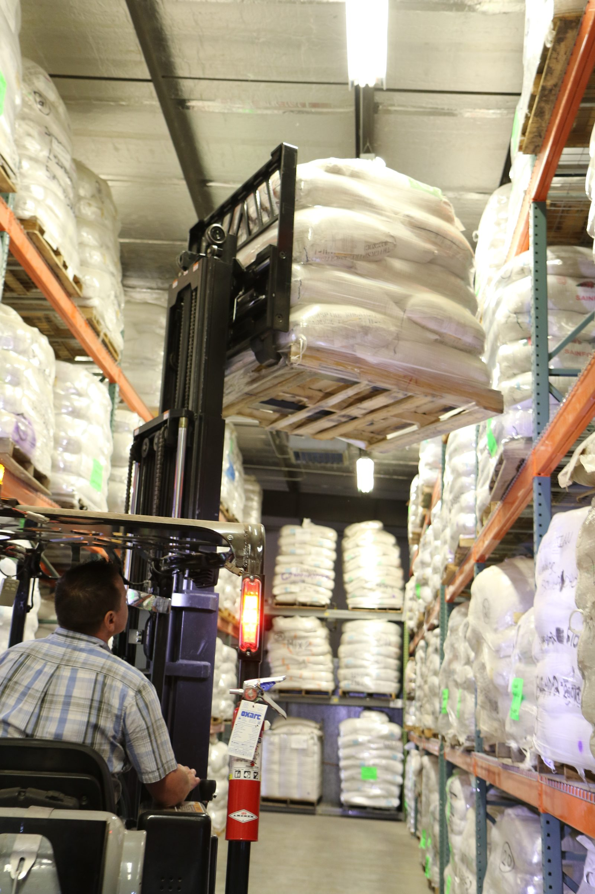

1999 is a hinge year for this shop and for this website, and I do not want that coincidence to become a myth. We opened a custom shop. A Utah company that had been D2-Discounts Direct, then Deals.com, took the name Overstock.com. They were not thinking about our tables. They were thinking about closeouts.
<figure class="hfrh-figure">
  
  <figcaption>Overstock’s partner model grew by listing other people’s inventory before owned closeouts dominated the story.</figcaption>
</figure>

Closeout is an old trade. Somebody made too much. Somebody cancelled. A jobber moves the pile. The civilian gets a bargain and a story about a deal. Patrick Byrne's group looked at that pile and put it on a transactional website. The SEC paperwork from the 2002 offering is the dry version: inconsistent quantities, fragmented supply, the internet as a way to gather both sides.

That is door two with leftover goods. Title often sat with Overstock. Risk sat with Overstock. The customer sat with Overstock. A shop that sold them a pile was doing something a factory understands: we made it, we need it gone, we will take a smaller number.

Then the other door opened.

Fulfillment partners. Commission deals. Manufacturers, catalogs, distributors, importers listing goods that Overstock had not necessarily bought. Overstock took the customer, the payment, the trust, the return. The partner shipped. In the early 2000s that side grew until, by the mid-decade, the partner dollars could eclipse the owned-inventory dollars. You can watch the climb in the old profiles: a rounding error in 2000, a pile in 2003, a majority later.

That is door four getting a company around it.

I want you to feel why a furniture shop would say yes.

A purchase order from a site people have heard of feels like air.
You do not have to teach a designer.
You do not have to rent a booth.
You already have inventory, or you can make to a SKU list.
They handle the stranger.

I want you to feel why that yes is a different profession.

You do not own the customer.
Their return policy is now your weather.
Their photograph is now your name, even when it is not your name.
Their freight experiment is now your claim.

Overstock's home people have argued, in the trade press, that they were early — rugs in 1999, sofas without the old delivery assumption, flying to partners' warehouses to make the logistics real. I will give early its due. Being early at door four does not make door four into door two.

They later built more supplier tools, more ways to be the warehouse for someone else's site, even. The names of those tools will change. The structure is the lesson. A website that started on piles learned to live on other people's piles without taking title.

Our shop is not going to perform a tell-all about a particular portal. I will not invent a contract for color. The industry pipe is the subject. Shops like ours were offered versions of that pipe. Some shops lived on it. Some shops used it to clear a finish that did not belong in a showroom. Some shops got religion after a season of returns and went back to a thicker document.

If you are a buyer who loved an Overstock price in those years, you were often buying a real object from a real shop you would never meet. That can be fine. It is not the same as buying from a shop. If something went wrong, you yelled at the site. The site yelled at a partner. The partner yelled at a carrier. The table, if it could talk, would have asked for a sidemark.

If you are a maker considering a closeout-shaped door now, ask whether you are selling a pile you already own — door two — or renting your bench to a customer you are not allowed to know. The first can be hygiene. The second is a job change.

Next: the Boston version of the same idea, which did not start on closeouts. It started on speaker stands, and then it became a city of websites.
