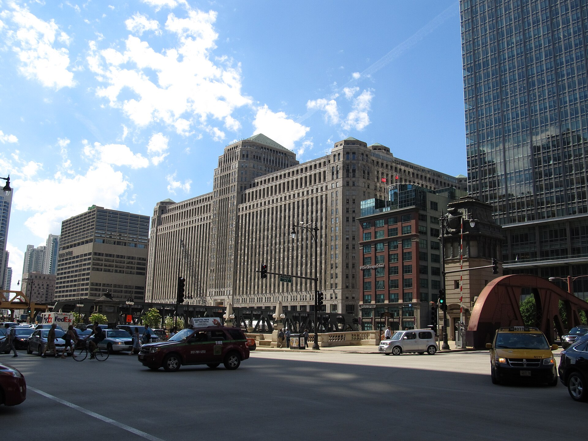

<figure>

<figcaption>CSN Stores grew from niche sites into Wayfair — supplier-direct dropship catalogs assembled in the same trade cities as showrooms.</figcaption>
</figure>

August 29, 2002. RacksAndStands.com. Television stands and speaker stands. Orders the same day.

That is not a cute founder story for our purposes. That is a thesis: if you pick a narrow noun and a photograph and a supplier who will ship, you can take money before you own a warehouse of stands. Niraj Shah and Steve Conine built a forest of those nouns. AllBarstools. Bedroomfurniture. Hundreds of sites, the S-1 later said, bootstrapped through 2011, hundreds of millions in revenue before they decided the forest was a problem.

The forest was a search trick and a trust trick.

Search: a person typing a specific noun found a site that looked like it had been waiting for them. The tear sheet had become a domain.
Trust: a site named after the object felt like a specialist. A specialist feels like a shop. It was a shopfront on a network of other people's inventory.

They went to High Point. The How I Built This interview is public about that. Traditional suppliers were not in love with e-commerce. Badges from a Boston company with an office that sounded like a street you might know helped the conversation. Market as recruiting office. I asked you to keep that picture. Here it is.

In late 2011 they closed and redirected a couple hundred niche sites into Wayfair.com, changed the name from CSN, and went about becoming a household word. 2014, they filed to go public. The S-1 voice is the educational gold: millions of products, thousands of suppliers, many of them small family operations without a national brand, and Wayfair as the access to a customer base those shops did not have.

Read that again as a shop.

We have the customer.
You have the object.
Together we look like a store.

That is door four said in a prospectus.

I am not going to do a stock analysis. I am not going to pretend I know their current mix of owned brands and suppliers. Those things move. The historical structure is what the BBF channel needs. For a long stretch, the way this company scaled furniture on the internet was to be a visually rich catalog on top of other people's docks.

Why it worked for so many shops:

The customer base was real.
The photography machine was real.
The order flow was real.
The alternative was to remain invisible in a town without a design center.

Why it hurt so many shops:

The customer was not theirs.
The price was often not theirs.
The return was theirs anyway.
The name on the box and the name on the review did not match the name on the bench.
The SKU machine asked them to become a catalog, not a shop.

We did not become a Wayfair brand story. I will not invent a warehouse memoir. We watched the weather. Designers started saying they had to explain why a showroom table cost more than a picture that looked cousin. The cousin was sometimes a different object with the same posture. Photography as showroom, industrialized.

If you bought a decent piece through that machine, I am glad you have a place to sit. I am still going to tell you that you bought from a network. If you want a shop, you have to go to a shop.

If you supplied that machine, you know the portal. You know the score. You know the email that says your metrics slipped. Metrics are not a sidemark. They are a weather report about strangers.

The consolidation of 2011 matters because it ended the specialist feeling. One word. One cart. One place that could look like it contained the entire house. America House had tried to contain a lot of American craft in one room. This was a different containment. Not teaching. Completeness.

Next: the contract under the completeness. Dropship, said slowly, as a job description.
