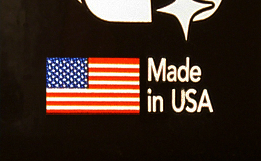

<figure>

<figcaption>MAP fights and private-label listings traded on country-of-origin language — American made as marketing before audit.</figcaption>
</figure>

A name is a tool.

On a showroom floor, our name is how a designer finds the cousin of a sample they sat at last year. The name is a memory device. It is also a promise: this building, these people, this truck.

On a platform, a name can be a problem. If the shop's name is on the listing, the buyer might search the name next time and skip the platform. If the shop's name is on the listing at a price the showroom cannot explain, the showroom will call you, and they will be right. If the shop's name is not on the listing, the platform owns the memory. You are a dock with a SKU.

Private label is the clean version of that last move. You make it. They name it. The civilian thinks the website has a house brand. Sometimes the house brand is a real design effort. Sometimes it is a sticker. Either way, your labor has become their memory.

I am not scandalized by private label as a factory job. A lot of honest objects have always worn someone else's name. The trade used to say "unbranded" and everyone knew. The educational problem is the costume. The listing language still says artisan, handcrafted, designed in-house, while the bench is a partner in a portal.

MAP — minimum advertised price — is the other tool. A brand says: you may sell this, but you may not advertise it below this number. The point is to keep a public price from making every other door look like a fool. Showrooms care about this in their bones. A designer who saw your table at a number on a website will not enjoy your list in a building on Third Avenue.

Platforms and MAP have had a long, technical fight that I will not pretend to litigate. The shop-floor version is this: if your work is on a site that lives on "a deal," your showroom number is in danger unless you are very careful about which objects go where. Some shops split the line. Portal gets a different name, a different construction, a different finish. Showroom gets the thing we are willing to sign. That split is sanity. It is also how a company becomes two companies.

If you do not split, you will referee.

The designer will send a screenshot.
The client will want the screenshot price with the showroom service.
The platform will want the object at a price that converts.
You will want a weekend.

Write the split before the screenshot.

Our own preference is obvious from the rest of this series. We keep the name. We keep the truck. We keep the door that can explain the number. I will not tell every shop to do that. I will tell every shop to decide. An undecided name is how you wake up as a private-label ghost with a showroom contract you can no longer perform.

If you are a buyer, ask whose name is on the box and whose name is on the invoice and whose name is on the review. If they are three names, you are in a network. Networks can deliver a decent object. They cannot deliver a person in year eight as easily as a shop can.

If you are a designer, do not specify a private-label cousin of a showroom piece and tell the client it is the same. It might be. It might be a hat. Your job is to know.

The educational point: branding is not vanity. It is a map of responsibility. When the map is redrawn so the website is the only visible adult, the shop becomes a child laboring in the back. Some shops accepted that because the orders were food. I understand food. I still want the adult in the room to be the people who held the work.

Next: the day after the truck — returns, chargebacks, and a table that already left the shop.
