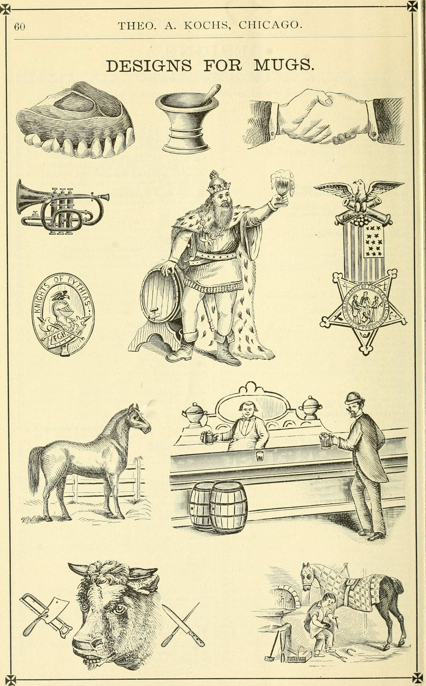

<figure>

<figcaption>Four prices for one handmade piece — gallery, designer net, showroom, and your floor — each honest only if calculated on purpose.</figcaption>
</figure>

Take a table. Walnut. A length. A base. A leaf story. Hold it in your mind as if it were one object.

Now put it through four doors. The number will move. The object may not.

Door one, gallery. The number includes the shop living and the room living. The room taught. The object sat. If it did not sell, we ate hope and they ate floor. The buyer paid for a decision in a taught room.

Door two, wholesale. The store paid us less and took the risk. Their number to the civilian includes their floor, their mistake, their sale. If they are good, they also taught a little. If they are a website pretending to be a store, they taught nothing and still took a living.

Door three, trade. The number the client sees may include shop, showroom, and designer. Three livings. A sample. A sidemark. A truck, if we are doing our job. The client is paying for a result in a house, not only for walnut.

Door four, dropship. The number looks smaller. Count again. Platform living. Ads. Returns. Freight that was called shipping. A photograph department. A score. The shop living, compressed. The teaching, deleted. If the number is still smaller, something in the object probably moved — construction, wood, finish, who comes to the house, whether anyone will answer in year eight.

Civilians compare the fourth number to the third and feel cheated by the building on Third Avenue. Sometimes they are right — a multiplier with no labor is a toll. Often they are comparing different bundles and calling the difference greed.

I want you to practice a sentence: what is included besides the walnut?

If the answer is a teacher, the number should be higher.
If the answer is a hospital wing for returns, the number should be higher, or the object should be cheaper to absorb it.
If the answer is nothing, be suspicious. Nothing is a lie. The driver is included, or the landfill is included, or the shop's year is included as a loss.

Our prices are not this episode. I will not perform a sheet. The education is the parsing, the same parsing we did with list and net.

A useful household exercise:

Find a table you like in a showroom photograph.
Find a cousin on a platform.
Write two columns: wood, joinery if you can see it, finish, who delivers, who you call, what happens if it is wrong, who designed the room around it.
Do not write the price until the columns are full.
Then write the prices.
Then see whether you are still angry.

Some of you will still prefer the platform column, with eyes open. Good. Eyes open is the whole channel.

Some of you will understand a designer fee for the first time. Also good.

Some of you make tables and have been underpricing door three because door four taught you to be ashamed. Stop that. Shame is a bad pricing tool.

The stolen words come back here. Handmade, custom, wholesale, artisan — they move the number in the buyer's head before the walnut does. If you put those words on door four, you are borrowing door one's price feeling without door one's bundle. That borrowing is the retail history of the last twenty years in one sin.

We are almost at the end of the series. One more word to mill: American made. Then I will close the door and tell you what this channel is for when the history lesson is over.
