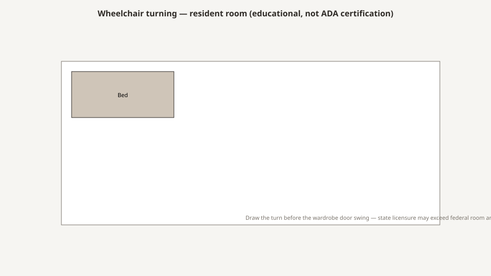

# ADA in the resident room

<!-- hif-figure:v1 -->
<figure class="hif-figure">
  
  <figcaption><strong>Fig. 1.</strong> Draw the turn before the wardrobe door swing — state books may exceed federal area. <em>Rights:</em> CC0 1.0 (original schematic); BBF staging / original line art; <a href="https://creativecommons.org/publicdomain/zero/1.0/">source</a>. Notional wheelchair turning circle — verify against adopted ADA and state licensure.</figcaption>
</figure>

The Americans with Disabilities Act is a civil-rights statute with a standards book. A nursing home is also a CMS building with a survey book. Those books do not always sit in the same chair.

I am not your accessibility lawyer. I am a mill who has had a wardrobe fail a reach and a table fail a knee. The 2010 ADA Standards give numbers I will treat as **teaching numbers**, not as a scoping opinion for your particular house. Scoping — which rooms, which alterations, which medical exceptions — is a legal job. Geometry is a furniture job.

## A civil-rights statute that learned inches

Congress passed the ADA in 1990. The furniture world heard a vibe for a decade and then, in 2010, a book with dimensions that a mill can fail. The 2010 Standards for Accessible Design are the public text I open when a designer says “ADA package” and means a raised toilet seat. The statute itself — 42 U.S.C. § 12101 et seq. — is not a nightstand catalog. It is a rights statute that later acquired a measuring tape.

Long-term care is not a motel and it is not a hospital ward, and the Standards know that enough to give medical-care and long-term-care facilities their own scoping and their own chapter. Chapter 2’s medical-care and long-term-care scoping (223 in the 2010 numbering) and Chapter 8’s 805 sentences about patient and resident sleeping rooms are the pages a furniture person should know exist. I will not tattoo a percentage or a side-count onto this essay as if I were certifying your plant. Open the current text. Ask the accessibility consultant which rooms are designated, which are alterations, which are existing. Then measure the leftover.

What a mill can own without pretending to be that consultant: **reach, clear floor, operable parts, and the heights of the objects we actually build.** F917 wants racks and shelves the resident can reach, or help. F584 wants a homelike room that does not invent a hazard. ADA language and CMS language are cousins. I do not need them to be the same citation to put the rod where a seated person can hang a shirt.

The 1990s and 2000s stock I walked was mostly a 1960s or 1970s envelope trying to buy compliance by the piece. You can buy a taller toilet. You cannot buy a 60-inch turn in an 80-square-foot double that already spent its leftover on two beds. The building is the first decision. The nightstand is the last place people pretend they can fix the building.

## Reach and the rod

The Standards talk about reach ranges for elements that must be accessible. Unobstructed forward and side reach in the 2010 book live in a band people quote as **15 to 48 inches** above the floor. Obstructed reach is a different sentence and a shorter high number. I am teaching the existence of the band, not certifying your wardrobe. A closet rod that only a standing adult can use is a furniture failure even when a lawyer could argue about scoping.

Shop practice: write a seated reach on the wardrobe drawing. If you cannot, you are drawing a staff closet. A second, lower rod or a hook rail is a dimension that does not die. A pull-down rod is a mechanism and a pinch. Prefer the dimension. The wardrobe draft is the long version of the closet tag. This draft is why a mill who has never opened the 2010 book still owes the inch.

Shelves at the moon are the same failure wearing a hotel habit. Season items may live elsewhere under the CMS closet language. Everyday shirts may not. If the only shelf a seated person can use is the floor, you have specified a pile.

Mirrors, if you put them in the room at all, have their own height sentences in the Standards when they are in scope — a reflecting surface that starts too high is a standing adult’s mirror. Memory-care will fight you about whether a mirror belongs at all. That is a care-plan object. Height is still a furniture object.

## Clear floor and the leftover

The Standards’ clear-floor-space idea — a roughly **30 by 48 inch** rectangle for a wheelchair to occupy — is a useful ghost in an 80-square-foot double. You will not always have it. You should know when you do not.

A bedside that eats the only 30-by-48 is a furniture decision. A visitor chair that lives in it is a furniture decision. A door that cannot open because a wardrobe is in the swing is a furniture decision. An overbed parked at the foot like a permanent wall is a furniture decision.

I will not tell you every SNF room must have a 60-inch turning circle. Many will not. Chapter 8’s sleeping-room sentences, when they apply, talk about turning space in the room and clear floor at the bed. That is for rooms that are actually in that scoping. I will tell you that **bariatric and wheelchair rooms that claim accessibility** and then fail a turn are a lie. Measure.

CMS still writes 80 square feet per person in a multiple and 100 in a single. Those numbers live in 42 CFR 483.90. They are not ADA numbers. They are why the leftover is already spent before you put a second chair in the rendering. The square-footage draft is the long version. Here: if you are going to claim an accessible room type, do not spend the leftover on a matching suite.

Door swing is furniture even when the door is architecture. A wardrobe that sits in the maneuvering clearance is a mill problem that will be blamed on the carpenter. A bedside that blocks the latch side is a mill problem that will be blamed on the resident. Draw the swing. Then draw the box. In that order.

Parallel approach to the bed is how a transfer actually happens on a lot of floors. A nightstand that fills the working side because someone wanted symmetry is how you fail a transfer and then buy a low bed to apologize. The low-bed draft already asked you to look from the floor. Look again with a 30-by-48 ghost in your hand.

## Heights: beds, tables, seats

ADA dining surfaces, toilet seats, and grab bars have numbers. A hospital bed has a motor. The motor is how a SNF room cheats a fixed bed height — for better and for worse.

A table at 34 inches may help a wheelchair and hurt a sit-to-stand from a 19-inch chair. A toilet seat that meets a number may fight a transfer from a low bed. Write the **program**, then the number.

The 2010 Standards’ dining-surface band (about **28 to 34 inches**, with knee and toe clearance in the 306 sentences) is a good teaching band for a public dining room. Whether your SNF dining room is in that chapter is a scoping question. Measure the chairs either way. An apron that hits a knee is a furniture failure even if a lawyer could argue the room is not in 902.

Toilet seat height in the plumbing chapter is a band people quote as **17 to 19 inches**. A SNF toilet is also a transfer from a bed that may be at eight inches at night and at twenty-four at noon. Those numbers do not love each other. I will not pick the clinical program. I will not let a mill specify a decorative stool that steals the transfer space.

Seat height on a resident chair is not an ADA dining number. It is a sit-to-stand machine. The chair draft already owned a shop range in the 19-to-21-inch neighborhood, compressed. A 17-inch lounge seat in an “ADA room” is a costume. Accessible is not low. Accessible is leaveable.

The bed’s low and high heights belong on a device sheet. The furniture sheet still has to say whether the nightstand top is a cliff when the deck is on the floor. ADA did not write Zone 3. Gravity did.

## Hardware

Operable parts, when they are in the Standards’ scope, want a shape a closed fist can use, a height, a force. The 2010 book’s operable-parts sentence is the one people paraphrase as one hand, no tight grasping or pinching or twisting of the wrist, and a force people quote as **five pounds**. I am teaching the idea. Open the section if you are writing a bid.

A tiny round knob on a wardrobe is a residential insult. A U-pull a person can hook is a kindness. A lock a person cannot work is a dignity fight we already had in the wardrobe draft. A pin latch that needs a fingernail is a pin latch for a staff member.

I like pulls you can use with a weak hand. I do not like pulls that are rungs in a rail-free room. Memory-care will make a rung into a climb. Write the room. A bariatric room will make a dainty pull into a tear. Write the capacity of the door as well as the box.

Drawer pulls at the back of a deep drawer are a reach failure even when the pull shape is honest. Put the pull where a seated person can find it without putting their head in the box. That is shop practice, not a cited inch.

## Grab bars are not furniture, until they are

A mill that attaches a bar to a headboard has joined a device and a wall conversation. Do not. Grab bars belong to the toilet and the shower and a backing in the wall. The Standards’ grab-bar sentences assume structure, not a maple panel with two screws into a particleboard core.

A decorative rail on a bed is a rail. We already wrote that draft. Side rails are a restraint and a geometry problem. They are not an “ADA assist.” Do not hide a rail program inside an accessibility package.

A headboard that looks like a grab is worse than a headboard that looks like a headboard. People will load it. If it is not backed and rated for that load, you have specified a fall. I will not give you a load number I have not tested. I will give you the refusal.

## Channel notes

Medline-era “ADA package” often meant a raised toilet seat and a hope. Sometimes it meant a wider door on two rooms and the same nightstand as the rest of the floor. Sometimes it meant a chair with a taller seat and a wardrobe with the same 68-inch rod as the marketing suite.

The punchout cannot carry a leftover. It can carry a finish name. That is why accessible rooms bought through replenishment look like standard rooms with one different object. One different object is not a type.

If you are buying an accessible room type, buy the **door, the toilet, the bed, the chair, the rod, and the leftover** as one type. A chair with a tall seat in a room that cannot turn is not a type. Break those rooms out of the standard package the way the room-package draft already told you to break memory care and bariatric.

Special-buys for a chain could freeze a pull. Freeze the rod height and the working-side leftover in the same buy. A pretty U-pull on a staff closet is a costume.

A mill in Warren can cut a rod down and hang a second one. We cannot invent a turning circle in a double that spent its floor on two beds. Do not ask the hardwood to apologize for the envelope.

## What I write

“This drawing is not an ADA certification. Rod height and pulls are set for seated use. Clear floor on the working side is ___. Table height is ___. If this room is designated accessible, owner’s accessibility consultant shall confirm scoping and remaining clearances. Grab bars are not part of this mill package. Headboard does not join the bed system and is not a grab.”

That paragraph keeps a mill out of a lawsuit and in a reach.

If the owner will not fill the blanks, you have a rendering. Renderings are how a 2010 book becomes a raised toilet seat and a hope.

## Walkthrough

I sit in the chair I expect the resident to use. I reach for a hanger and a drawer pull. I look at the working side of the bed and ask whether a 30-by-48 ghost still fits. I open the door and ask whether the wardrobe is in the swing. I look at the toilet from the bed and ask whether the heights are one program.

If the only person who can use the closet is a CNA, the room is accessible for staff. Staff already had the room.

## Sources

- ADA 2010 Standards for Accessible Design (reach, clear floor, dining surfaces, operable parts; Ch. 2 scoping at 223 and Ch. 8 at 805 — confirm current text and scoping).
- 42 CFR 483.90; Appendix PP F917 (reachable closet; functional furniture).
- 42 U.S.C. § 12101 et seq. (the statute; not a furniture catalog).
- Shop practice on rods and pulls is mill knowledge.

See also: [Wardrobes and the closet rule](wardrobes-and-the-closet-rule.md), [Dining in the SNF](dining-in-the-snf.md), [Bariatric furniture](bariatric-furniture.md), [Resident room square footage](resident-room-square-footage.md).
