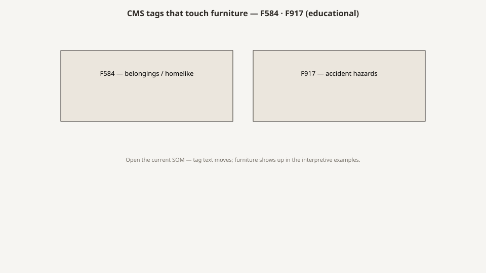

# CMS F584 and F917, the furniture tags

<!-- hif-figure:v1 -->
<figure class="hif-figure">
  
  <figcaption><strong>Fig. 1.</strong> Belongings and accident hazards are where furniture shows up in survey language. <em>Rights:</em> CC0 1.0 (original schematic); BBF staging / original line art; <a href="https://creativecommons.org/publicdomain/zero/1.0/">source</a>. Survey tags that reference belongings and accident hazards.</figcaption>
</figure>

Surveyors do not buy nightstands. They write numbers.

If you specify furniture for a certified nursing home and you cannot name the tags that will see it, you are specifying for a photograph. The two numbers I want on a mill drawing’s margin are **F584** and **F917**. They are not the only tags a room can earn — dignity, infection control, accidents, physical environment all have cousins — but they are the ones that talk about furniture as furniture.

I am not a surveyor. I am not teaching you how to pass. I am teaching you what the public interpretive guidance already says, so a catalog page cannot tell you a story the SOM will not back.

## The 2017 renumbering, in one paragraph

People who learned the old book still say F252 and F461. Starting with the November 28, 2017, implementation of the revised Requirements of Participation, a pile of environment tags were folded. F584 took the homelike / housekeeping / linens / lighting / temperature / sound cluster (the old F252, F253, F254, F256, F257, F258, and part of the bedroom furniture language). The bed / furniture / closet language also lives in the physical-environment series; current teaching files often point at **F917** for §483.90(e)(2).

If you are reading an old punch list from a Medline-era job, the number on the sticky note may be the old one. The sentence underneath is usually the same sentence. Do not fight a DON about the number. Fight about the chair.

## F584: the room as a climate

F584 is §483.10(i). The resident has a right to a safe, clean, comfortable, homelike environment. The facility must provide that environment and allow personal belongings to the extent possible; housekeeping; linens in good condition; private closet space as specified in 483.90(e)(2)(iv); adequate and comfortable lighting; comfortable and safe temperatures; comfortable sound.

The temperature number is the one that surprises furniture people: facilities first certified after October 1, 1990, must maintain **71 to 81 °F**. That is not a finish spec. It is why a vinyl seat in an 80-degree west-facing room is a different object than the same vinyl in a 71-degree interior double.

Lighting is defined in the guidance as adequate for the tasks the resident or staff must do, and comfortable when it minimizes glare and gives the resident control where feasible. Furniture that blocks the only lamp, or a high-gloss top that becomes a glare source, is an F584 problem wearing a mill problem.

Sound is the tag people forget when they specify hard case goods and hard floors and then add a television. A room package is an acoustic package whether you named it or not.

The homelike paragraph I already quoted in the OBRA draft lives here. Read it again when you are about to specify a metal locker because it is cheap. The guidance is not romantic about money. It is romantic about direction.

## F917: the packing list with teeth

F917, as current teaching files map it, is the bed / furniture / closet tag under §483.90(e)(2). The CFR sentence is short. The interpretive language is the furniture spec CMS actually wrote.

**Functional furniture appropriate to the resident’s needs** means the furniture helps the resident attain or maintain the highest practicable independence and well-being. In general that includes:

- a place to put clothing away, organized, clean, unwrinkled, accessible, and protected from casual access by others;
- a place for personal effects — pictures, a bedside clock;
- furniture for the comfort of the resident **and visitors** (a chair is the example they bother to name).

**Clothes racks and shelves accessible to the resident** means the resident can get to and reach hanging clothing when they want. If they cannot use a closet, the facility owes assistance or alternative storage they can use.

**Private closet space** means the roommate does not share your hanging space. Season items may live elsewhere. Your everyday clothes may not be a community drawer.

A wardrobe can satisfy a closet. A locked staff-only cabinet does not. A rod at 68 inches in a room of wheelchair users is a tag waiting for a short woman with a good daughter.

## What the tags do not say

They do not say maple. They do not say Medline. They do not say 250-pound rating. They do not say CAL 117. They do not say the chair must match the nightstand.

They do not say a rail is furniture. Rails are a restraint and a device conversation that lives in other tags and in FDA guidance. Do not hide a rail program inside F584.

They do not say you must buy new. A resident’s own chair can be the visitor chair. A refinished dresser can be the place for the clock if it does the job and does not create a new hazard.

They do not give you a dimension for the nightstand. That is why mills and catalogs invent one, and why I will give shop ranges in the bedside draft and mark them as shop ranges.

## How a Medline punchout fails these tags without meaning to

A punchout page is a JPEG, a finish name, and a price. It is very easy to buy a matching set that fails F917.

Matching is not a tag. Height is. I have seen packages where the wardrobe, bedside, and headboard matched and the only chair was a stacking banquet chair from the dining room. Visitor comfort is in the guidance. The stacking chair is a tell.

I have seen lockable bedside drawers sold as “security” that only staff could open. Protecting clothing from casual access is in the guidance. Punishing the resident for having a wallet is not.

I have seen closets specified as “use existing” in a 1960s plant where the existing closet was a 12-inch catch for coats and the rod was in the dark. “Use existing” is not a specification. It is a hope.

The channel is not the villain. Speed is. A punchout exists so a house can replace twenty nightstands after a flood without a designer. That is a real need. The tag still applies to the replacement.

## How I would annotate a drawing

If I were marking a shop drawing for a teaching file, I would put in the title block:

- F584: lighting glare on tops; vinyl and temperature; personal-item surface; sound if the package is all hard.
- F917: chair for resident; chair or named place for visitor; clock surface; clothing volume; rod and shelf heights; separation from roommate; lock logic (who holds the key).
- Not these tags: bed rails, mattress gap, flame test — pointer to the other drafts.

That annotation will not pass a survey. It will keep a mill from shipping a pretty failure.

## Old files, new numbers

If you inherit a Medilodge-era binder from 2009, you may see F461 on a closet note and F252 on a homelike note. Translate, do not discard. The building did not become a different building in 2017. The binder got new tabs.

If a vendor tells you the old tags are gone so the old problems are gone, they are selling. The CFR sentences are still there. The chairs are still there.

## Linens and the furniture that fights them

F584 still carries housekeeping and linens. A bedspread that cannot come off without moving the bed is a linen problem wearing a furniture problem. A drawer that eats washcloths because the box was never sealed is the same fight. EVS will tell you before nursing will, if you ask EVS.

I have seen a “homelike” throw that infection control condemned in a week and a “institutional” bedspread that a resident actually liked because it was hers and it washed. The tag does not pick a print. It picks a condition: linens in good repair, a room that can be kept clean, personal belongings to the extent possible. Furniture that makes those three sentences impossible is an F584 failure even if the wood is pretty.

## Dignity is a cousin, not a substitute

Dignity tags are not F584 and they are not F917. They will still write a chair you cannot leave and a closet you cannot open. People collapse the numbers because the feeling is the same. Keep them separate on a drawing. Homelike is environment. Functional furniture is the packing list. Dignity is how a person is treated, including by objects.

If a vendor says their suite is “dignity compliant,” ask which sentence. If they cannot point at the SOM, they are selling a feeling.

## What a 2567 sentence actually sounds like

I am not going to invent a deficiency. I will say the shape. The note is short. It names the room or the unit, the object, and the resident impact. “Wardrobe rod not accessible.” “No chair for visitor.” “Furniture stained / in disrepair.” “Personal items stored in a community drawer.” The mill that only reads the catalog page never sees that sentence until the house calls in a panic.

The educational use of the tags is to write the sentence *before* the surveyor does. Not as a scare. As a cut list. A rod height on a drawing is cheaper than a plan of correction. A visitor chair in the leftover is cheaper than a marketing rewrite after the 2567 is public.

Confirm the tag number in the SOM you are holding. I will keep saying that. The chair does not care what number it failed under.

## Sources

- 42 CFR 483.10(i) (F584’s regulation).
- 42 CFR 483.90(e)(2) (bed, mattress, furniture, closet).
- CMS State Operations Manual, Appendix PP, F584 (Rev. 211 text widely circulated; confirm current SOM before a legal use).
- CMS / industry F-tag maps for F917 (resident room bed/furniture/closet). Confirm the current number in the SOM you are using; do not tattoo a teaching-file number onto a 2567.
- CMS Compliance Group and similar public explainers of the 2017 consolidation (secondary; useful for the old-to-new map, not as authority).

See also: [OBRA 1987 and homelike](obra-1987-and-homelike.md), [Wardrobes and the closet rule](wardrobes-and-the-closet-rule.md), [Resident chairs and sit-to-stand](resident-chairs-and-sit-to-stand.md), [What I would ask a DON](what-i-would-ask-a-don.md).
