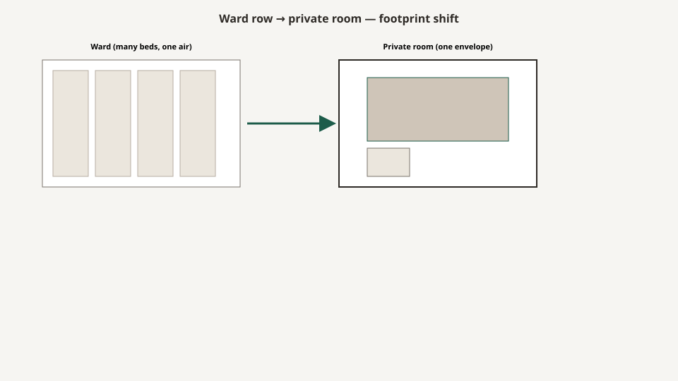

# From ward to private room

<!-- hif-figure:v1 -->
<figure class="hif-figure">
  
  <figcaption><strong>Fig. 1.</strong> Reform moved density into one envelope — furniture followed the square footage. <em>Rights:</em> CC0 1.0 (original schematic); BBF staging / original line art; <a href="https://creativecommons.org/publicdomain/zero/1.0/">source</a>. Ward row vs. private room footprint shift.</figcaption>
</figure>

The first nursing-home furniture I understood was not a chair. It was a **gap between beds**.

A ward is a room that treats beds as a count. A private room is a room that treats a bed as a person. Most of the American skilled-nursing stock I walked in the Medline era was neither. It was a double that had inherited the ward’s density and then hung a curtain and called it privacy.

If you want to know why a nightstand is 20 inches wide and why an overbed has a base that looks like a wishbone, you have to start in the ward. The objects were designed for a staff member who worked a row, not for a couple who wanted a lamp.

## Nightingale’s leftover

Florence Nightingale’s pavilion hospitals and the American Nightingale wards that followed them were arguments about air, light, and supervision. Beds in a line. A stove or a window rhythm. A nurse who could see everyone. The furniture that survived that argument is furniture that **does not block a sightline** and **does not own the floor**.

A ward locker is not a dresser. It is a vertical claim on a sliver of wall. A bedside is a small top because the aisle is the real room. An overbed is a table that can leave. Those shapes outlived the pavilion. They showed up in the 1960s nursing home and they showed up, painted cherry, in a 2009 Medilodge-era double.

I am not doing Nightingale scholarship here. I am naming a habit. `[CITE NEEDED: a primary American pavilion-ward furniture inventory if an editor wants the accession-level pin.]` The habit is: **staff geometry first, resident geography second.**

## Hill-Burton and the postwar bed

The Hospital Survey and Construction Act of 1946 — Hill-Burton — flooded the country with hospital beds and with a taste for the objects that attend them. Batesville and its competitors learned to ship a metal bed, a cabinet, and a table as a set. When Medicare and Medicaid arrived in 1965, the nursing home became a payment category that could buy those sets with a different sign on the door.

The postwar SNF is a hospital leftover in a residential zip code. That is why so many older plants have a nurses’ station that looks like a ship’s bridge and rooms that open on a corridor like cabins. The furniture followed the plant. You can hang a picture. You cannot hang a new structural bay.

Hill-Burton’s exact furniture specifications are not the point of this draft. The point is the **supply**. Once a nation is good at making hospital cabinets, a nursing home will be offered hospital cabinets. The Medline catalog of the later century is a descendant of that supply, even when the JPEG looks like a bedroom.

## The double as a compromise that froze

Private rooms cost envelope. Doubles cost dignity. American long-term care froze, for decades, on the double as the Medicaid default and the private as the brochure.

CMS still writes the floor in square feet, not in room type: 80 per person in a multiple, 100 in a single. States and owners add their own fights. Culture-change movement writing — Pioneer Network and the people who measured how traditional plants actually work — has been saying for years that the “traditional” nursing home is not traditional in any domestic sense. It is an institution that borrowed domestic words.

Furniture became the cheap way to argue. You could not always knock out a wall. You could buy a bedspread, a wooden-looking headboard that clipped to a metal frame, a wardrobe instead of a metal locker, a chair that was not a stacking commode. That is not nothing. It is also not a private room.

A cubicle curtain is the honest object of this compromise. It is a wall you can wash and a wall you can hear through. The curtain draft will sit with flame and track. Here I only need the typology: **the double is a ward that learned shame.**

## What “private” does to a cut list

When an owner actually wants privates — new construction, a replacement plant, a wing — the mill’s cut list changes in ways people who only buy singles never notice.

You lose the curtain, or you keep a small one for the toilet door. You lose the second bedside’s fight for the same outlet. You gain a chair that can live somewhere other than the foot of the bed. You may gain a window wall that wants a low chest instead of a tall wardrobe because the building finally gave you a closet.

You also lose the excuse. In a double, every scar can be blamed on the roommate. In a private, the furniture is the whole environment. If the only wood in the room is a laminate box with a lock the resident cannot work, you cannot point at the curtain.

Medilodge of Montrose, on the public record, is a 121-bed house. I will not invent how many of those beds were doubles when we were in the building. I will say what any 121-bed Midwest SNF of that era usually was: a mix, with the furniture package trying to look the same in both so the warehouse could stock one nightstand.

## Culture change and the neighborhood

The late-1990s and 2000s culture-change vocabulary — households, neighborhoods, country kitchens, the Greenhouse and its cousins — tried to break the corridor. Some of it was architecture. Some of it was a dining table that was not a tray line. Some of it was a nurses’ station that stopped looking like a bunker.

Furniture vendors loved this, because it sold “residential collections.” The honest versions changed the **height of the chair** and the **length of the table** and the **noise of the cart**. The dishonest versions changed the corbel on the wardrobe and left the 17-inch seat.

I am not going to pick a fight with a model I have not measured. I will say this as shop knowledge: if the neighborhood still has a med cart the width of a hallway and a chair no one can stand from, you have renamed the ward.

## What to look for when someone says the rooms are new

Ask whether they moved a wall or a nightstand.

If they moved a nightstand, ask whether the bed is still on the same centers. Ward spacing is a clinical habit. Beds that stay on ward centers with new wooden tops are a costume.

If they moved a wall, ask where the closet went. A private room with no closet and a tall wardrobe in front of the only outlet is a private ward.

If they added a chair, sit in it and stand up. Privacy you cannot leave is a different institution.

The series will keep returning to this move: **architecture first, then furniture, then fabric.** The Medline punchout reverses the order because fabric is easy to photograph. Do not let a JPEG tell you the plant changed.

## The cubicle track is the honest wall

I said the curtain is a wall you can wash. The track is the furniture that makes the wall.

A double without a working track is a ward that has lost its shame and not gained a room. The mesh, the carrier, the bend at the toilet door, the collision with a sprinkler — those belong to the privacy-curtain draft. The history point here is simpler. American long-term care bought privacy by the linear foot because it could not buy envelope. Hill-Burton and the 1965 payment category made beds. They did not make walls. So the industry invented a textile wall and then spent fifty years arguing whether the textile was furniture, linen, or life safety.

If you want to date a plant, look up. A surface-mounted track that stops short of the toilet is one decade. A recessed track that someone later boxed around a smoke detector is another. A decorative valance that hides a broken carrier is a Medline-era costume. The beds may have moved three inches toward “homelike.” The track still says double.

## What Medicare actually purchased

The Social Security Amendments of 1965 did not specify a nightstand. They created a payer that would reimburse a bed-day in a house that looked enough like a hospital to be paid and enough like a residence to be licensed. That is a furniture market. Batesville already knew how to ship a metal set. The nursing home bought the set, then lived long enough to be embarrassed by the metal, then bought wood that still occupied the same floor.

I am not writing reimbursement history. I am writing the supply consequence. Once Medicaid will pay for a double at 80 square feet, the mill’s honest customer is a double at 80 square feet. Private rooms are a different bid, a different leftover, a different photograph. The ward-to-private story is mostly the story of a payment category that froze the double and then asked furniture to apologize for it.

## The private-pay wing as a dialect

Owners who could sell a private as an amenity often bought a different package for that wing: a second chair, a taller crown, a lamp that was not the overbed. The bed was frequently the same device with a wooden panel. The aisle was frequently still a working aisle. Families paid for the photograph. Staff still needed the working side.

Shop knowledge: the dangerous job was not the Medicaid double. It was the private-pay room that had been specified as a hotel and then occupied by the same hips as the double. A 17-inch lounge chair in a private is still a chair you cannot leave. “Private” is a door count. It is not a body.

## Sources

- 42 CFR 483.90(e)(1)(ii) (80 / 100 square feet).
- CMS Appendix PP, F584 (homelike; institutional leftovers).
- Pioneer Network, *Nothing is Traditional about Environments in a Traditional Nursing Home* (culture-change environmental critique; secondary).
- Hill-Burton Act, 1946 (Hospital Survey and Construction Act) — supply-side context, not a furniture spec.
- Social Security Amendments of 1965 (Medicare / Medicaid) — payment category that bought the leftover hospital set.
- MediLodge of Montrose public listing: 121 certified beds, 9317 W. Vienna Road, Montrose, MI.

See also: [The SNF room as a product](the-snf-room-as-a-product.md), [OBRA 1987 and homelike](obra-1987-and-homelike.md), [Privacy curtains and cubicle track](privacy-curtains-and-cubicle-track.md), [Resident room square footage](resident-room-square-footage.md).
