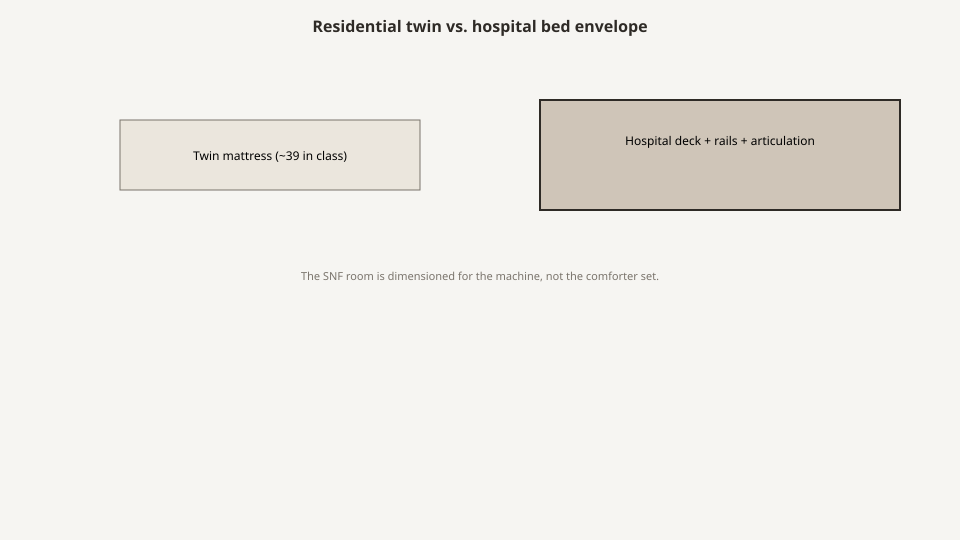

# Hospital beds are not residential

<!-- hif-figure:v1 -->
<figure class="hif-figure">
  
  <figcaption><strong>Fig. 1.</strong> The SNF room is dimensioned for the bed machine, not the comforter set. <em>Rights:</em> CC0 1.0 (original schematic); BBF staging / original line art; <a href="https://creativecommons.org/publicdomain/zero/1.0/">source</a>. Hospital bed envelope vs. residential twin width (educational).</figcaption>
</figure>

A residential bed is a platform you trust with a night.

A hospital bed is a **machine that changes shape** while a person is on it, while a rail is up or halfway, while a mattress compresses, while a staff member is trying to turn someone without becoming the second patient. FDA’s 2006 guidance is written for that machine. It is not written for a sleigh bed from a catalog.

The Medline-era crime I saw most often was not a bad mill. It was a brochure that put a wooden headboard on a device and let a family think they had bought a bedroom. The device was still a device. The gaps were still gaps. The motor still wanted a plug the closet had covered.

## What FDA means by hospital bed

The 2006 guidance uses “hospital bed” for a variety of medical devices classified as beds — Class I and Class II — used in acute care, long-term care, or home care. The Agency is explicit that a bed system can move from one setting to another. A nursing-home bed does not escape the conversation by living in a room with a quilt.

The guidance is about **entrapment in the system**: frame, rails, mattress. It is not a furniture standard. It does not grade your nightstand. It will still ruin your nightstand plan if the only outlet is behind a wardrobe and the bed cannot sit where the gap is safe.

IEC 60601-2-38 was the international bed standard the 2006 document talks back to. The later IEC 60601-2-52 is the particular-standard lineage people name now. I am not going to fake a clause number I have not opened this week. If you are specifying a new fleet, you open the current particular standard and the current FDA thinking, not my memory. `[CITE NEEDED: pin 60601-2-52 edition and the exact dimensional table an editor wants quoted.]`

## The deck is the furniture

If I have to pick one word a mill should learn, it is **deck**.

The deck is what the mattress sits on. Slats, a pan, a grid, a foam-on-foam story. Width and length of the deck are the numbers that decide whether a “36-inch” mattress is a match or a Zone 3 factory. Replacement mattresses from a punchout are how decks get betrayed.

Height of the deck is a clinical number. High for staff backs. Low for falls. The low-bed draft will sit with the fall program. Here I only need the conflict: a furniture headboard that assumes a fixed mattress height will look drunk when the deck moves six inches.

Articulation — head up, foot up, Trendelenburg if the house still has it — changes every gap the rail sees. The 2006 guidance says entrapment can occur in flat or articulated positions, rails fully up or intermediate. A rail that is “fine” at flat is not a rail you have measured.

## Rails are not a style option

A residential bed may have a footboard a child can climb. A hospital bed may have a rail that is a medical device accessory and a restraint depending on how it is used. CMS restraint rules and FDA geometry are different conversations that meet in the same steel.

I will not teach you how to get around a restraint definition. I will teach you that **calling a rail an “assist bar” does not change a 120-millimetre opening**. The side-rail draft and the zone draft are the long versions.

The Medline punchout loved “half rails” and “quarter rails” as comfort language. Comfort language is not a dimension. Ask for the zone assessment, not the nickname.

## Home-care beds and the garage

FDA knows these devices go home. That is why the guidance is not only a hospital document. The used-and-refurbished draft will sit with the Facebook listing. Here the point is typology: a home-care bed that shows up in a nursing home, or a nursing-home bed that shows up in a daughter’s spare room, is still a system. The quilt does not declassify it.

If the rail is missing because someone wanted it to look like a house, you do not have a house. You have an incomplete device.

## What a mill is doing near a bed

Bradley Brand did not build the motor. When we were in a room with a bed, we were building the objects that have to **live with the machine**: a headboard panel that does not create a Zone 6 or 7 fantasy, a bedside that does not block articulation, a wardrobe that does not own the plug, a chair that can wait while the bed goes low.

The educational sin is a headboard specified as furniture without a bed-maker’s blessing. A panel that sits off the frame can make a beautiful gap. A panel that sits on the frame can fight a control housing. Either way, someone has to own the interface. “Matching the nightstand” is not ownership.

## How to read a bed on a floor

I walk it like this. No tools beyond a tape and humility.

1. Name the maker and the model family if a label still exists.
2. Name the mattress maker. If they differ, you are in the guidance’s warning.
3. Look at the rail in up, intermediate, and down, at flat and at head-up, if you are allowed to move the bed. If you are not allowed, you do not have an assessment. You have a glance.
4. Look at the space between mattress and rail, mattress and headboard, split rails if any.
5. Look at the plug and the cable. Furniture that pinches a cable is a fire and a function problem.
6. Look at the working side. If the pretty bedside is on the working side, the pretty bedside is wrong.

I am not performing the HBSW test method. The 2006 document includes test methods and a tool. Facilities and manufacturers use those. A visitor with a tape is not a test lab. A visitor with a tape can still see a four-inch canyon.

## What I want a specifier to write

Write **device**, not **bed** in the residential sense.

Write the low height, the high height, the capacity, the rail type, the mattress match, the deck width, and who assesses zones after install. Write that furniture shall not sit on the working side unless nursing signs it. Write that a decorative headboard is part of the system or is forbidden.

If that paragraph feels too clinical for a “homelike” package, you are beginning to understand the job.

## The 1995 alert is the ancestor

On August 23, 1995, FDA told the country that hospital bed side rails were killing people. Ferlo Todd, Ruhl, and Gross spent the next two years on the 1985–1995 reports and put the paper in the *American Journal of Public Health* in 1997. The 2006 guidance is that pile, grown: about 691 reports by January 1, 2006, 413 deaths, 120 injuries, 158 near-misses. I am repeating the numbers because this draft is the place a specifier still tries to treat a bed as a platform.

A platform does not generate a safety alert. A machine with a rail and a moving deck does.

If someone tells you the 1995 story was “hospital only,” they have not read the settings list. Nursing homes are in it. Private homes are in it. The quilt is not a classification.

## Wooden panels are a costume

The Medline-era brochure loved a wooden headboard on a metal frame. Families loved it. I understand why. A painted steel headboard says ward. A cherry panel says bedroom. The panel does not change the motor, the deck width, the rail geometry, or the plug. It can change Zone 6 and Zone 7 if it sits off the frame or pretends to be the board.

The mill’s ethical job, when we were asked for that panel, was to write whether it joined the system. “Matches the nightstand” is a stain note. It is not a bed note. If the bed-maker will not bless the panel, the panel stays off. I have left money on the table for that sentence. I will leave it again.

## Home-care beds in a SNF closet

Houses inherit devices. A home-care bed comes in with an admission. A nursing-home bed goes out with a discharge and shows up on a Facebook listing. FDA already knew the traffic. The used-and-refurbished draft will sit with the listing. Here the typology is enough: if it articulates and takes a rail, it is in the 2006 conversation whether the room has a quilt or a cubicle curtain.

Staff will sometimes strip a rail to “make it look like home.” That is a restraint conversation and a geometry conversation at once. It is not a decorating conversation. An incomplete device is not a house.

## What “proper size and height” is asking

42 CFR 483.90(e)(2) wants a bed of proper size and height. It does not give you the inches. Proper is the resident, the transfer, the fall program, the bariatric fact if there is one. A residential queen in a SNF double is not proper because a catalog called it homelike. A device that cannot go low when the fall program needs low is not proper because the JPEG showed a wood panel.

Write the heights. Write the capacity. Write the mattress match. Then let the furniture live with the machine instead of pretending to replace it.

## Sources

- FDA, *Hospital Bed System Dimensional and Assessment Guidance to Reduce Entrapment* (March 10, 2006): settings; system components; articulation; classification language.
- 71 Fed. Reg. 12369 (March 10, 2006).
- FDA Safety Alert, *Entrapment Hazards with Hospital Bed Side Rails* (August 23, 1995).
- Ferlo Todd, Ruhl, Gross, “Injury and Death Associated with Hospital Bed Side Rails,” *AJPH* 87 (1997): 1675–1677 (1985–1995 FDA reports).
- IEC 60601-2-38 / 60601-2-52 lineage (pin edition before quoting).

See also: [Seven entrapment zones](seven-entrapment-zones.md), [Side rails, restraint, and geometry](side-rails-restraint-and-geometry.md), [Mattress fit is a gap](mattress-fit-is-a-gap.md), [Low beds and fall culture](low-beds-and-fall-culture.md).
