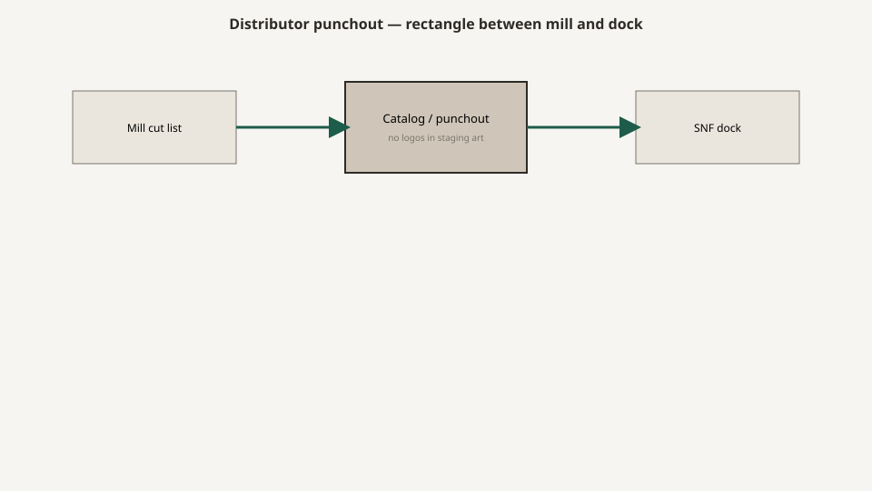

# Medline as a channel

<!-- hif-figure:v1 -->
<figure class="hif-figure">
  
  <figcaption><strong>Fig. 1.</strong> The distributor face is a rectangle between the mill and the wipe-down. <em>Rights:</em> CC0 1.0 (original schematic); BBF staging / original line art; <a href="https://creativecommons.org/publicdomain/zero/1.0/">source</a>. Distributor punchout channel schematic; no vendor logos.</figcaption>
</figure>

If you walked a skilled-nursing loading dock in the years I am writing about, you did not meet a mill first. You met a **truck with a logo the receiving clerk already knew**.

Medline is a medical company. Jim and Jon Mills founded it in 1966 in Evanston with a small warehouse and one dock, out of a family that had been in garments and hospital supply since A.L. Mills’s 1910 Chicago shop. The headquarters story moves to Northfield. The modern company is a manufacturer and a distributor at a scale that makes a hardwood shop look like a workbench. That public history is enough. I do not need a 10-K to tell you what the channel felt like on a mill floor.

Furniture rode along because the customer was already buying underpads, gloves, and housekeepers’ bleach from the same binder. Once a director of nursing can punch a nightstand the way she punches a case of wipes, the mill has a new kind of customer: a **face that is not the mill**.

## What a channel is

A channel is not a brand. A channel is a **route with a memory**.

The memory is the account number, the GPO tier, the punchout, the sales rep who is in the building every Tuesday, the truck schedule, the ability to invoice a chair on the same statement as a mattress cover. The mill does not have that memory in a hundred buildings. Medline did. So did other national distributors. I am using Medline as the name the era actually said out loud, not as an exclusive.

When a mill like Bradley Brand got into that route, we did not become Medline. We became a **possible page**. Sometimes the page had our name. Sometimes it had a house name. I will not invent catalog numbers. I will say the educational fact: the DON saw the page. The mill saw the purchase order, if it was lucky, and the complaint, if it was not.

## Punchout is a furniture language

A punchout catalog is a small rectangle. Title, JPEG, options, price, a lead time that was written by someone who has never waited on a kiln.

That rectangle trains the buyer to think furniture is a **replenishment item**. Gloves are replenishment. A wardrobe is a capital object that has to live with a particular closet and a particular resident. When you sell it like gloves, you get glove behavior: lowest price, fastest dock date, no one in the room with a tape.

The honest use of punchout is replacement. Twenty nightstands after a pipe burst. Four chairs after a wound-care program changed the foam. The dishonest use is a whole-floor package bought at midnight because the capital meeting was yesterday.

Shop knowledge: the worst drawings I ever saw came from a punchout screenshot forwarded as a spec. A screenshot has no rod height.

## The rep is the designer

In a lot of Medilodge-era houses the closest thing to a furniture designer was the Medline rep — or the therapy-and-rehab specialist, or whoever had the furnishings book in the trunk.

That is not an insult. A good rep had seen forty buildings and knew which chair arm ripped. A bad rep had a quota and a finish board. The mill’s job, when we were allowed to have one, was to get on the phone before the page froze.

If you are trying to understand a piece on a floor and there is no architect of record, ask who the distributor rep was the year it was bought. The details will make more sense. The corbel, the lock, the vinyl grade — those were often a conversation in a break room, not a specification in a binder.

## GPO, tier, and the price that is not the price

National accounts and GPOs (group purchasing organizations) are how a 121-bed Michigan house buys like a chain. The tier price on the punchout is not the mill’s shop rate. It is a stack: mill, distributor margin, program fee, freight estimate that may be a lie, install that may be extra.

I will not invent a multiplier. I will say the educational fact: **if you compare a mill-direct quote to a punchout price, you are comparing different animals.** One is wood and finish. The other is wood, finish, memory, truck, and someone to call when the drawer stick.

The channel economics draft will sit with freight and install. Here I only need the politics. A mill that undercuts the punchout without the memory will win a sample and lose the floor. A mill that hides inside the punchout will survive and be invisible. Invisibility is not always a failure. It is how a lot of honest wood got into buildings that would never have found Warren, Arkansas on a map.

## House brand, special buy, and the name on the drawer

Three ways a mill’s work showed up. I am speaking generally, not confessing a particular label.

1. **Named mill.** Rare on a national punchout. More common on a special buy for a corporation that wanted a drawing.
2. **House brand.** The distributor’s name, the mill’s joinery. The complaint comes to the face. The face comes to the mill, or does not.
3. **Special buy / private label for a chain.** Medilodge-as-operator, ConvoCare, BarceloCare — the public names on our project list — are the kind of customers who could freeze a drawing for a run of buildings. The page might never be public.

The educational caution: do not read a logo on a drawer as a factory. Read it as a **route**. If you are repairing a piece, the route tells you who has a part. If you are writing history, the route tells you why the same nightstand is in Montrose and in Paragould with a different sticker.

## What the channel was good at

It was good at **sameness**. A chain that wanted one vinyl in twelve buildings could get it. A flood that wanted thirty bedsides in three weeks could get a version of them. A business office that wanted one PO could get one PO.

It was good at **trust transfer**. The house already trusted the glove. The chair borrowed the glove’s trust. Sometimes that was earned. Sometimes it was a costume.

It was good at **memory for consumables** and, by extension, for the furniture that failed like a consumable — vinyl that ripped, casters that died, pulls that snapped. The reorder path was short.

## What the channel was bad at

It was bad at **the leftover square footage**. A punchout does not walk the room.

It was bad at **the gap between bed and rail**, because those objects often came from different pages, different years, different vendors inside the same logo.

It was bad at **rod height**. I will keep saying this until it sticks.

It was bad at **telling a mill what the bleach was**. “Healthcare grade finish” is not a chemistry. The bleach draft is the long version.

It was bad at **install truth**. Drop-ship to a dock with no crew and no elevator plan is not a channel service. It is a transfer of chaos.

## How to read a Medline-era piece now

Turn it around. Look for a label, a shop mark, a finish date, a fabric code. Photograph the label. Then look at the building’s receiving log if anyone kept one.

If the label says a distributor, you have a route. If it says a mill, you have a factory. If it says nothing, you have a ghost, and the replacement will be a guess.

Do not call the piece “a Medline” the way people call a tissue “a Kleenex” unless you mean the route. The wood may be ours, or Indiana, or a polymer shop, or a later copy. The channel is the reason you cannot tell from the hallway.

## Why gloves and nightstands share a binder

Consumables taught the house to trust a truck. Furniture borrowed the truck. That is the whole channel in one habit. A DON already had an account number, a Tuesday visit, and a way to get a credit when a case of wipes was short. Extending that habit to a chair was rational. It was also how a capital object learned to be reordered like a glove.

I do not resent the habit. I resent the amnesia. A glove that fails is a box. A wardrobe that fails is a resident who cannot hang a dress. The binder does not know the difference unless someone writes inches on the page.

Medline’s public story — 1910 A.L. Mills in Chicago garments and hospital supply, 1966 Jim and Jon Mills in Evanston, later Northfield — is the story of a company that got very good at being in the building. Furniture rode that competence. A mill in Warren rode the ride. The educational job is to keep those three sentences from collapsing into one logo.

## Sources

- Medline public history: 1910 A.L. Mills; 1966 Jim and Jon Mills, Evanston; later Northfield HQ; manufacturer-distributor model (company newsroom / Wikipedia as secondary).
- Medline furnishings category pages (public; existence of a furnishings channel, not a SKU list).
- Bradley Brand public project geography (Medilodge of Montrose; Arkansas and Texas SNFs on the same record).
- Shop observations of punchout / GPO / special-buy behavior are mill knowledge, not a Medline internal document.

See also: [The Medline catalog vs the mill](medline-catalog-vs-the-mill.md), [Channel economics](channel-economics-gpo-freight-install.md), [Medilodge-era on the floor](medilodge-era-on-the-floor.md), [Why this series exists](why-this-series-exists.md).
