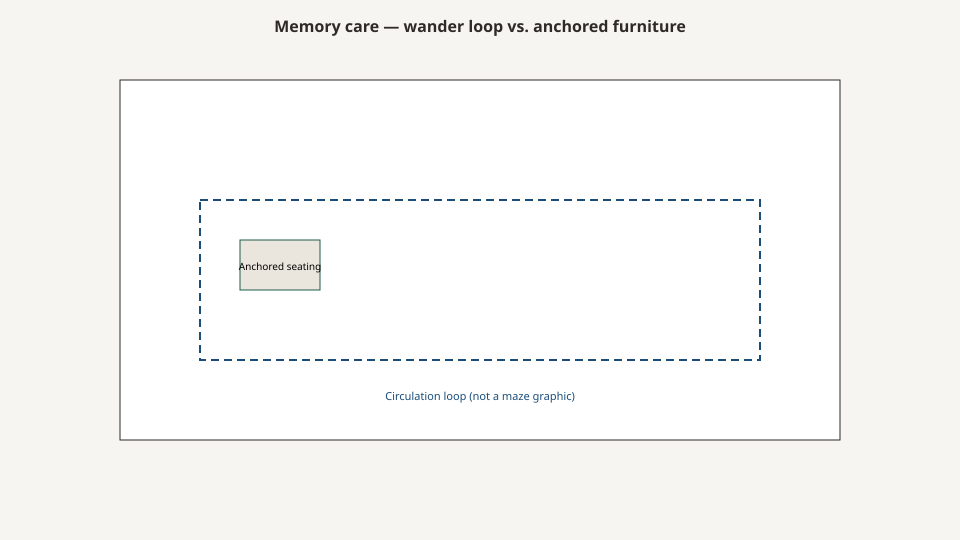

# Memory care furniture

<!-- hif-figure:v1 -->
<figure class="hif-figure">
  
  <figcaption><strong>Fig. 1.</strong> Wander paths and anchored seating compete for the same footprint. <em>Rights:</em> CC0 1.0 (original schematic); BBF staging / original line art; <a href="https://creativecommons.org/publicdomain/zero/1.0/">source</a>. Memory-care circulation loop with anchored seating.</figcaption>
</figure>

A memory-care wing is not a SNF with floral vinyl.

It is a place where a chair is a climb, a door is a puzzle or a magnet, a contrast is a way to find a toilet, and a lock is either a kindness or a cruelty depending on who holds the key. If you specify the standard room package and change the artwork, you have specified a pretty hazard.

I am not a dementia clinician. I am a mill who has been asked for “memory-care hardware” as if it were a finish.

## A product that grew a wing

In the 1990s and 2000s, American long-term care learned to sell a locked neighborhood with a softer name. Assisted living discovered it had nursing-home hips and built “memory care” as a product line. Skilled-nursing houses carved a wing and changed the paint. Culture-change writing — Pioneer Network and the people who measured how traditional plants actually work — had already said the traditional nursing home is not traditional in any domestic sense. Memory care inherited that argument and then added a door that does not behave like a house door.

I will not pick a model I have not measured. Greenhouse, households, country kitchens, the fake bus stop, the fake office — those are program objects. Some of them are architecture. Some of them are clutter. Furniture vendors loved the vocabulary because it sold “residential collections” with bird prints. The honest versions changed rod height, contrast, hardware, and climb. The dishonest versions changed the corbel and left the 17-inch seat.

CMS still owns dignity, belongings, reachable closets, and a room that does not invent a hazard. F584 and F917 do not take a holiday because the vinyl has a wren on it. Restraint language in Part 483 does not take a holiday because a tray looks like a table. The side-rail draft already refused to let you solve a behavior with a geometry you will not name. This draft refuses to let you solve a behavior with a hidden latch you will not write down.

A person with dementia is still a person with hips, a wipe, a flame story, and a sweater. Sit-to-stand did not become optional. Infection control did not become optional. 101 did not become optional. The special problem is that the room talks, and the person will answer.

## Contrast is a wayfinding object

A white toilet in a white room is a disappearance. A chair the same value as the floor is a fall. A table edge that does not announce itself is a bruise.

Shop practice: I want a **value contrast** between seat and floor, between table edge and top, between toilet and wall, between the bed and the nightstand if you do not want them to merge at 3 a.m. Color names are not contrast. A dark walnut on a dark vinyl is a single object. A “calming palette” that is one value from floor to seat to wall is a disappearance wearing a brochure.

Homelike wants calm. Calm that erases edges is a clinical failure wearing a palette. F584’s lighting sentences already care about glare and task. A high-gloss top that becomes a lake under a fluorescent is a glare kit. A matte top that is the same value as the floor is a trip kit. You do not get to pick neither.

Contrast as wayfinding is old environmental writing and older shop observation, not a trial I will fake: **edges have to exist to be used.**

Toilet contrast is not a furniture mill’s first job, and it is the job a furniture package can wreck. A white top next to a white bowl next to a white wall is a disappearing bathroom. Specify toilet, seat, and floor as a set if you are going to claim a memory program.

Night lighting is a furniture problem because the nightstand is where the lamp lives, if it lives. A lamp with a shade is a fire and a tip. A hard overbed fluorescent with no dim is a slap. The headwall draft already asked for ambient, task, and night. Memory care will punish you twice if the night path to the toilet is a black lake.

## Doors, drawers, and the climb

A person who is looking for home will open what opens and climb what looks like a stair. Full-extension drawers at shin height are stairs. Open shelves of interesting objects are invitations. A wardrobe with a mirror can be a stranger in the room.

I have preferred drawers that do not become steps, pulls that are not rungs, and a wardrobe that does not look like an exit. A curtain on a closet can be kinder than a door that is a puzzle — if the flame story is named. The curtain draft will sit with 701. Do not hang a residential blackout on a closet track because it looked soft.

Hinged wardrobe doors in a tight leftover are shins. Sliding doors are tracks that collect lint. Bi-folds pinch. In memory care I will take a curtain or a slider before I will take a cathedral-arch pair that photographs as a front door. A wardrobe that reads as a porch door will be used as one.

Mirrors: some people want them and some people cannot bear them. That is a care-plan object, not a mill default. Do not put a full-length mirror on a wardrobe because a residential collection had one. Do not put a mirror on the back of a door that the person will meet at 3 a.m. as a visitor. If the program wants a mirror, put it where staff can live with the day the program changes.

Low windows and climbable nightstands next to them are a fall program. A box that is a step, a sill that is a seat, a chair parked under a window like a ladder — those are one specification. The low-bed draft already asked you to look from the floor. Do it twice here. A floor-level deck next to a climbable chest is how you buy a window exit you did not mean to specify.

Open display — the shadow box, the shelf of china — is a program object and an infection object. I will not decorate it. If the program wants it, it still needs a wipe. Glass doors on a wardrobe are a residential insult in this wing.

## Locks

A lock that keeps a person from walking into winter may belong to the door and the staff, not to the nightstand. A lock that keeps a person from their sweater is a dignity tag. A lock that keeps a roommate out of a drawer may be F917.

Write who holds the key, and whether the resident is supposed to be able to work the lock. Magnetic catches, hidden latches, and “childproof” hardware are all ways of saying the person is a problem. Sometimes the environment is the problem. I will not pick your care plan. I will not hide the hardware so a surveyor has to discover it.

CMS restraint and dignity language is a book I will not fake from memory. Open the current SOM. A tray that will not come off a chair is a restraint conversation wearing a dining conversation. A lap belt on a lounge chair is not furniture hardware. Do not ask a mill to build a hold and then call it a table.

Locks that only staff can work, on everyday clothes, are a warehouse. The closet rule did not expire at the memory-care door. If the person cannot use the closet, the facility owes assistance or alternative storage they can use. A locked Sunday-best cabinet down the hall is not that alternative if Monday’s shirt is in it.

Attic stock a key. A special-buy that froze a hidden latch for a chain froze a care plan. Care plans do not freeze. When the latch becomes a cruelty, you need a way to make the drawer a drawer again without a millwright.

## Exit-seeking and the furniture costume

Furniture that looks like an exit — a wardrobe that reads as a door to the porch, a window seat that reads as a sill to climb — will be used as one. Furniture that disguises an exit is a life-safety conversation and a rights conversation. I will not teach you how to hide a door. I will teach you not to add extra doors in maple.

Murals that paint a bookcase over a rated door are not a mill’s work, and I will not pretend they are cute. If the AHJ and the clinical program have a sentence, that sentence is theirs. A furniture package that adds a second “front door” to a bedroom is a mill’s work, and I will refuse it.

The fake bus stop and the fake office are program objects. They are also clutter and infection and flame. I will not decorate them. If the program wants them, they still need the wipe and the 101. A bench at a fake stop is still a sit-to-stand machine. A 17-inch skirted thing that looks like a depot bench is a trap with a story.

Wayfinding furniture — a chair that is always the blue chair, a table that is always the oak table — only works if the objects stay. Punchout replacement that changes the blue chair to a green chair because the vinyl program ended is how you undo a year of teaching. Attic stock the vinyl or stop calling the color a program.

## Seating

Sit-to-stand still matters. So does a chair that does not tip when someone pushes up. So does a chair that does not look like a toilet if that is a confusion you actually see. So does a chair that can be wiped after a void without a welt museum.

Rockers and gliders are motion that can soothe and motion that can pinch. If you specify one, specify the pinch and the walk. A glider that walks toward a heater is a heater program. A rocker that pinches a calf is a wound. I like motion I can stop. I dislike motion that looks like a house and acts like a machine with no guard.

Weight rating still matters. A memory-care wing is not exempt from bariatric census. A 250-pound chair with a bird print is still a 250-pound chair.

Cleanout, moisture barrier, foam density — the chair draft already named them. Memory care will use the cleanout more, not less. Skirts are a lint trap and a urine trap. I have refused skirts. I will refuse them again when they come back as “residential memory.”

Geri chairs and recliners will show up because the wing will have people who cannot sit a room chair. The geri-chair draft is the long version. Here: a recliner that looks like a bed will be used as a bed. A tray that looks like a table will be used as a hold. Write the program.

## Channel notes

Medline-era “memory collections” were often a standard package with a different fabric and a bird print. The grown-up version changed rod height, contrast, hardware, and climb. Ask which one you are buying.

A punchout page cannot carry a care plan. It can carry a JPEG of a shadow box. The mill drawing can carry a pull that is not a rung and a rod a seated person can use. Use the drawing.

Bradley Brand’s wood frames could take a new cover when the bird print died. That is a reason to build a frame that is a frame. A foam sculpture with a hidden latch is a landfill with a care plan frozen inside it. Write a way out of the latch on the same page that specifies it.

## What I will not do

I will not use a photograph of a resident. I will not claim a finish cures agitation. I will not tell you to restrain a person with a tray. I will tell you that **the room is part of the behavior**, and furniture is how the room talks at 3 a.m.

If the room talks in rungs and disappearing toilets, do not blame the person for answering.

## Walkthrough

I look for a climb first: drawers, sills, a chair under a window. I look for a false door, a mirror that is a visitor, a lock and who holds the key. I sit and stand. I ask whether the toilet and the chair have edges.

If I can turn a nightstand into a stair without trying, the nightstand is a stair.

## Sources

- CMS Appendix PP, F584 / F917 (belongings; reachable closet; layout and safety).
- Restraint and dignity framework in Part 483 (open the current SOM).
- Pioneer Network and culture-change environmental writing (secondary).
- Shop practice on contrast, climb, and mirrors is mill/floor knowledge, not a dementia RCT.

See also: [Side rails, restraint, and geometry](side-rails-restraint-and-geometry.md), [Wardrobes and the closet rule](wardrobes-and-the-closet-rule.md), [Resident chairs and sit-to-stand](resident-chairs-and-sit-to-stand.md), [ALF vs SNF, the residential lie](alf-vs-snf-the-residential-lie.md).
