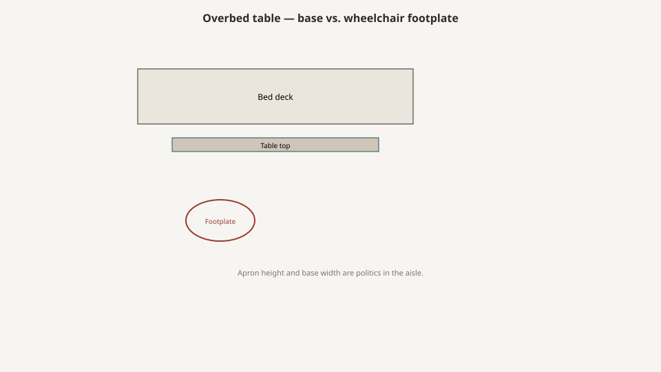

# Overbed tables

<!-- hif-figure:v1 -->
<figure class="hif-figure">
  
  <figcaption><strong>Fig. 1.</strong> The apron and base width are politics in the aisle. <em>Rights:</em> CC0 1.0 (original schematic); BBF staging / original line art; <a href="https://creativecommons.org/publicdomain/zero/1.0/">source</a>. Overbed base vs. footplate clearance schematic.</figcaption>
</figure>

An overbed table is a tray that learned to stand.

It is one of the few objects in a resident room that is honest about the institution. It does not pretend to be a Federal card table. It has a column, a base that has to miss the bed’s wheels and a wheelchair’s footplates, a top that has to come up and down without pinching a hand, and casters that will collect hair. When a catalog calls it “the dining solution,” I stop reading.

I have built wood tops for these and I have refused to build the column. The column is a mechanism. Mechanisms have pinch points and a failure mode that dumps a tray of pills on a chest.

## History: a table that has to leave

The form is older than the Medline punchout. Hospital wards needed a surface that could hover over a mattress and then get out of the aisle. A fixed table next to a high-high bed is furniture. A surface that must meet a cranked deck, then a motorized deck, then a low-position deck is a machine wearing a tray. I will not invent an inventor. `[CITE NEEDED: a primary early overbed-table patent or Hill-Rom catalog plate if an editor wants the origin story pinned.]` The shop fact is enough: by the time a southern mill was matching tops to nightstands, the column was already a metal commodity and the SNF had already inherited it from the hospital.

Hill-Burton plants and the nursing homes that bought their leftovers treated the overbed as part of the bed set — frame, cabinet, table. Medicare and Medicaid made that set a payment habit. OBRA 1987 then asked the room to look like a house. The overbed refused. You can stain a top. You cannot make a wishbone base look like a Duncan Phyfe. Culture-change dining wanted people in a dining room. The overbed stayed for the people who could not or would not go. That honesty is why I like the object, and why I hate it when a catalog tries to baptize it as a dining program.

Low beds changed the travel the column had to do. A table specified for a hip-high deck will not meet a mattress near the floor. The late era sold low frames and mid-travel columns on facing pages. The tray became a cliff. FDA’s 2006 guidance is not an overbed standard, but it is a reminder that bed height changes and that furniture on the working side can fight articulation. A table parked against a rail is how you add a hanger and a pinch to a system that already had **691** entrapment reports, **413** of them deaths, between January 1, 1985, and January 1, 2006. I am not saying the table is a zone. I am saying the table is an accessory that lives in the same leftover.

## Shop geometry: travel, base, leftover

It has to hover over a mattress that changes height. It has to leave. It has to roll on vinyl that has been waxed too often. It has to take a wipe. It has to hold a water pitcher, a meal tray, a tablet, a Bible, a basin, not all at once if anyone is lucky.

Shop ranges I will own as shop ranges, not as a standard:

- Height travel that actually meets a low bed and a high bed, not a travel that looks good in a warehouse. A lot of the metal ones I met advertised something like the mid-20s to the low-40s in inches. Measure the one you are buying at the top of the gas spring’s tired day.
- Top size small enough to pass a door and large enough to hold a tray. The 15-by-30 class is a common shape. Bigger is not kinder in a double.
- A base that is an H, a U, or a wishbone, with a van clearance for bed wheels and a wheelchair.

If your specified height range cannot meet the low-bed program, you have specified a cliff for the tray.

CMS’s room floors — **80** square feet per resident in a multiple, **100** in a single — are why the base is politics. The leftover after two bed envelopes and a curtain track will not forgive an H-base that parks like a coffee table. Draw the lift, then the mat if there is a low-bed program, then the overbed’s parked position. If the parked position is “somewhere,” you do not have a specification.

A U-base that opens toward the bed can get under a low frame. It can also trip a person who does not see the horns. An H-base is stable and greedy about floor. A weighted base that looks like a floor lamp is how you buy a tip when someone leans. The wheelchair is the forgotten user. A resident who eats in the chair, not the bed, still needs the top to come to them without the base fighting the footplates. If the dining program has already failed this person, the overbed is their table. Specify the base for that use or admit you are making them eat with a tray on their lap.

Pneumatic columns die. Crank columns live longer and look older. Electric columns want a cord in a room that already lost its outlets to the bed. I do not romanticize any of them. I ask who will fix it when it will not stay up. A table that sinks is how a tray becomes a chest weight.

Pinch points live at the column and at the vanity slide if there is one. A hand that is holding a cup should not be the hand that finds the shear. I will not draw a mechanism I do not build. I will say the mill’s top should not add a sharp underside edge at the height a seated person uses.

## Tops: the mill’s part

When a hardwood shop is in this object, we are usually the top or the vanity drawer that sometimes hangs under it.

A good top is sealed on the edges. A cup holder stamped in laminate is a hospital leftover that still works. A raised lip keeps a spill off a motor. A flush pretty edge looks like a dining table and irrigates the column.

Vanity drawers are where dentures go and then the smell. If you specify one, specify a sealed box and a wipe that will actually happen. If it will not happen, do not specify the drawer.

Wood vs. laminate vs. phenolic: bleach and impact. The bleach draft is the long version. A wood top in a SNF is a choice you make for the private-pay wing and then maintain. A laminate top is a choice you make for the rest and then replace when the edge peels. Facilities first certified after October 1, 1990, live in a **71 to 81 °F** band. A high-gloss top in an 80-degree west room is a glare story F584 already knows how to write.

Special-buy wood tops on commodity columns were a mill job I understand. We could make a top that matched the nightstand. We could not make a tired gas spring honest. Matching stain is not matching height. If the top cannot meet the bedside and the wheelchair, the room is not coordinated. It is stained.

## Casters and the hair nest

Four casters, or two casters and two glides — the trade has opinions. Locking casters that no one locks are decoration. Casters that lock from a pedal the resident can hit are a kindness and a trip.

Hair, oxygen tubing, and the hem of a quilt are the enemies. A shroud that looks clean in a JPEG can be a nest. Specify a caster you can pick hair out of without taking the table to maintenance.

A caster that marks a vinyl floor will be banned by EVS and then used anyway. A caster that is too small under a loaded tray will dent. I will not invent a diameter as law. I will say the condemned pile in maintenance is full of columns that still had pretty tops.

## Why it is not a dining room

A dining program is a table height, a chair, a time, and a staff ratio. An overbed is a compromise for a person who cannot or will not go to the dining room.

If more than a few residents eat every meal on the overbed, you do not have a furniture problem. You have a dining problem that is wearing out columns. The dining draft will sit with that. Do not buy heavier overbeds as a substitute for a table a wheelchair can pull to.

Count the trays leaving the kitchen at noon. That count is the dining spec. The overbed is the overflow. Overflow that becomes the program will also become the fall program, because a person eating in bed is a person whose tray is a weight over a mattress that still has rails, gaps, and a low-or-high fight.

## Channel notes

Medline-era punchouts treated overbeds as a metal commodity. That is mostly fair. The crime was pairing a cheap column with a “wood package” and calling the room coordinated. Coordination is a height: can the top meet the bedside and the wheelchair.

If you inherit a floor of sinking tables, do not refinish the tops first. Ask maintenance how many columns they have already condemned. The condemned pile is the spec.

GPO pages listed overbeds by travel range and top color. Travel range on a fresh spring is not travel range in year four. I have seen houses attic-stock tops and not springs. Tops are what a mill can send. Springs are what a metal shop or a distributor has to admit they sell.

Freight: a column on a pallet gets a bent horn. A bent U-base will not go under a low frame. Specify a carton that is real, or specify a base you can straighten without pretending. Install: the working side. An overbed that lives on the working side because the pretty bedside already stole the wall side is a furniture fight, not a metal fight.

Bradley Brand’s public list put us in rooms that already had these machines. Our job was the top and the nightstand, not a fantasy that maple could replace a column.

## What to look for on a floor

Roll it. If you cannot roll it with a tray on it, neither can a CNA at 7:30. Raise it to the high bed. Lower it to the low bed, or admit the house does not have a low bed and stop using the word. Park it. Does the base fight the bed wheels, the wheelchair footplates, the mat, the lift?

Press the top. A sinking column is a chest weight waiting for a tired spring. Look at the underside edge. Look at the vanity, if any, and smell it. Look at the casters for hair and tubing. Look at the lip — or the missing lip and the stain down the column.

Count how many people are eating on them at noon. Look at whether the condemned pile is larger than the attic stock. If the mill is being asked to “match” a new wood package to these tables, ask which height the match is for.

42 CFR 483.90(e) wants functional furniture. The overbed is not named in the CFR. It is still the functional object most rooms cannot live without and most catalogs cannot stop romanticizing.

## Sources

- 42 CFR 483.90(e) (functional furniture; bed height) — the overbed is a functional object, not named in the CFR.
- FDA 2006 guidance (bed height changes; do not let a table fight articulation or the working side).
- Shop ranges for height travel and top size are mill/floor observation, not a federal dimension.
- `[CITE NEEDED: a primary early overbed-table patent or Hill-Rom catalog plate if an editor wants the origin story pinned.]`

See also: [Dining in the SNF](dining-in-the-snf.md), [Low beds and fall culture](low-beds-and-fall-culture.md), [The room package](the-room-package.md), [How to read a spec sheet](how-to-read-a-spec-sheet.md).
