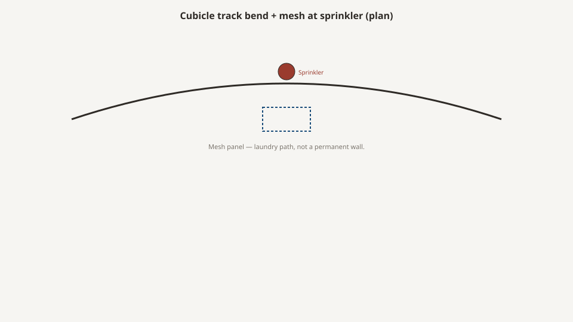

# Privacy curtains and cubicle track

<!-- hif-figure:v1 -->
<figure class="hif-figure">
  
  <figcaption><strong>Fig. 1.</strong> Privacy track is a washable wall — sprinkler and mesh rules still apply. <em>Rights:</em> CC0 1.0 (original schematic); BBF staging / original line art; <a href="https://creativecommons.org/publicdomain/zero/1.0/">source</a>. Cubicle track bend with sprinkler clearance callout.</figcaption>
</figure>

A curtain is a wall that can go to the laundry.

In a double, it is the only wall the roommate did not pay for. F584 wants privacy and a homelike room. The cubicle curtain is how a 1968 plant answers both with a track in the ceiling. If the curtain is torn, too short, or stuck on a bend, the double is a ward again.

I do not sew curtains. I have to live with their track when a wardrobe wants the same ceiling.

## A wall the architect would not fund

The American nursing home inherited the hospital ward and then learned to be ashamed of it. Nightingale’s leftover was a row of beds a nurse could see. The furniture that survived — a small bedside, an overbed that can leave, a locker that does not own the floor — assumes a roommate. Privacy, in that geometry, is not a door. It is a textile on a rail.

Hill-Burton and the postwar hospital boom made cubicle track a factory product the way they made the metal bedside a factory product. Extruded aluminum, carriers, a bend kit, a stop. When Medicare and Medicaid turned the nursing home into a payment category, the same track showed up under a different sign. You could hang a picture. You could not hang a new structural bay. The curtain was the cheap wall.

OBRA 1987 made “homelike” a federal word. Vendors heard a finish. The honest object of the double is still the curtain: a wall you can wash and a wall you can hear through. The ward-to-private draft already named the typology. This draft is the hardware.

CMS still writes the floor in square feet, not in room type: 80 per person in a multiple, 100 in a single. A house that keeps doubles and deletes the working curtain has kept the density and thrown away the only privacy the density can buy. 42 CFR 483.90(e) treats privacy of residents as a room duty. **A double without a working curtain is a ward with better paint.**

## The track is furniture

A cubicle track is a metal path with carriers, bends, and a place it meets the wall. It collects dust. It fails at the bend. It fights a sprinkler. It fights a lift. It fights a ceiling that was already a mess of other tracks.

Specify the track as a drawing, not as “curtains by owner.” Who hangs it, who repairs a carrier, who has extra carriers — that is a program. A pretty fabric on a dead track is a flag.

I walk a track the way I walk a wardrobe. I pull the panel through every bend. I look at the end stop, at whether the carriers stack or jam, at whether the wall return actually returns. A track that does not return is a gap at the head of the bed. A gap at the head of the bed is a face.

Height: a curtain that shows a face is not a curtain. A curtain that drags is a trip and a wipe. The gap at the floor is a dignity and an infection fight. I will not invent the inch. Look at the bed, the lift, and the EVS mop. A low bed changes the sightline. A high-low that sits at transfer height for half the day and at floor height for the other half means the “right” hem is a compromise. Write the compromise. Do not pretend a catalog hem knows your deck.

Carriers are the mechanism clock. They crack, they lose wheels, they freeze after a bleach fog. A house that has no spare carriers will tie a panel to the track with a zip tie and call it a temporary. Temporary in this category is a year. Specify a carrier that comes off without a two-hour shutdown. Specify a bag of extras in the EVS closet, labeled, not in a warehouse two counties away.

Bends are where the drawing lies. A 90 that is too tight will stack carriers and refuse to move. A compound bend around a soffit will look fine on a reflected-ceiling plan and fail on Thursday. I have watched a crew hang a track that photographed as a clean L and lived as a catch. The punch list is the specification. If the installer cannot pull the panel through with one hand, the resident will not pull it when they need a toilet.

## Flame is a textile book

Cubicle curtains live in NFPA 701 territory more often than in TB 117 territory. 701 is a vertical textile test — *Standard Methods of Fire Tests for Flame Propagation of Textiles and Films*. It is not a cigarette smolder on a chair mockup. It is not ASTM E1537. Do not put a 117 sticker on a curtain and go home.

701 has more than one method. Method 1 and Method 2 exist because fabrics are not one weight and one coating. I will not recite which method your vinyl-coated panel wants as if I were the lab. Write **which method, which report, which laundry cycle**. A sheet that says “meets 701” without a method is a cousin of the sheet that says “meets CAL 117” without an edition.

NFPA 101, the Life Safety Code as adopted by the state or the CMS survey, has sentences about draperies, curtains, and other loosely hanging furnishings. CMS will look at life safety on the edition the last survey used. I will not quote a clause from memory and I will not tattoo 2012 or 2015 or 2021 on this page as if it were eternal. Write **NFPA 701, the 101 edition, and the laundry cycle**.

A curtain that met 701 when it was new and failed after a bleach career is a replacement object. Flame resistance on a textile is not a personality. It is a treatment or a fiber story that laundry can undo. Attic stock a panel. A house that has one extra curtain is a house that can close a double when a panel tears. A house that has zero extras will leave the torn panel up because the alternative is a roommate’s face.

Mesh at the top exists so sprinklers can see a fire. That is an NFPA 13 conversation wearing a fabric decision. Do not specify a solid to the ceiling because someone wanted “more privacy” unless the AHJ has signed the sentence. Privacy that rains fire is not a wall. I will not invent the mesh height. The sprinkler drawing and the AHJ own the inch. The furniture drawing has to leave the inch alone.

Window drapes and cubicle panels are not the same SKU just because they share a color. A drape may be a belonging. A cubicle panel is a room duty. Do not put a residential blackout from a big-box store on a cubicle track because the color matched. The flame draft is the long version for upholstery. This draft is the textile that moves.

## Infection and the laundry

Cubicle curtains are dirty. Everyone knows and everyone delays. Infection-control literature has been pointing at them as high-touch objects for years. I will not invent a colony count. Shop fact: **the interval is the specification**, and most houses do not have one they will say out loud.

A wipeable curtain — coated, a film, a surface EVS can treat like a wall — trades hand to the laundry for a wipe and a crack. The crack is where the film fails at a fold or a carrier pinch. A cloth curtain trades a wipe for a laundry cycle that has to keep the flame story. Neither is free. Pick the failure you can see.

Write the interval. I will not invent the week. Infection control knows when they are lying about the interval. Furniture people who specify a color without an interval have specified a costume. The infection-control draft already said the wipe is part of the bill of materials. A curtain that cannot survive the wipe or the wash you actually use is not a healthcare textile, no matter how homelike the print.

Hooks and carriers should come off without a war. A system that requires a two-hour shutdown, or a ladder over a resident still in the bed, will wait for an empty. Empty in a SNF is a rumor. Specify a snap or hook a trained person can work without calling maintenance for a lift.

Date the panel. A faded date is still a date. A house that cannot tell you when the panel last went to the laundry is a house that is using hope as infection control. I like a tag in the hem that survives the wash. I dislike a marker on the mesh that EVS cannot read from the floor.

## The wardrobe fight

A freestanding wardrobe and a curtain track will meet in a double. The wardrobe will win the floor. The track will win the ceiling. The curtain will catch on the crown. Specify them in one drawing. I have cut a crown so a curtain could pass. That is a punch-list document.

The wardrobe draft asked for rod height and swing. This draft asks whether the crown is a snag. A cathedral arch that photographs as homelike is a hook for a mesh. Radius the crown or lower it. If you cannot, you have chosen the wardrobe over the wall, and the roommate will pay.

Headwalls, TVs, and oxygen have their own ceiling claims. The curtain is not the last object to the ceiling. It is the one that moves. A TV bracket in the path will be used as a catch. A lift track will own the air over the bed when it is in use. Write the move.

Sprinkler heads are not decorations. A panel that parks against a head, or a track that runs through a required clearance, is Thursday’s two inches again. Measure the ceiling politics before you freeze a crown or a bend. I measure the ceiling before I measure the wood. The wood can be recut. The sprinkler cannot.

Bradley Brand’s hardwood story belongs here only as a collision. A mill in Warren can recut a maple crown so a carrier can pass. We cannot invent a 701 for you, and we should not. Stay out of the fabric unless you are ready to own the test.

## Channel notes

Medline-era textiles were a core channel product — the company began in garments. A.L. Mills’s 1910 Chicago shop and the 1966 Mills brothers story are garment-and-hospital-supply before they are furniture. Curtains riding a medical distributor makes historical sense. The glove and the panel already shared a binder. The crime was a fabric page that never met the track page.

A punchout can sell a color. It cannot sell a bend. I have seen houses that bought new panels and hung them on a track that had been dead since the last roof leak. I have seen houses that replaced track and reused panels that had been bleached into a rumor of 701. The channel was good at sameness: one print in twelve buildings. It was bad at the leftover ceiling, the same way it was bad at leftover square footage.

Special-buys for a chain could freeze a print. Fine. Freeze the carrier type and the attic-stock count in the same buy. A print without carriers is a costume that will be zip-tied by Christmas.

A mill is in this story only when the wood fights the track. Draw them together.

## What I write on a drawing

If I am marking a teaching file, the furniture plan gets a curtain note even when textiles are “by others”:

“Cubicle track shown for clearance against wardrobe crown, headwall, TV, lift, and sprinkler. Panel hem to be confirmed against low-bed and mop. Mesh at head per AHJ / sprinkler drawing — do not close solid to deck. 701 method and report by textile vendor; laundry cycle named by infection control. Attic stock: one spare panel per wing, spare carriers in EVS. This drawing is not a life-safety certification.”

That paragraph keeps a mill out of a flame book it does not own and in a collision it does.

## Walkthrough

Pull the curtain through the bend. Does it stick? Can I hide a face? Is there mesh where the head is? Is the panel dated? Is there a spare? Does it catch the wardrobe? Does it hit a sprinkler? Can a person in the bed close it, or is it a staff-only wall? Is the return actually a return? Are the carriers stacked or jammed? Does the hem show a face when the bed is low?

If I can see a roommate’s face at the toilet, the double is a ward.

The curtain is the rare fabric that is also architecture. Treat it that way or you will buy a print and live in a row.

## Sources

- CMS Appendix PP, F584 (privacy; homelike).
- NFPA 701; NFPA 101 adopted edition (drapery / cubicle sentences).
- 42 CFR 483.90(e) (privacy of residents as a room duty).
- Shop observations of track-vs-wardrobe are mill/floor knowledge.
- `[CITE NEEDED: NFPA 13 sprinkler-obstruction / mesh sentence if an editor wants the mesh paragraph to carry a clause rather than an AHJ pointer.]`

See also: [From ward to private room](from-ward-to-private-room.md), [CAL TB 117 and NFPA 101](cal-tb-117-and-nfpa-101.md), [Headwalls and overbed light](headwalls-and-overbed-light.md), [The SNF room as a product](the-snf-room-as-a-product.md).
