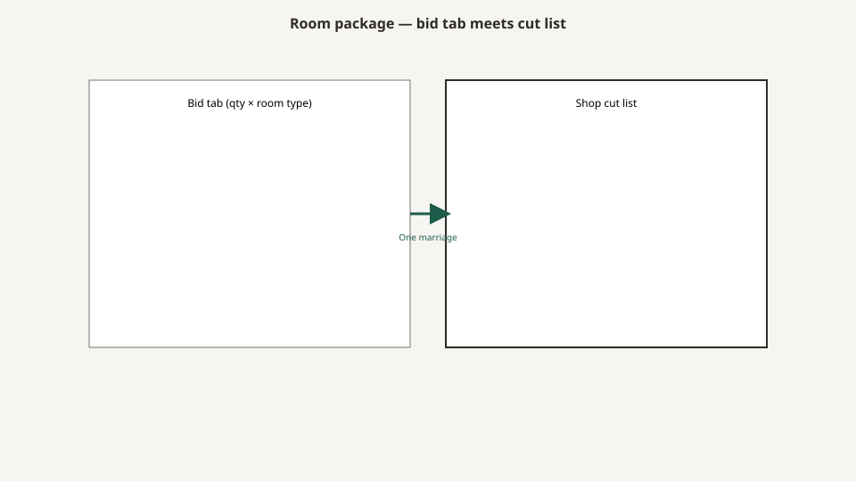

# The room package

<!-- hif-figure:v1 -->
<figure class="hif-figure">
  
  <figcaption><strong>Fig. 1.</strong> A room package is a fiction that has to ship as matched case goods. <em>Rights:</em> CC0 1.0 (original schematic); BBF staging / original line art; <a href="https://creativecommons.org/publicdomain/zero/1.0/">source</a>. Bid tab married to mill cut list.</figcaption>
</figure>

A room package is a fiction that ships.

It is a useful fiction. A 120-bed house cannot buy a life one pull at a time. It is a dangerous fiction because the objects inside it do not share a factory, a standard, or a failure mode, and the bid tab writes them as if they do.

I have built the wood half of packages. I have watched the device half arrive on a different truck with a different union of casters. The educational job is to take the package apart without pretending you can live without one.

## What is usually in the box

A Medline-era resident-room package, when it was honest, named:

- bed (often a separate capital line even when the sales pitch said “package”)
- mattress
- overbed table
- bedside cabinet
- wardrobe or closet fit-out
- resident chair
- sometimes a visitor chair
- sometimes a tackboard, a lamp, a privacy curtain
- sometimes a headboard panel that clipped to a metal frame and let the brochure say “wood bed”

A dishonest package named “room” and a finish. Everything else was “as per standard.” Standard is not a dimension.

## Why the bed will not stay in the package

The bed is a medical device. FDA classifies hospital beds as Class I and Class II devices depending on the type. The 2006 entrapment guidance applies to bed **systems**: frame, rails, mattress. A nightstand is not in that system. A nightstand can still kill a program if it blocks the working side, but it will not be in the zone diagram.

So the package is already a marriage of **device law** and **furniture custom**. The channel likes the marriage because one PO feels like control. The gap likes the marriage because no one owns it.

If you are writing a bid, force the bed onto its own line with a model family, a low-height number, a rail type, a weight capacity, and a mattress match. Then force the case goods onto their own line with rod heights. Then write a sentence that says who is responsible for the interface. If the vendor will not sign that sentence, you do not have a package. You have a pile with a matching stain.

## Finish matching is a narcotic

The thing owners want from a package is that the room looks like one thought. Matching grain direction, matching crown, matching vinyl.

Matching is cheap to photograph and expensive to maintain. Vinyl programs change. Laminate lots change. A replacement bedside two years later will be “close.” Close in a double is a roommate story.

Shop knowledge: if you want a floor to stay kin, specify a **finish system and a vinyl grade** that will still exist, not a picture. And accept that the bed’s plastic end caps will never be your maple.

The honest package matches **heights and edges**, not mythology. Nightstand top near a seated reach. Wardrobe toe-kick that does not catch a lift. Chair arm that clears the bedside. If those three line up, the room looks intended even when the species do not.

## Three package grades the era actually sold

I am naming types, not SKUs.

**The replacement kit.** Nightstands and chairs only. The beds stay. This is the punchout’s honest work. Measure the leftover before you copy the old footprint. The old footprint may have been wrong.

**The wing kit.** A renovation. New case goods, maybe new chairs, beds as existing or a mixed fleet. This is where Zone 3 is born if you also change mattresses.

**The new-plant kit.** Everything. This is where people forget the closet because the architect drew one and the value-engineer deleted it. Count rods on the drawing you will build from, not the rendering.

Medilodge-era work I can speak to as a mill sat in all three types across different states. I will not assign a type to Montrose. I will say the type matters more than the operator name.

## What a package price hides

Install. Freight. Stair carries. After-hours. Protection of vinyl floors. Haul-away of the old stuff. The old stuff is a hazardous-waste conversation if it is wet, and a dignity conversation if a resident is still attached to it.

Lead time. A punchout that says two weeks on a wardrobe that does not exist is a wish. Wood that exists is in a stack. Wood that does not exist is a forest and a kiln.

Attic stock. A grown-up package buys extra pulls, extra vinyl, a spare bedside. A childish package buys exact count and then screams at the mill when a door is damaged on the elevator.

The channel economics draft will put numbers in their place. Here the point is political: **the extended price is a story about objects. The real cost is a story about a live building.**

## How to break a package on purpose

You should break it.

Break out bariatric. A + on a chair is not a 500-pound program. Rooms that need the program need a different bed, a different chair, a different toilet plan, and usually a different leftover.

Break out memory care. Locks, contrast, whether a door looks like a door, whether a chair invites a climb. The memory-care draft will sit with this. A standard package in a memory unit is how you buy a pretty hazard.

Break out isolation / bariatric / comfort-care if the house actually runs those rooms. One vinyl that “cleans” is not a program.

Keep the remaining standard rooms boring. Boring is how you stock a pull.

## The punch list is the specification

I keep saying it because it is the only specification that ever met the resident.

On Tuesday they will ask you to cut two inches off a wardrobe because the sprinkler clearance was a rumor. They will ask you to change a lock because the daughter is the thief in someone’s head. They will ask you to add a shelf because the closet tag just became real.

A package that cannot take a punch list is a product, not a room. Mills that survived the era were the ones who could cut two inches on Thursday without a lawsuit. Distributors that survived were the ones who returned the phone call. Owners that survived were the ones who paid for the two inches.

If you are reading this as history, look at a floor and find the two-inch cut. That is the document.

## Who is not in the package

The toilet is not in the package. The grab bars are not in the package. The headwall is not in the package. The bed often pretends to be in the package and then arrives on a different truck. The family’s recliner is not in the package and will still win the leftover.

A bid that says “complete room” and does not name those absences is selling a feeling. Write the absences on the tab. “Bed by others.” “Headwall by electrical.” “Curtain by textiles.” “Existing closet.” Then decide whether you still have a room.

The mill’s half of a package is case goods and sometimes seating. When Bradley Brand was in a kit, that was usually the half. Owning the half does not own the gap. The sentence I want on the tab is who owns the interface. No sentence, no package.

## The condemned pile is a specification

Every house I walked had a courtyard or a basement or a locked shower with the last package in it. Cup rings. A missing pull. A chair with a split on the front edge. A bedside whose lock had been drilled. That pile is more honest than the JPEG. If you are replacing a floor, photograph the pile before you punch a page.

Shop knowledge: the pile tells you the wipe, the staff hip, and the lock story. It does not tell you the leftover, because the leftover is in the room the pile came from. Walk both.

## Attic stock is ethics

A 120-bed run that buys exact count is a run that will orphan a damaged door. Extra pulls, a spare bedside, a hide of the vinyl — those are not luxury. They are how a floor stays kin when the elevator takes a bite. I will not invent a percentage. I will say a childish package screams at the mill for a door that the carton already confessed.

The channel will try to treat attic stock as a cost to value-engineer. Value-engineer the crown first. Keep the pull.

## Stain matching across vendors

The bed’s plastic, the curtain’s mesh, the nightstand’s maple, the vinyl’s grain — four factories. “Match” is a meeting, not a chemistry. The honest package matches height and edge and then stops claiming kinship. A later replacement that is “close” in a double becomes a roommate story. Specify a finish system that will still exist, or accept the story.

## When the package is a flood

Pipe burst. A wing wet. Twenty nightstands and a promise of two weeks. This is the punchout’s honest hour. Copy the leftover, not the brochure. The old footprint may have been the thing that made the aisle a crash. Measure. Then punch. A flood is not permission to freeze a JPEG that never walked the room.

## Sources

- 42 CFR 483.90(e) (what the room must contain).
- FDA 2006 bed-system guidance (system = frame + rails + mattress; furniture is outside the diagram).
- CMS Appendix PP, F917 / F584 (chair, closet, visitor, clock).
- Shop typology of replacement / wing / new-plant kits is mill knowledge.

See also: [The SNF room as a product](the-snf-room-as-a-product.md), [Hospital beds are not residential](hospital-beds-are-not-residential.md), [Channel economics](channel-economics-gpo-freight-install.md), [How to read a spec sheet](how-to-read-a-spec-sheet.md).
