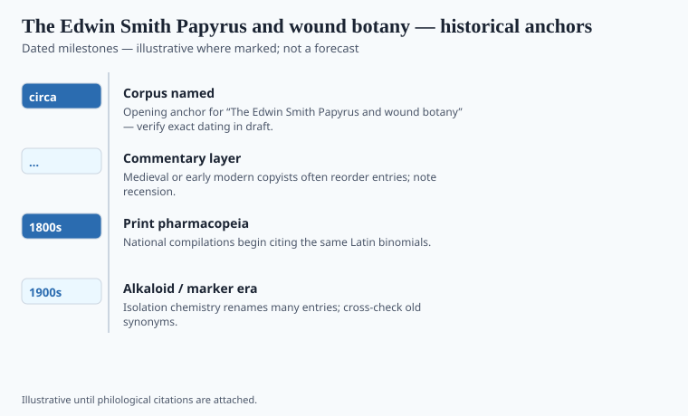

**Disclaimer.** Educational history only. Not medical advice. Past uses of plants do not prove safety or efficacy today. Do not use this series to self-treat or to market disease claims.

Edwin Smith bought the roll in Luxor in 1862. He was a dealer who could read some hieratic; he never published the book. James Henry Breasted did, in 1930, in two Chicago volumes with plates that still sit in medical libraries as if they were a first aid manual. They are not. They are a New Kingdom copy — the usual date is the Second Intermediate Period or early Eighteenth Dynasty, around 1600 BCE — of surgical teaching that sounds older in places. Forty-eight cases. Head, neck, clavicle, arm, chest, spine. The scribe stops mid-thought. The rest of the roll is a blank that editors have been staring at for a century.

This series starts here because herbal histories usually start with a recipe book and then pretend surgery was a side hobby. The Edwin Smith Papyrus will not let you do that. It examines, it pronounces, it sometimes refuses. "An ailment I will handle." "An ailment with which I will contend." "An ailment not to be treated." That last sentence is more honest than a thousand later herbals.

## Textual and archaeological context

<!-- graphics-pack:v1 -->

*Figure 1. Anchors for antiquity-to-modern framing — verify dates in draft.*

The timeline in Figure 1 should be read as a filing cabinet, not as a relay race. Hieratic medical writing in Egypt is older than this copy; the Kahun gynecological fragments and the later Ebers, Hearst, and Berlin papyri sit in the same centuries. Breasted's edition fixed the popular date. Nunn and later Egyptologists have argued about how much of the case logic is Old Kingdom and how much is the copyist's. `[VERIFY]` the paleographic date against the holding catalog (New York Academy of Medicine) before a print caption locks "1600 BCE" as a laboratory number. It is a neighborhood.

What the papyrus does not do is inventory a garden. The famous triad for open flesh — lint, honey, grease — is a dressing logic. Honey is a plant product in the broad sense; it is also a bee's work. Grease is animal. Lint is fiber. A writer who turns that triad into "ancient antibiotics" is selling a magazine the papyrus did not write. Laboratory activity of honey against some organisms is a modern file. It is not a New Kingdom trial.

The roll's afterlife is American. Smith died in 1906. His daughter donated the papyrus; Breasted's Oriental Institute made it a monument of "rational" Egyptian science, a word 1930 needed. Rational here means: look at the wound, say what you see, do not immediately blame a demon. Demons still appear in other Egyptian medical books. This one prefers the bone.

## Plants named in the surviving record

<!-- graphics-pack:v1 -->

*Figure 2. Comparative materia medica plate — illustrative line art, not botanical ID.*

Figure 2 is a cousin plate, not a page from Smith. Willow, poppy, castor, and the other silhouettes belong to the wider Nile file — especially the Ebers Papyrus, which Georg Ebers bought in 1873 and published in 1875. Ebers is the dining-table scroll of prescriptions: beer, dates, acacia gum, sycamore, *kaka* (castor, one of the less reckless identifications). Smith is the other drawer. Mixing the two plates without a caption is how "Egyptian herbal surgery" gets invented.

Where Smith does use vegetable matter, the use is local to a wound: poultices, astringent washes, the occasional named plant-word that translators still fight. Lise Manniche's *An Ancient Egyptian Herbal* is the book that walks names into gardens and then admits how many walks fail. A hieratic plant-word is not a Linnaean voucher. This essay will not print a confident binomial for a Smith case that specialists mark doubtful.

Read the two papyri as a pair and you get a civilization that could write both a prognosis and a kitchen recipe. Greece did not have to invent that split. The split was already on linen. If this pack later talks about Dioscorides or Galen, remember that an Egyptian scribe had already decided some ailments were not to be treated. A herbal that cannot say no is a catalog, not a clinic.

## After Chicago

Breasted's 1930 volumes made an American monument out of an Egyptian roll a dealer had sat on. Medical schools quoted the triad and the three verdicts. They quoted them as ancestors of "scientific medicine," a phrase that flattered Chicago more than Thebes. The roll is a better ancestor of honest notes: look, say what you see, refuse when you must.

The New York Academy of Medicine still holds the object. Facsimiles travel. If a magazine needs a photo besides Figure 1 and Figure 2, use a 1930 plate, not a generated priest. The plants that belong to Egypt's recipe drawer wait in the Ebers file. This essay's job was to keep the drawers from collapsing. Wound logic is not a herbal. A herbal is not a prognosis. The scribe who stopped mid-column left a better ending than a moral.
