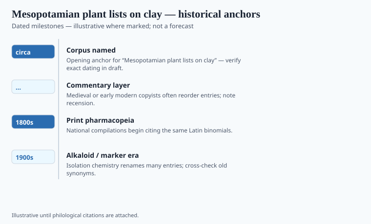

**Disclaimer.** Educational history only. Not medical advice. Past uses of plants do not prove safety or efficacy today. Do not use this series to self-treat or to market disease claims.

The tablet later numbered among the Kuyunjik medical texts is not a hymn, though it sounds like one if you only hear the recitation. It lists plants, woods, fats, and beer. It tells a trained reader what to crush and what to say. The clay was written for Nineveh's libraries and baked by accident when the city burned in 612 BCE. Fire, which ruins paper, made these prescriptions durable.

We do not have the shops. We have the lists. Ashurbanipal's seventh-century collection, excavated by Layard and Rassam and catalogued in the British Museum K series, is why the lists look royal. A palace wanted the series copied. A village healer's bag did not get a shelf-mark.

## Textual and archaeological context

<!-- graphics-pack:v1 -->

*Figure 1. Anchors for antiquity-to-modern framing — verify dates in draft.*

Figure 1's early date ("circa 2000 BCE") is a neighborhood for Old Babylonian medical writing, not the birthday of every tablet in the plate. Therapeutic recipes run from the second millennium into the first. The diagnostic series *Sakikkū* (SA.GIG), the therapeutic compilations modern editors have tried to reconstruct, and the *šammu šikinšu* plant-description texts are named scholarly objects. They are not a pile labeled "ancient wisdom."

Sumerian logograms carried prestige and brevity; Akkadian spelled out how a thing was used. A "drug" here is a material with a direction: to bind, to fumigate, to plaster, to drink, to hang at the neck. The last of those bothers readers who want pharmacy and religion in separate drawers. The tablets do not keep those drawers.

JoAnn Scurlock and Mark Geller have spent careers showing that some recipes are empirically fussy — quantities, substitutions, timing — while the diagnosis may name a ghost. The ghost is not decoration. It is part of the causal system. Drop it out to make the tablet look like a proto-PDR and you have edited the document.

## Plants named in the surviving record

<!-- graphics-pack:v1 -->

*Figure 2. Comparative materia medica plate — illustrative line art, not botanical ID.*

Dates, barley, onion-kin, mustard-kin, resins, cedar, myrrh when the trade allowed, mineral bitumen, river clay, animal fats. Thompson's 1924 *Assyrian Herbal* mapped many of these onto Linnaean names with the confidence of its year. Some mappings still stand. Many do not. When a caption says *kasû* has been read as a mustard, that is a scholarly habit, not a field identification you could take to a market in Baghdad and get right every time.

Figure 2 is therefore honest only as a silhouette. It is not a key to the logograms. Beer as a menstruum is the more stable historical fact: alcohol and weak acids pull different things from a root than water does. The scribes did not speak of alkaloids. They spoke of strength, of "cutting" a disease, of a drug being "good" when the patient sweated or slept.

Nineteenth-century translators liked to present Mesopotamian medicine as magic with a few lucky plants attached. The tablets are ruder. They include prognosis that looks like surrender and wound care that looks like attention. They also include materia that later Greek and Syriac writers would recognize because the same resins moved west. Influence is not a relay. It is a market and a translation problem.

If you want a clean origin for "Western pharmacy," you will not find it at Nineveh. You will find a habit: write the recipe down, name the plant as the script allows, and accept that the god and the poultice are both on the payroll. The identifications are still being argued in journals with small circulations. That argument is the live part. A confident list of "Sumerian antibiotics" on a wellness page is the dead part.

## After the fire

Kuyunjik's tablets are in London because a nineteenth-century excavation shipped a burned library. That shipping is its own extraction story. Assyriologists still argue plant equations in journals a wellness writer will never open. Let them. A magazine caption that prints "*kasû* = mustard, therefore Sumerian antibiotic" has skipped the argument and stolen a result.

What travels without the binomial is the series habit: incipits, catch-lines, the fear that the next copyist drops a plant. Later pharmacopeias are the same fear in a nicer typeface. Nineveh is not the origin of the Western shop. It is proof that a palace already wanted the shop written down. The god stayed on the payroll. That is not a defect in the tablet. It is the tablet.
