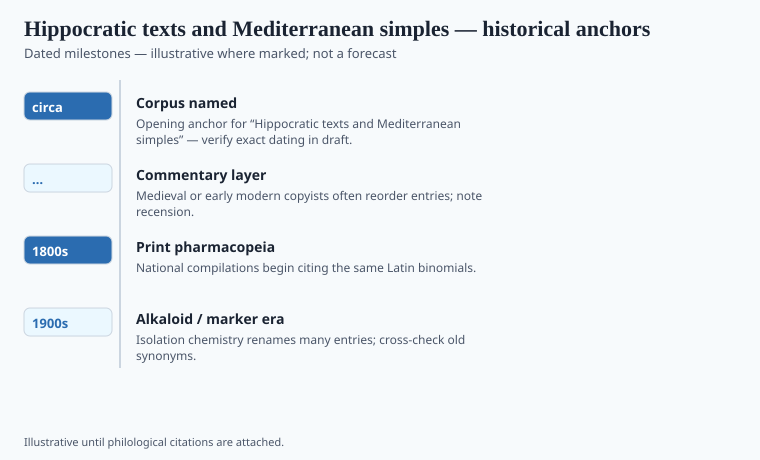

**Disclaimer.** Educational history only. Not medical advice. Past uses of plants do not prove safety or efficacy today. Do not use this series to self-treat or to market disease claims.

"Hippocrates said let food be thy medicine" is a modern sentence in a toga. The line does not sit, in that form, in the Greek texts that travel under his name. What the corpus does say, in several places and several voices, is that diet, season, and a short list of simples belong to the same craft as the knife and the prognosis. That is already enough work. It does not need a false quotation on a juice-bar tile.

The corpus is a library assembled around Cos and the wider fifth- and fourth-century BCE Greek medical world, then copied until Alexandria and later Rome could not tell which book was whose. *Affections*, *Regimen*, *Diseases of Women*, the epidemic books: different authors, different tempers. Some like theory. Some like a list.

## Textual and archaeological context

<!-- graphics-pack:v1 -->

*Figure 1. Anchors for antiquity-to-modern framing — verify dates in draft.*

Figure 1's "circa 400 BCE" is a centroid, not a birthday. The "Hippocratic" label is a later filing. Plato already knew a Hippocrates of Cos; the sixty-odd works in the medieval collections are not one man's week. Laurence Totelin's *Hippocratic Recipes* is the book that treats the prescriptions as texts with ingredients, measures, and a social world of root-cutters (*rhizotomoi*) and drug-sellers (*pharmakopōlai*). Those trades are older than the famous oath.

The oath, by the way, is a poor herbal. It binds a student to a household. It does not inventory a garden. Readers who want plants should open the gynecological and regimen books, where pomegranate, squirting cucumber, silphium's expensive ghost, wine, honey, and a long argument about "hot" and "cold" foods do the daily work.

Silphium is the celebrity absence. Cyrene grew a ferula that later writers said was harvested to scarcity. Coins show a plant. Modern botanists argue about *Ferula* species and about whether the extinction story is too neat. `[VERIFY]` any caption that says "extinct in 100 BCE." The honest sentence is: a Cyrenaic export with a plant-shape on money disappeared from the trade, and the substitutes (asafoetida and kin) never quite satisfied the old advertisements.

## Plants named in the surviving record

<!-- graphics-pack:v1 -->

*Figure 2. Comparative materia medica plate — illustrative line art, not botanical ID.*

Hellebore, as a purge, has a long, dangerous Greek career. Elaterium from squirting cucumber. Mandrake in later layers more than in the leanest Hippocratic recipes. Vines and their wines as vehicles. The plate in Figure 2 is comparative, which means it will show plants the later Dioscoridean shelf made famous even when a given Hippocratic book is shy of them. Do not treat the silhouettes as a Cos shopping list.

What the corpus contributes to this series is a tone: prognosis before a pile of names, and a willingness to say that a disease has a course you can watch. That tone is why later centuries kept "Hippocrates" as a statue while they actually compounded from Dioscorides and Galen. The statue does not weigh a root. The root-cutter did.

Food and drug share a kitchen in these texts. That sharing is historical. It is not a license to print a Mediterranean diet as a protocol, and it is not proof that a modern supplement "is Hippocratic." A capsule with a Greek helmet on the label is a trademark. The corpus is a set of Greek sentences about bodies in a particular climate, written by physicians who argued with each other and did not know they were founding a brand.

## After the statue

Cos became a pilgrimage and a cruise stop. The island sells a name. The corpus sells something harder: a set of Greek arguments about season, diet, and a short, dangerous list of simples. Totelin's recipe work is the antidote to the statue. Read a gynecological recipe through to the measure. Then try to print "Hippocrates said" with a straight face.

The food-medicine line, honestly held, is a historical fact about a kitchen and a clinic that had not yet hired two faculties. Dishonestly held, it is a juice slogan. This pack will keep the kitchen and throw the slogan. Silphium can remain a coin and a fight. Hellebore can remain a purge people regretted. The oath can remain a household document. None of them is a supplement license.
