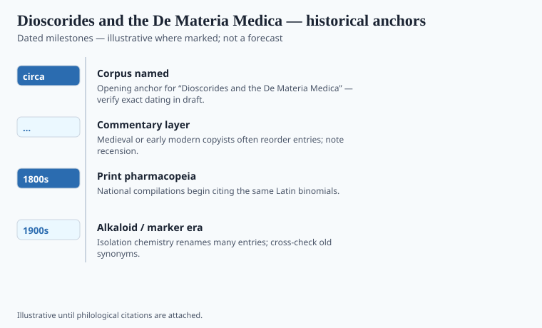

**Disclaimer.** Educational history only. Not medical advice. Past uses of plants do not prove safety or efficacy today. Do not use this series to self-treat or to market disease claims.

Pedanius Dioscorides of Anazarbus served, the later biographies say, with Roman armies. Whether or not he held a formal commission, *De materia medica* reads like a book written by someone who had to recognize a plant in a market he did not grow up in. He groups substances by affinity — aromatics with aromatics, metals with metals — not by the alphabet later scribes would impose. He tells you how a resin should snap, how a root is padded with cheaper weight, which city sends the better grade.

He is impatient with books that only copy. He says so. Anazarbus is in Cilicia. The eastern Mediterranean of the first century CE was a Roman warehouse of gums and oils. A man who had walked with soldiers had seen the same plant under two names. That irritation is the book's engine. The conventional "circa 77 CE" in the file is a dating habit, not a colophon. `[VERIFY]` against Riddle and Beck before a caption treats 77 as a printer's year.

## Textual and archaeological context

<!-- graphics-pack:v1 -->

*Figure 1. Anchors for antiquity-to-modern framing — verify dates in draft.*

Five Greek books: aromatics and oils; animals; grains and herbs; more roots; vines and wines. Lily Beck's translation is the modern working text. John Riddle has argued, not gently, that this is a more empirical book than Galen's theoretical pharmacy, and that medieval Latin readers who preferred Galen paid for it. Galen will explain why a drug *must* cool. Dioscorides will tell you what farmers in a named place do with it, then what he thinks of their story.

The copies became the book. Arabic translators took him into a language that already had garden words; the result was argument as much as transfer. Latin Europe received him in pieces, then as a humanist trophy. The Vienna Dioscorides (Österreichische Nationalbibliothek, Cod. med. gr. 1), made in Constantinople around 512 CE for Anicia Juliana, is the celebrity object: painted plants, gold, a dedication picture. Luxury can freeze a text. Field notes want cheaper copies that wear out.

When later botanists sneered at "the ancients," they were often sneering at the gap between a Mediterranean name and a northern weed. Fuchs tried to re-identify. Linnaeus later nailed names to specimens. The chain from Dioscorides to a modern binomial is a series of those repairs.

## Plants named in the surviving record

<!-- graphics-pack:v1 -->

*Figure 2. Comparative materia medica plate — illustrative line art, not botanical ID.*

Opium poppy, mandrake, squill, birthwort, myrrh, the many honeys. Figure 2 will tempt a designer to put the mandrake in the center because museums do. The working pages are how a Syrian or Italian doctor, a thousand years later, decided what to buy. Opium is less theatrical on the painted leaf and more important in the history: juice of *Papaver somniferum*, already a known sleep and a known danger. This essay will not describe harvest. Dioscorides records harm. That is the historical fact.

He also records cheats. Pharmacognosy before the word is a man snapping a resin in a stall. Every subsequent "complete herbal" is, in some posture, answering him. Galen became the theory. Dioscorides remained the shelf. This pack follows the shelf.

## After Vienna

The Anicia Juliana copy is how museums get a crowd. A working Arabic or Latin Dioscorides is how a doctor bought a gum. This series is on the side of the working copy. Riddle's point about empiricism versus Galenic necessity is an earned opinion if you have sat with both. If you have not, do not caption Figure 1 as "science begins."

He will be wrong about a northern plant. Being wrong in a checkable way is still a better habit than being right by temperament. Fuchs, later, tried to re-identify. The chain of repairs is the live science. The painted mandrake is the poster. Keep the poster in the figure slot. Keep the cheat-detecting sentence in the prose. That split is the whole method of this pack.
